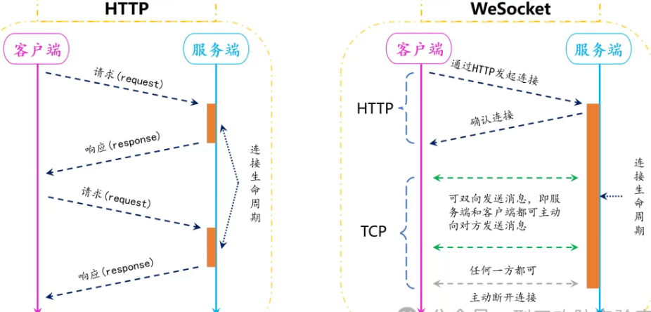

## Websocket

WebSocket是一种网络通信协议，用于在客户端（如浏览器）和服务器之间建立全双工、持久性的连接。与传统的HTTP协议不同，WebSocket允许服务器主动推送数据给客户端，而不需要客户端反复发起请求

### 应用场景

1. 网页聊天与社交应用 微信网页版、Slack、Discord
2. 在线游戏与虚拟竞技 网页版《Agar.io》、多人（如MMORPG）
3. 金融与交易平台 Robinhood、币安交易所
4. 协同编辑与远程办公 Google Docs、腾讯文档

### URL格式

```
ws://类似与http使用明文传输 ，默认端口为80
ws://host[:port]path[?query]
wss://类似于https使用TLS加密传输,默认端口为443
wss://host[:port]path[?query]
```

## WebSocket抓包

除去常规漏洞外，较容易出现：

1、CSWSH（跨站点网站劫持，最为广泛的漏洞）

类似于CSRF漏洞，在没有验证请求源的情况下，任意来源均可以连接WebSocket服务器进行数据交互，攻击者通过构造恶意页面，诱使用户访问借助用户的身份信息与服务器建立连接，从而劫持用户身份下的WebSocket连接。

2、XSS跨站

3、业务验证

4、DOS攻击

