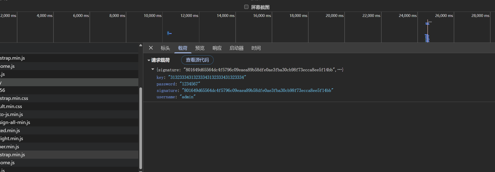
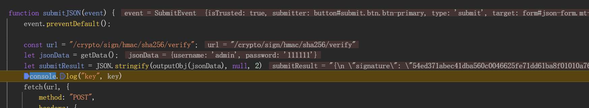
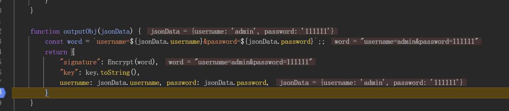
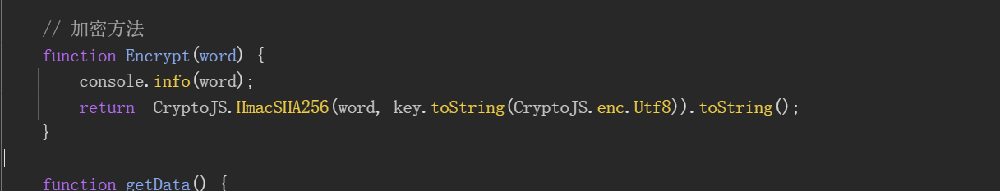
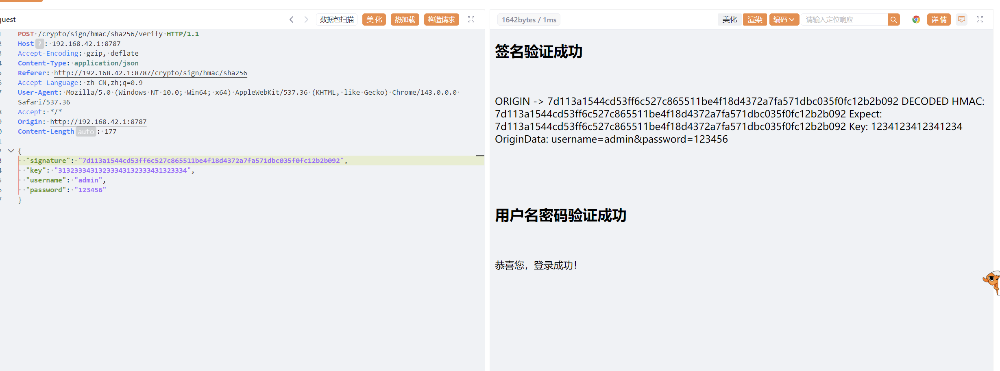
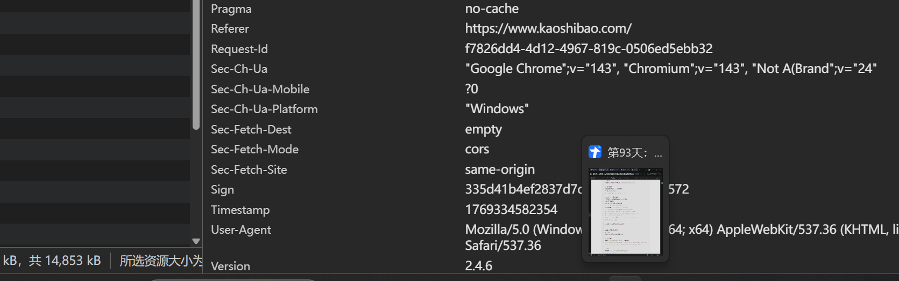
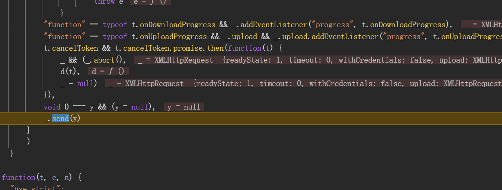
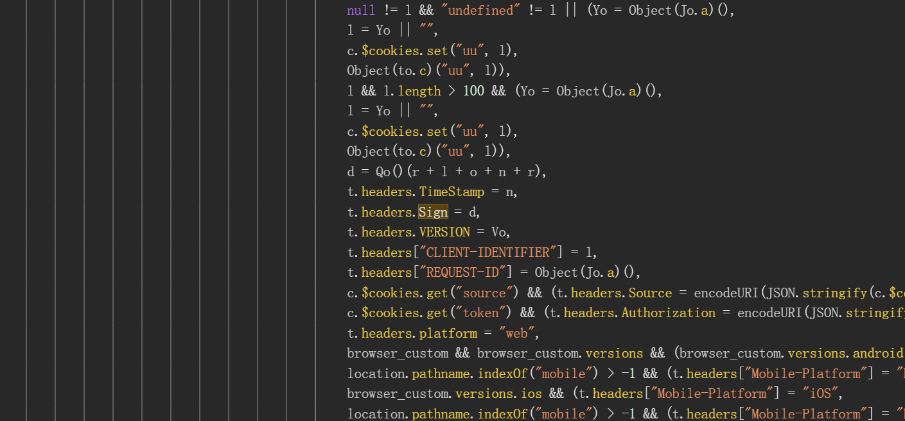
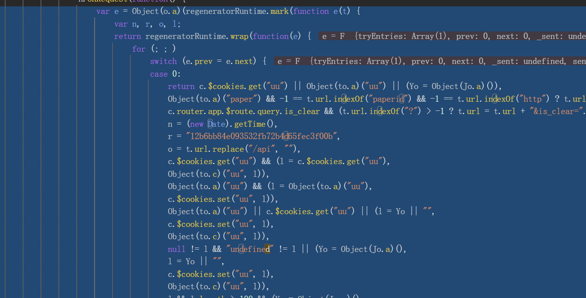
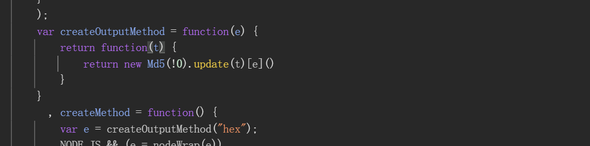

## Sign

Sign（签名）机制广泛应用于API请求、数据传输、身份验证等场景，用于确保数据的完整性和来源可信性。它对渗透测试（Penetration Testing）带来了显著的影响，既有安全增强作用，也增加了测试的挑战，测试人员需要结合逆向分析、动态Hook、服务器逻辑测试等方法，**才能有效发现潜在的绕过漏洞**

签名和加密的区别：签名加密算法有可能不可逆
## 案例

### 案例一

输入账号密码发现签名验证

启动器定位加密代码

追踪加密代码

实现签名

### 案例二

发现数据包中含有签名值

利用xhr断点追踪

追踪堆栈找到Sign赋值处

找到加密参数来源

找到加密函数原型

