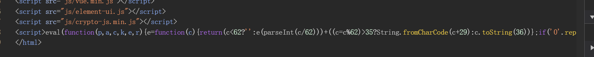
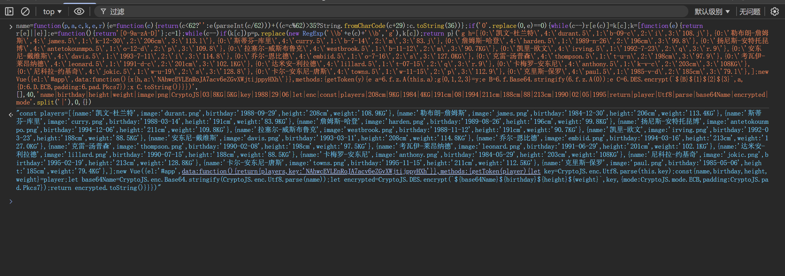
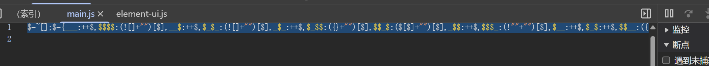
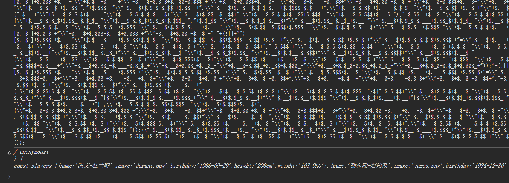
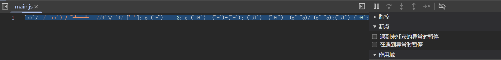
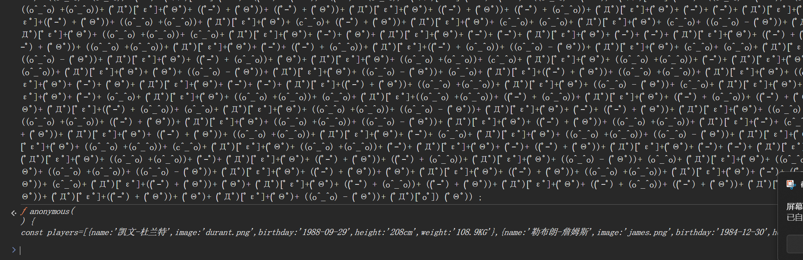
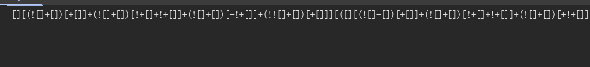
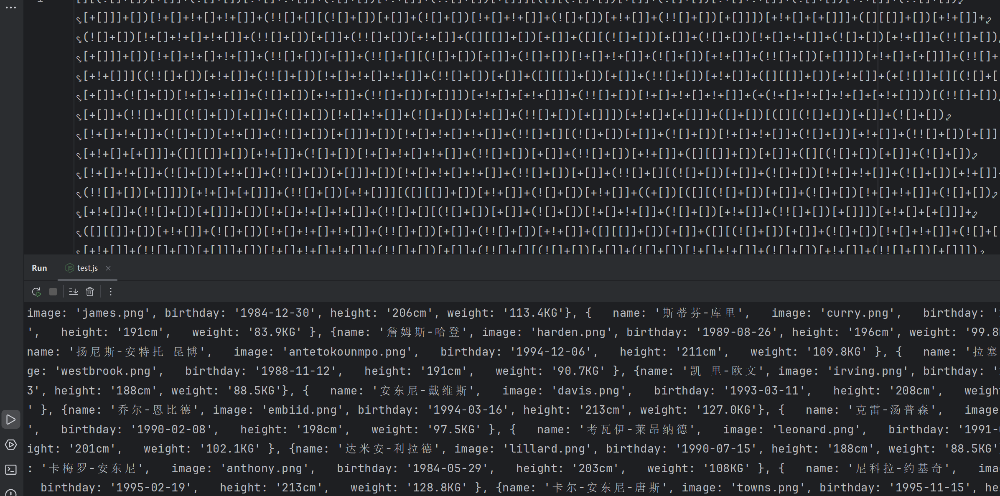
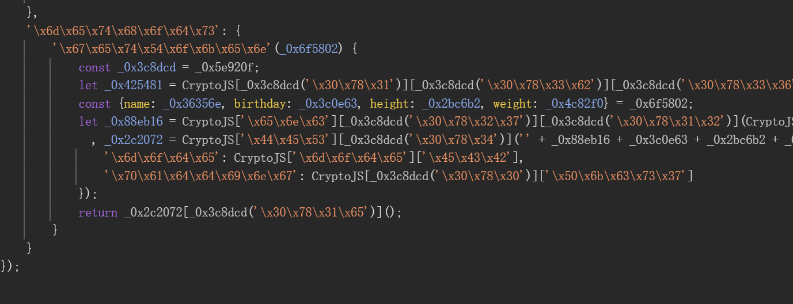

## 常见混淆手法

*eval,JJEncode,AAEncode,JSFuck,Obfuscator等混淆还原
eval:
特征：出现关键字eval
还原：控制台输出（去除eval()后）给函数名，新建JS文件优化

JJEncode，AAEncode，JSFuck：
特征:包含很多$
特征:包含很多颜文字
特征：包含很多[ ]、()、+、!
还原：控制台输出（一般去除()调用后）点击查看或直接运行

Obfuscator：
特征：包含很多——0x字母无意义的字符串，阅读难度增加
还原：控制台输出美化代码断点调试输出分析，利用AST技术解密还原

## 案例

### Eval 混淆

发现eval混淆

执行eval函数内代码，获得代码

### JJEncode

混淆代码

去掉最后面的()，在执行代码

### AAEncode

 混淆代码
 

删除后面的调用再执行代码

## JSFuck

JSFuck代码

node环境运行

### OB混淆

混淆代码

## 平台

1、人工分析：

看特征或代码注释找到关键加密字（加上后续的AST技术）

2、平台自动：

https://jsdec.js.org/

https://lelinhtinh.github.io/de4js/

涉及平台项目：

https://www.jshaman.com/

https://c.runoob.com/front-end/51/

https://tool.ip138.com/javascript/

https://www.sojson.com/jsjiemi.html

https://utf-8.jp/public/jjencode.html

https://tool.chinaz.com/tools/jscodeconfusion.aspx

https://github.com/mishoo/UglifyJS

github.com/javascript-obfuscator/javascript-obfuscat