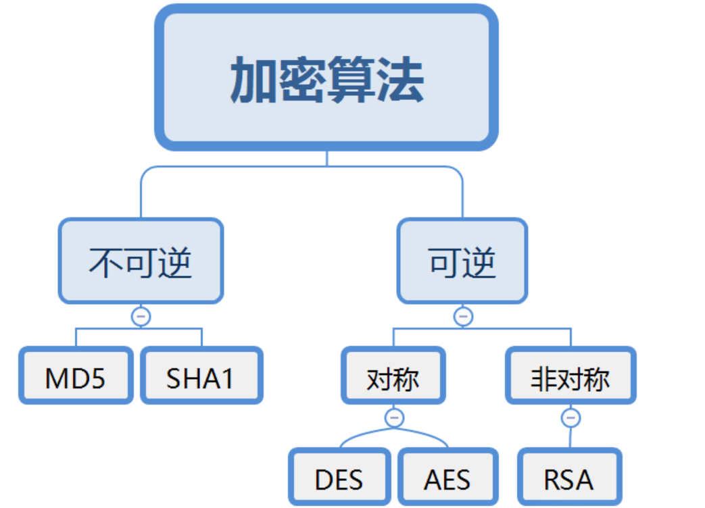

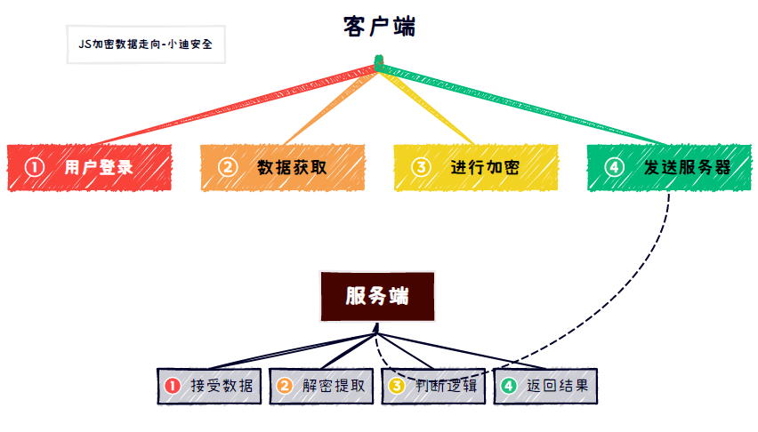

## 分析方法

1、根据调用堆栈找加密前后定位

2、根据提交URL,参数名等搜索定位

## 请求数据解密

### 案例1

输入账号密码，发现加密参数param

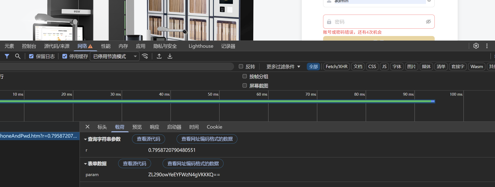

全局搜索地址，打断点

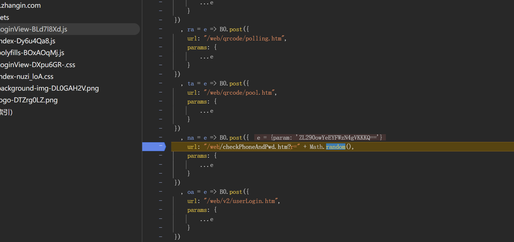

跟踪调用堆栈发现加密函数

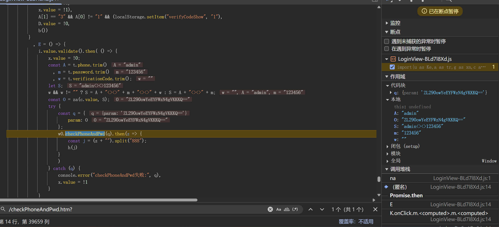

跟踪加密函数确认加密算法,key以及iv的值

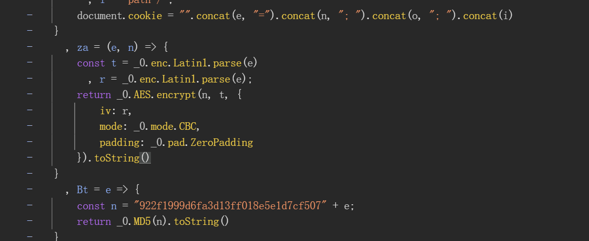

解密参数，确认加密流程

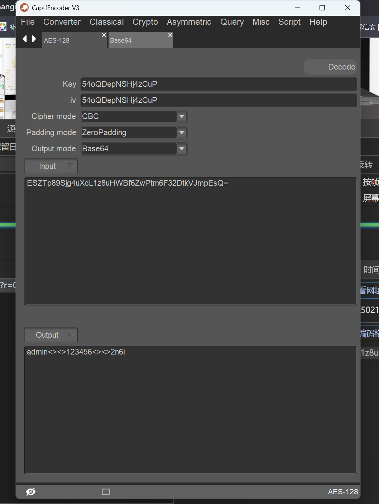

### 案例二

输入账号密码，发现加密参数

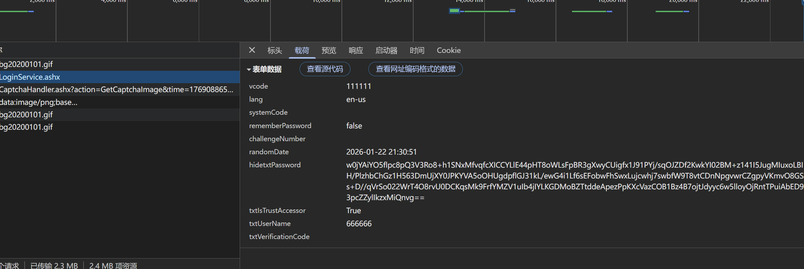

查看启动器追踪加密函数

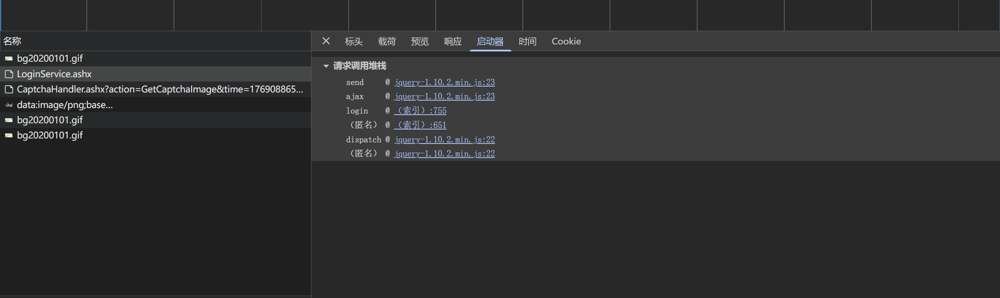

查看加密处，把加密函数代码下载下来

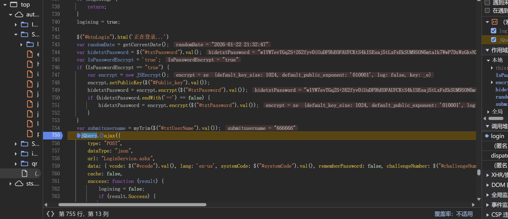

表单搜索公钥

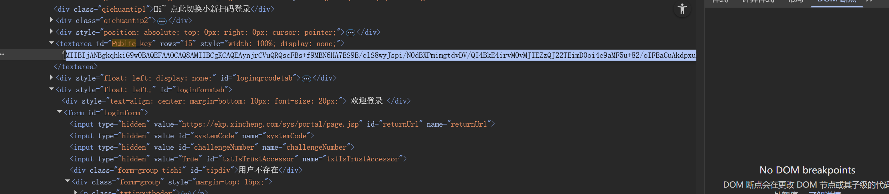

在本地复现加密流程

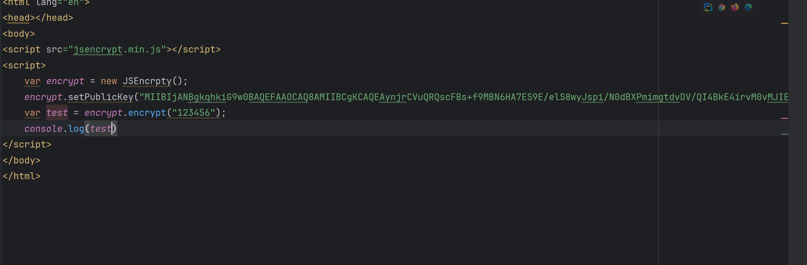

### 案例三

刷新网页，看到加密数据

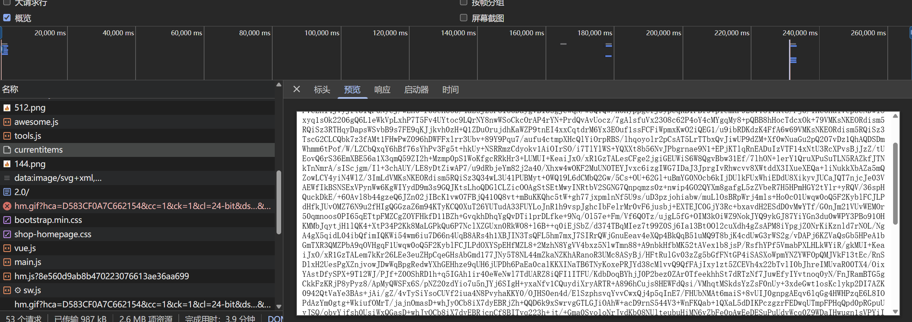

搜素地址定位加密函数

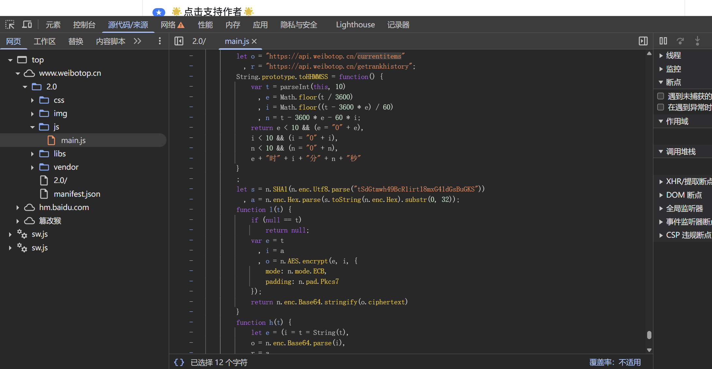

利用代码解密

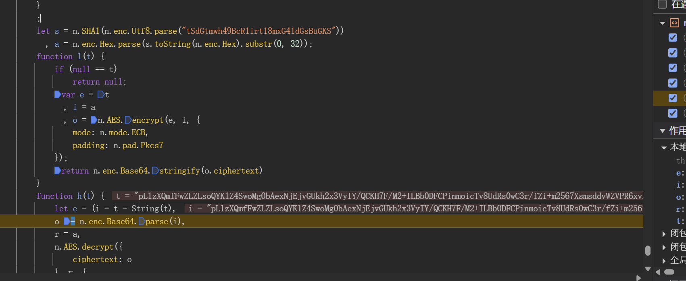