## 检测反调试方法

- 无限Debugger技术

- 键盘监听（F12）

- 检测浏览器的高度插值

- 检测开发者人员工具变量是否为true

- 利用console.log调用次数

- 利用代码运行的时间差

- 利用toString

- 检测非浏览器

## 绕过技巧

1. 禁用所有断点(自己不能使用断点)
2. 禁用局部断点
3. 设置条件断点
4. 替换文件执行（修改文件重定向）
5. 通过Burp修改匹配（流量到burp修改返回）
6. 油管猴插件配合HOOK（插件对浏览器执行JS删除）

## 案例

- 小迪吧

1. 禁用全局断点

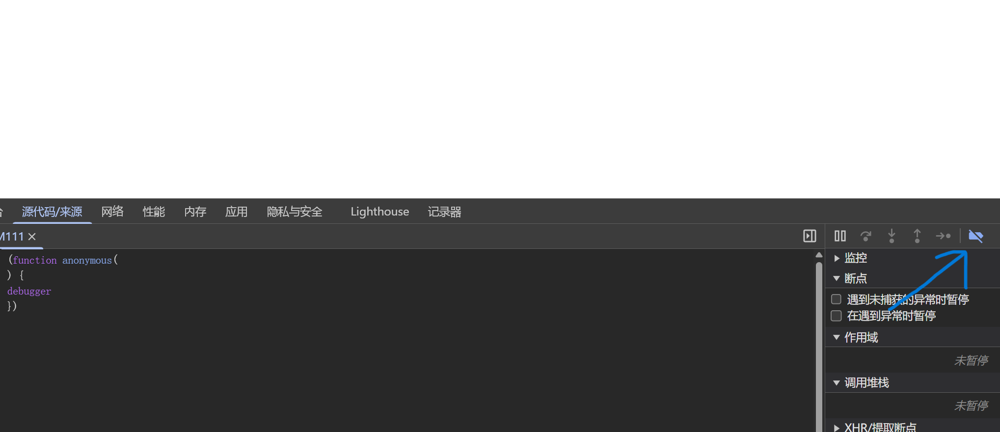

2. 禁用局部断电

- 禁用局部断电

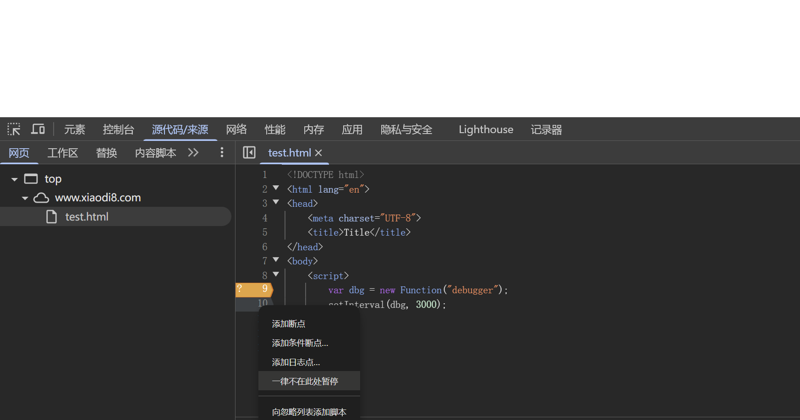

- 爬虫网站

1. 禁用局部断电

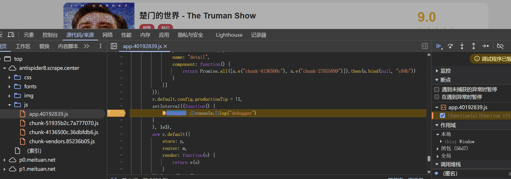

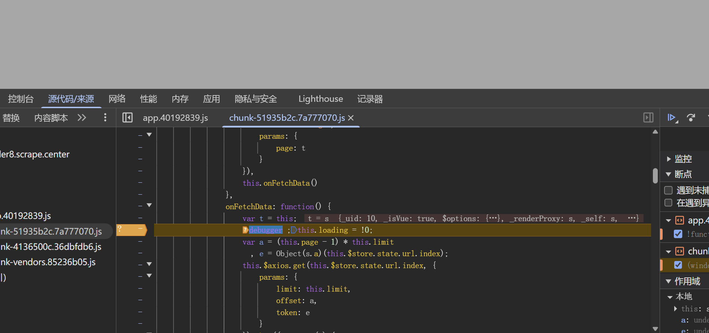

2.  设置条件断点

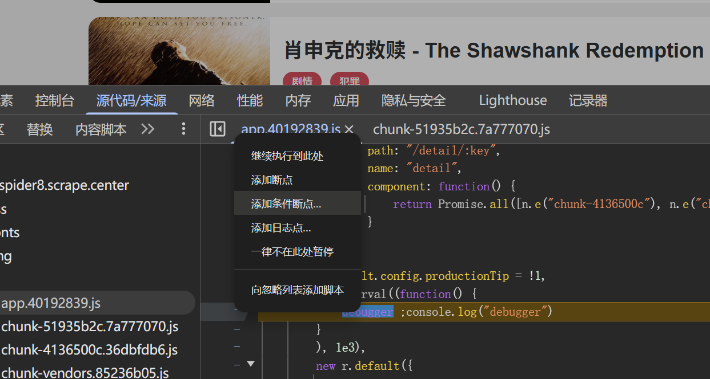

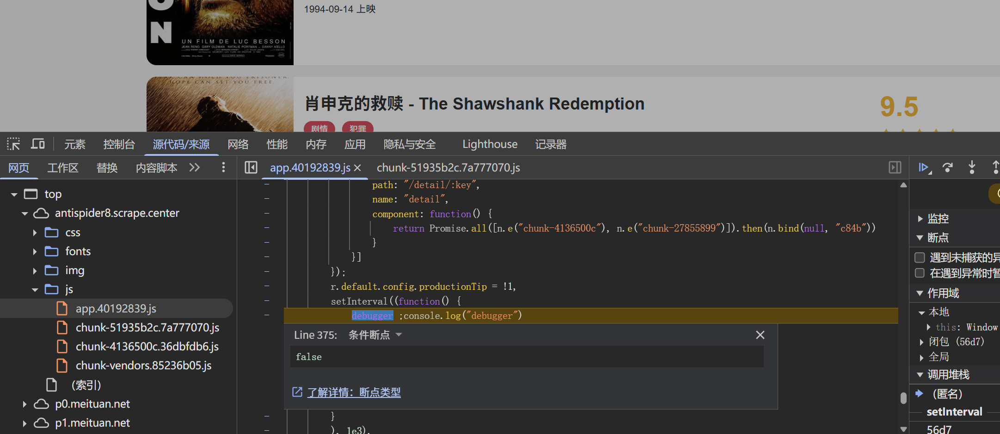

3. 文件替换

替换反调试文件

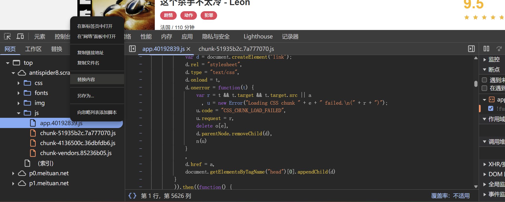

删除反调试代码, Ctrl+s保存

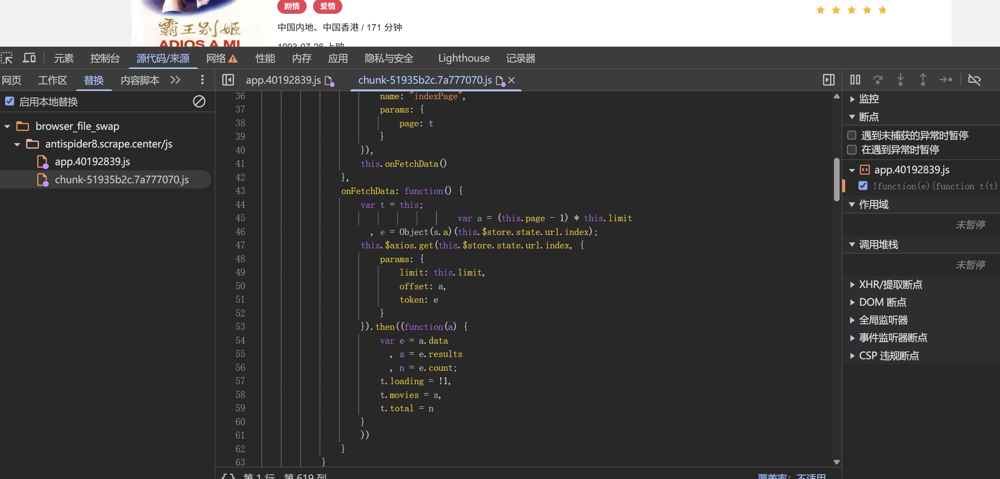

- PM2.5网站

右键被检测

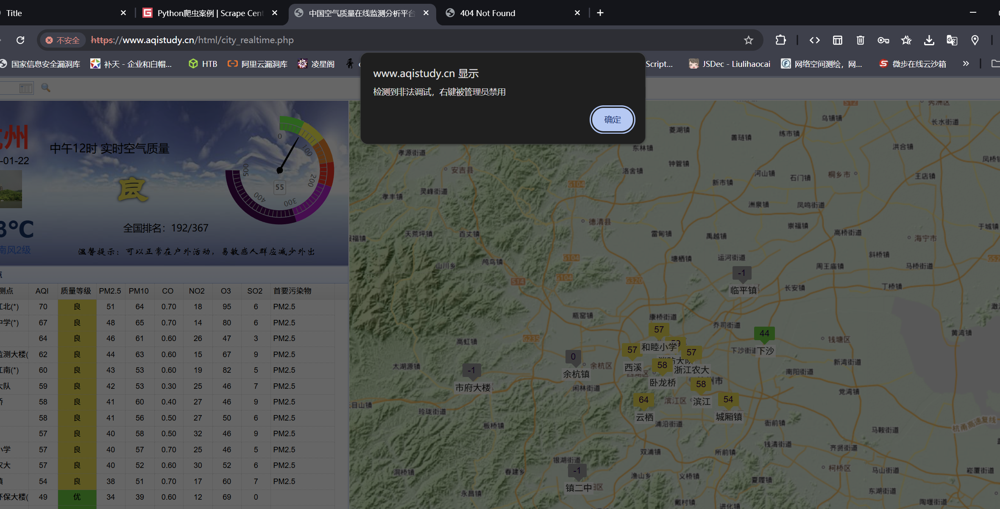

F12被检测

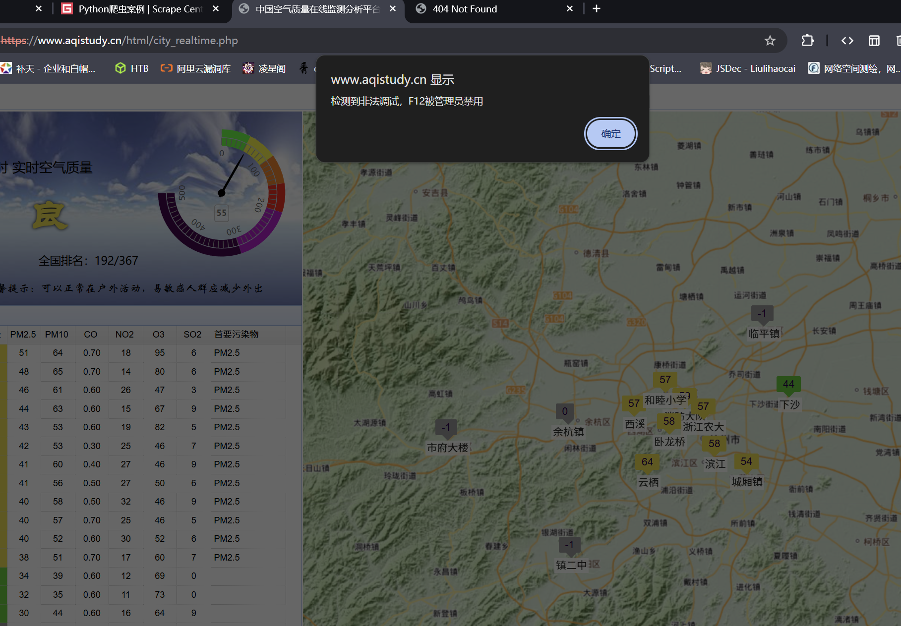

强制进入F12发现无限debug

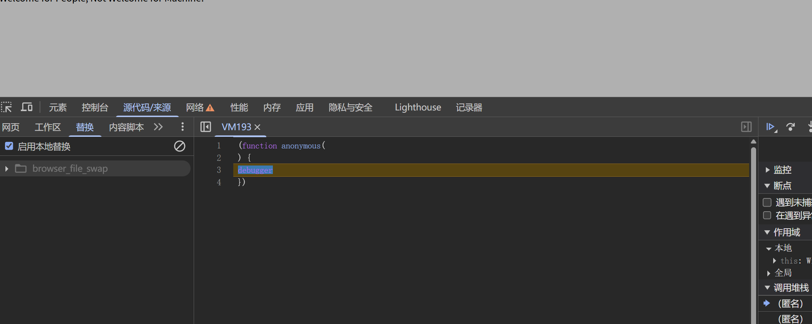

全局搜素“检测到非法调试”，没有搜到，只有虚拟机文件

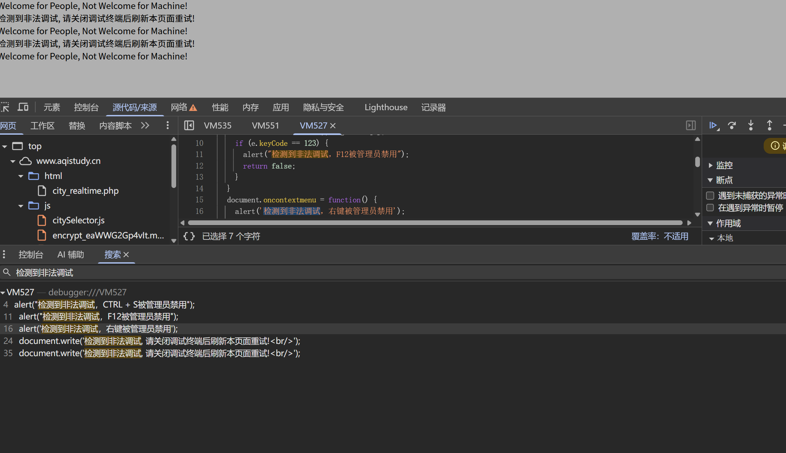

进入主站搜索，定位到反调试函数endebug

进入要突破反调试的目录级下面搜索endebug，替换文件，删除endebug

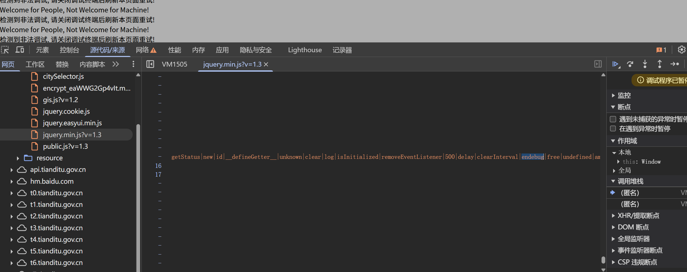

发现没有突破反调试，定位eval函数

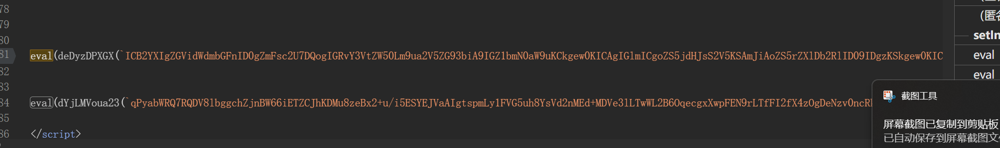

把eval里加密的内容粘贴到控制台，发现eval执行反调试代码

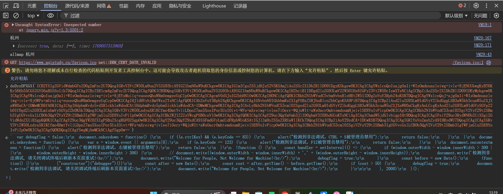

注释eval函数，局部禁用加载到虚拟机里的反调试代码，绕过成功

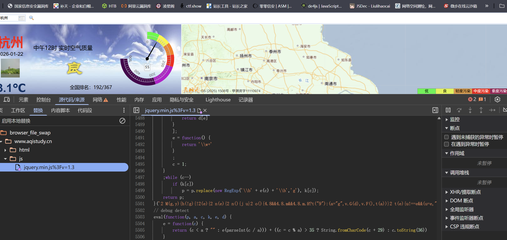

