##  前置

1. JS逆向与安全

	事实上，前端的逆向通俗来说就是在浏览器的调试器中，对存在的前端代码（这里的前端代码包括html、js、css见上图差异对比）进行分析，通过分析其逻辑获取其中的路由、加密方式、敏感信息泄露等。

*应用场景：

例子1：某登录框加密传输时，枚举爆破攻击手法
例子2：某电商前端计算折扣，逆向JS篡改价格
例子3：某操作验证码认证时，生成验证码可预测
例子4：某平台的X-Sign签名，逆向后可构造任意请求
例子5：某应用参数加密时，逆向算法可改Payload测试

2. JS文件与安全

	*前期课程用项目提取JS信息

	*前期课程用项目发现更多JS

## 开发者工具使用

1. F12面板

	网络,源代码/来源,控制台,元素等

2. 作用域

	简单来说就是运行后相关的数据值

3. 调用堆栈

	简单来说就是代码的执行逻辑顺序

4. 断点调试

*启动器调用堆栈从下往上看*

参考 https://mp.weixin.qq.com/s/E-eip5LXjGHFYmNlrNK-bg

## 案例

1. zBlog登录密码逆向

	输入账号密码，发现password字段被加密
		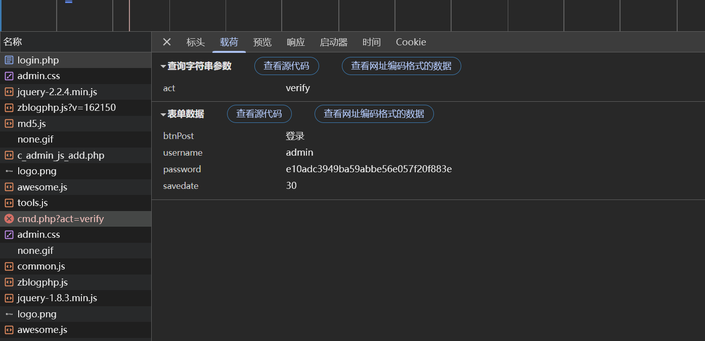

	全局搜索cmd.php?active=verify，定位到加密逻辑
		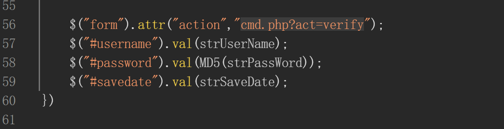

	控制台利用MD5函数加密，验证加密后参数
		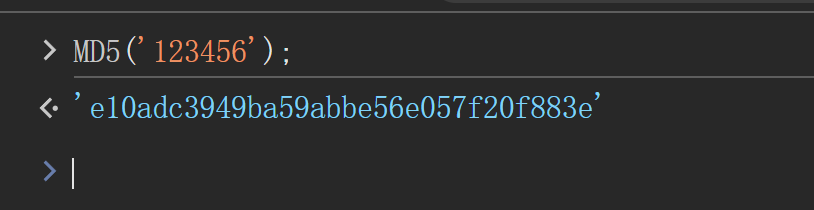

	全局搜索MD5函数，找函数逻辑
		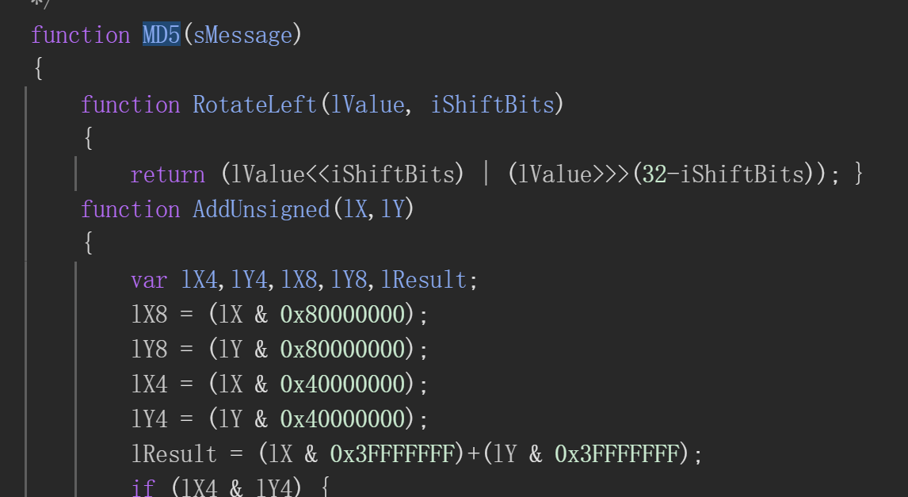

*注意：登录后会跳转到其他页面但是要在登录页面(login.php)全局搜索，不然搜不到*

2. 申通登录

	输入账号密码，发现password字段被加密
		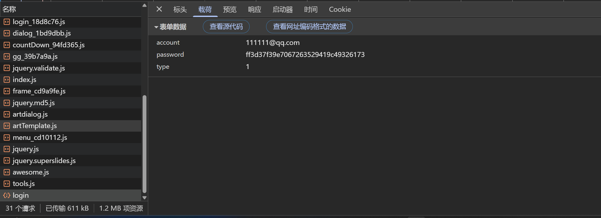

	查看启动器调用堆栈，定位加密代码
		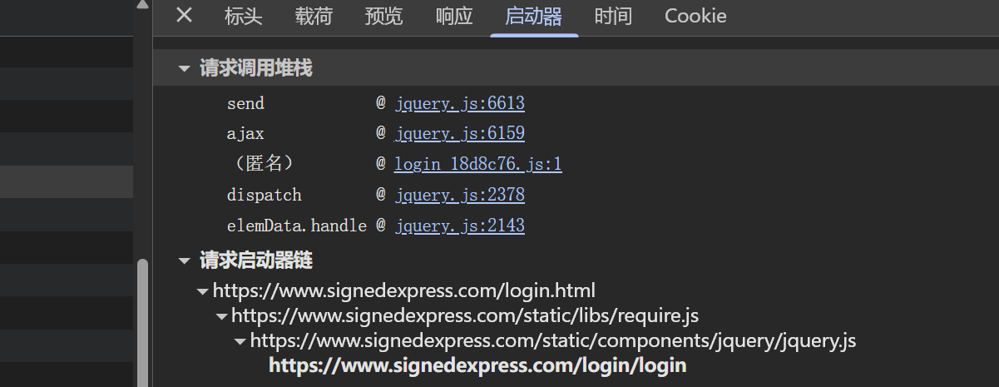

	查看匿名堆栈，定位到加密代码
		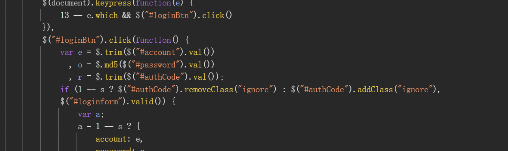

3. 交我算平台

- DOM型断点

输入账号密码登录，发现password字段加密

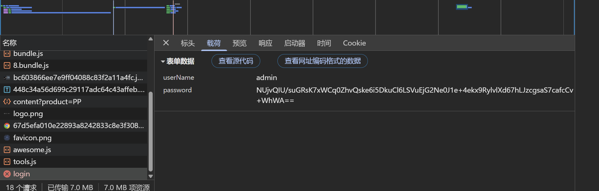

右键登录按钮，检查，添加DOM断点

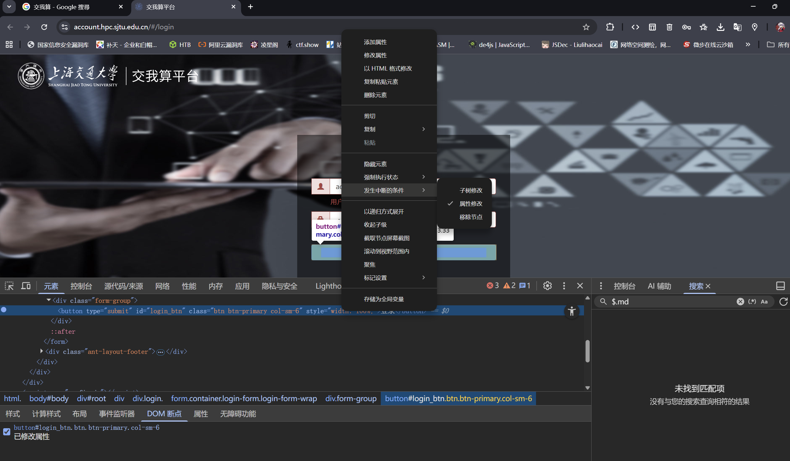

- XHR断点(地址断点)

设置XHR断点

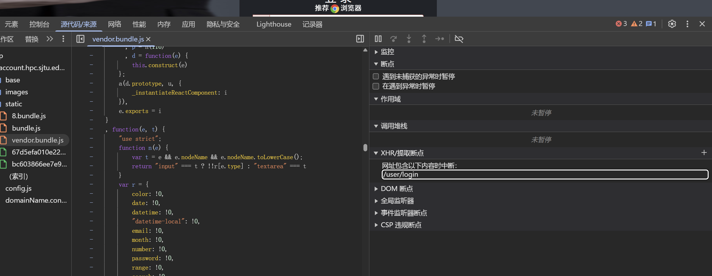

跟踪调用堆栈，寻找password没有被加密的时期

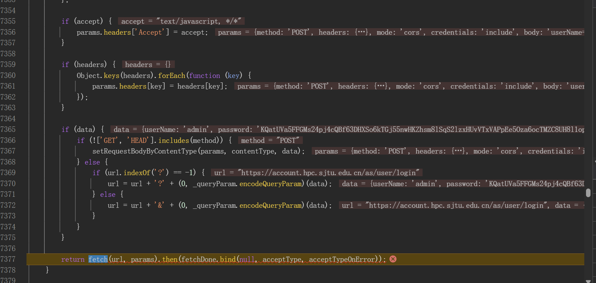

找到加密方法以及公钥

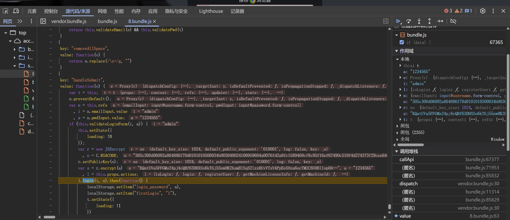