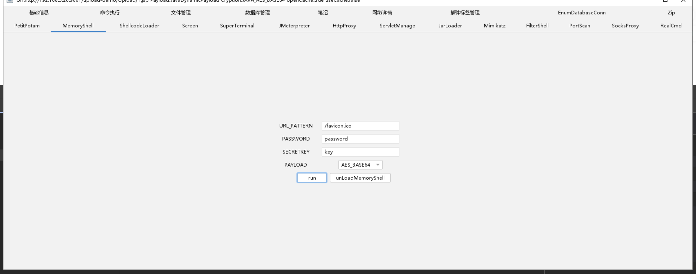
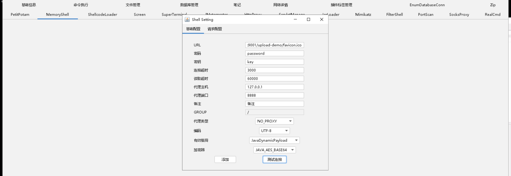

## 内存马

主要作用是维持权限，是拿到网站权限之后在植入内存马

### 分类

PHP,Java,Python,ASPX等

### Java类

1. Webshell工具：

	蚁剑，哥斯拉，冰蝎，天蝎，游魂等

2. 内存马生成项目：

	https://github.com/ReaJason/MemShellParty
	https://github.com/pen4uin/java-memshell-generator

### 工具利用

拿到网站权限之后注入内存马

连接内存马

网站目录没有实际文件

*通过漏洞执行执行Java反射逻辑，注入内存马*
