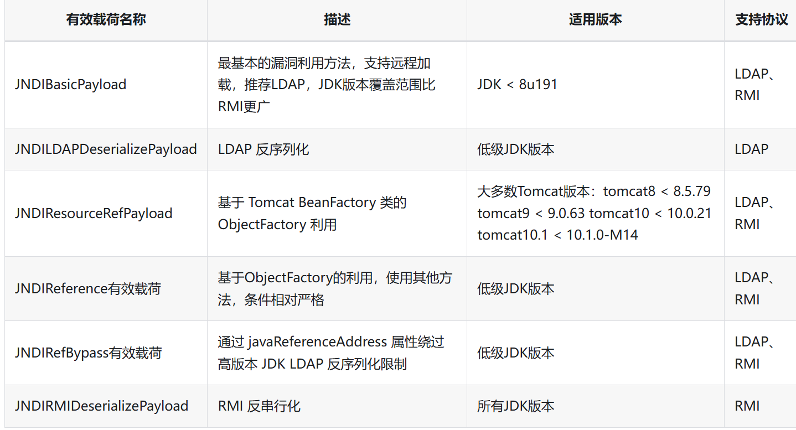

## 高版本JNDI绕过

https://tttang.com/archive/1405/

### JNDI触发

1、远程Reference链
2、本地Reference链
3、反序列化链

### 链条利用分类

1、针对JDK版本的jndi注入
2、针对中间件包的jndi注入
3、针对依赖jar包链的jndi注入

### rmi限制

com.sun.jndi.rmi.object.trustURLCodebase、com.sun.jndi.cosnaming.object.trustURLCodebase的默认值变为false，即不允许从远程的Codebase加载Reference工厂类，不过没限制本地加载类文件

### LDAP限制

com.sun.jndi.ldap.object.trustURLCodebase属性的默认值被调整为false，导致LDAP远程代码攻击方式开始失效。这里可以利用javaSerializedData属性，当javaSerializedData属性value值不为空时，本地存在反序列化利用链时触发

## 绕过总结

看项目引用了什么依赖包，利用不同的链绕过

高版本绕过只能利用本地的链，远程已经被禁用

## 项目

https://github.com/qi4L/JYso
https://github.com/X1r0z/JNDIMap
https://github.com/B4aron1/JNDIBypass
https://github.com/vulhub/java-chains
https://github.com/cckuailong/JNDI-Injection-Explo

java-chains工具

