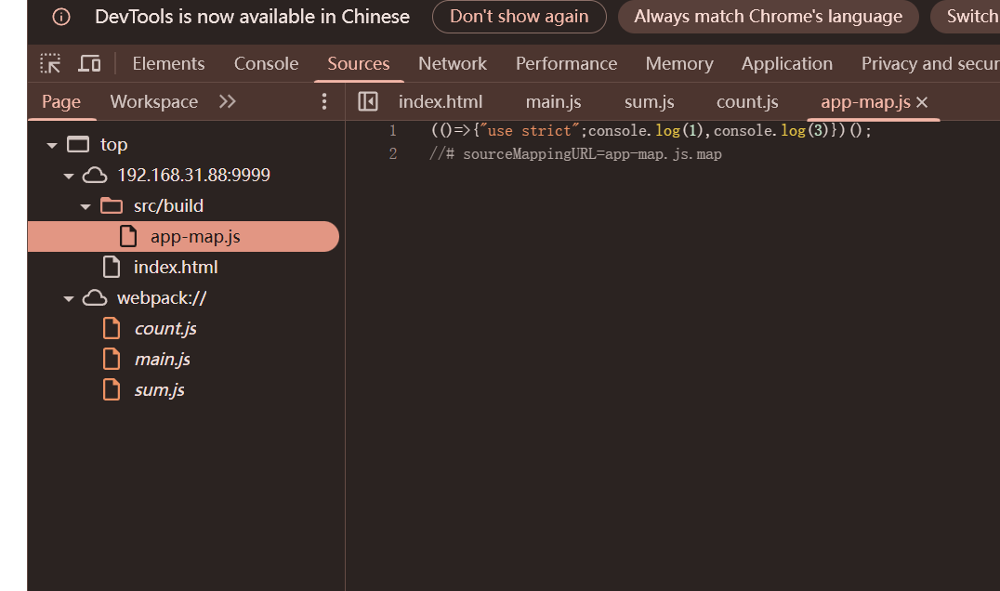

Webpack 是一个强大的模块打包工具，它主要用于将 JavaScript 代码和其他资源（如 CSS、图片、字体等）打包成浏览器能够高效加载的文件

## Webpack

sum.js

```
export default function count(x, y) {  
    return x + y  
}
```

count.js

```
export default function count(x, y) {  
    return x - y  
}
```

main.js

```
import count from "./count.js";  
import sum from "./sum.js";  
  
console.log(count(2, 1));  
console.log(sum(1, 2));
```

index.html

```
<!DOCTYPE html>  
<html lang="en">  
<head>  
    <meta charset="UTF-8">  
    <title>Title</title>  
</head>  
<body>  
  
<script src="/src/main.js"></script>  
  
</body>  
</html>
```

主页引用之后发现报错，这是就应该运用webpack打包技术

终端运行下载webpack

```
npm i webpack --dev
npm i webpack-cli --dev
```

要打包文件夹的目录下创建webpack.config.js

webpack.config.js

```
const path = require('path');  
const webpack = require('webpack');  
  
module.exports = {  
    mode: 'production', //生产环境模式  
    entry: './main.js',  
    output: {  
        path: path.resolve(__dirname, 'build'), //输出目录绝对路径  
        filename: 'app.js',  
    },  
};
```

进入打包的文件夹运行 npx webpack 产生build文件夹，build文件夹里面有app.js文件

index.html文件引用app.js,发现不报错

```
<!DOCTYPE html>  
<html lang="en">  
<head>  
    <meta charset="UTF-8">  
    <title>Title</title>  
</head>  
<body>  
  
<script src="/src/build/app.js"></script>  
  
</body>  
</html>
```

## 安全问题

### 泄露问题

#### 开发者模式

```
const path = require('path');  
const webpack = require('webpack');  
  
module.exports = {  
    mode: 'development', //开发者模式  
    entry: './main.js',  
    output: {  
        path: path.resolve(__dirname, 'build'), //输出目录绝对路径  
        filename: 'app.js',  
    },  
};
```

mode: 'development' 是开发者模式
如果打包上线仍然使用开发者模式就会报原型代码以前显示在前端文件夹造成信息泄露(webpack://文件夹)

#### devtool配置

参考 https://mp.weixin.qq.com/s/tLjSb5cinXawMEC7RfJEJQ

在使用webpack打包部署代码时，如果参数devtool配置不当，将会在部署代码文件中生成对应匹配的soucemap文件（源码映射），如果将参数devtool配置为“source-map”、“cheap-source-map”、“hidden-source-map”、“nosources-source-map”、“cheap-module-source-map”等值时，打包后将生成单独的map文件



webpack://文件会产生而且打包过后的文件会产生一个map文件，右键复制链接地址访问可下载

## map文件还原

### shuji&reverse-sourcemap

npm install --global shuji

npm install --global reverse-sourcemap

shuji app-map.js.map -o 目标文件夹

reserve-sourcemap --output-dir 目标文件夹 app-map.js.map

## map文件寻找

SourceDecetor插件


