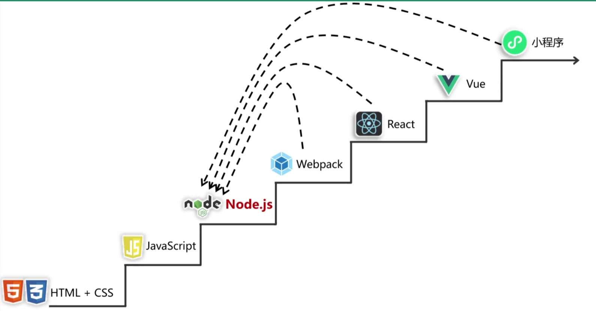

JavaScript被广泛用于Web应用开发，常用来为网页添加各式各样的动态功能,为用户提供更流畅美观的浏览效果。嵌入动态文本于HTML页面；对浏览器事件做出响应，读写HTML元素，在数据被提交到服务器之前验证数据；检测访客的浏览器信息；控制用户凭据，包括创建和修改等



## 学习文档

1、原生JS教程
https://www.w3school.com.cn/js/index.asp
2、jQuery库教程
https://www.w3school.com.cn/jquery/index.asp
3、Axios库教程
https://www.axios-http.cn/docs/intro

## 安全结合

1、发现更多的有利用价值的信息（URL、域名、路径等等）测试站、后台路径、未公开的路径、api地址等等

2、发现敏感信息（硬编码的帐号、pass、API密钥、注释等等）硬编码帐号可登录、测试帐号可被登录、密钥泄露、注释中开发信息等等

3、发现危险的代码（eval、dangerouslySetInnerHTML等等）URL跳转，XSS跨站、模版注入（SSTI）等

4、了解网站的逻辑校验功能前端检测，加密逆向，数据走向等

## Ajax技术

1、数据交换：通过AJAX可给服务器发送请求，并获取服务器响应的数据

2、后台发送：浏览器的请求是后台js发送给服务器的，js会创建单独的线程发送异步请求，这个线程不会影响浏览器的线程运行。

3、局部刷新：浏览器接收到结果以后进行页面局部刷新

### 原生实现

```
<script type="text/javascript">  
    var xhttp = new XMLHttpRequest();  
    xhttp.open("GET", "1.txt", true);  
    xhttp.send();  
    xhttp.onreadystatechange = function() {  
        if(xhttp.readyState == 4 && xhttp.status == 200){  
            console.log(xhttp.responseText);  
        }  
    }  
</script>
```


### JQuery库实现

```
<script src="jquery.js"></script>  
<script>  
    $.ajax({  
        method: "GET",  
        url: "1.txt",  
        dataType: "text",  
        success: function(response) {  
            console.log(response);  
        }  
    })  
</script>
```

#### 实现代码登录请求

login.html

```
<script src="jquery-3.7.1.min.js"></script>  
<script>  
  $("button").click(function (){  
    $.ajax({  
      type: 'POST',  
      url: 'login.php',  
      data: {  
        username:$('.user').val(),  
        password:$('.pass').val()  
      },  
      dataType: 'json',  
      success: function (data) {  
        console.log(data);  
        if (data['infoCode']==1){  
          alert('登录成功!');  
        }else{  
          alert('登录失败!');  
        }  
      }  
    });  
  });
```

login.php

```
<?php  
  
$user=@$_POST['username'];  
$pass=@$_POST['password'];  
$success=array('msg'=>'ok');  
if($user=="qiyi"&&$pass=="123456"){  
    $success['infoCode']=1;  
} else {  
    $success['infoCode']=0;  
}  
echo json_encode($success);
```

### Axios

```
<script src="https://cdn.jsdelivr.net/npm/axios/dist/axios.min.js"></script>  
<script>  
    axios({  
        method: 'GET',  
        url: '1.txt',  
    }).then(function(response){  
        console.log(response.data);  
    })  
  
    axios.get('1.txt').then(function(response){console.log(response.data);})  
</script>
```

#### 实现代码登录请求

```
<script src="axios.min.js"></script>  
<script>  
  axios({  
    method: "POST",  
    url: "login.php",  
    data: {  
      firstName: $('.user').val(),  
      lastName: $('.pass').val(),  
    }.fail(function(res){  
      alert(res);  
    }).success(function(res){  
      if(res==1){  
        alert("登录成功");  
      }else {  
        alert("登陆失败");  
      }  
    })  
  })  
</script>
```

php代码同login.php

## 安全

前端校验安全性脆弱，burpsuite拦截之后修改请求包和响应包都可以绕过
