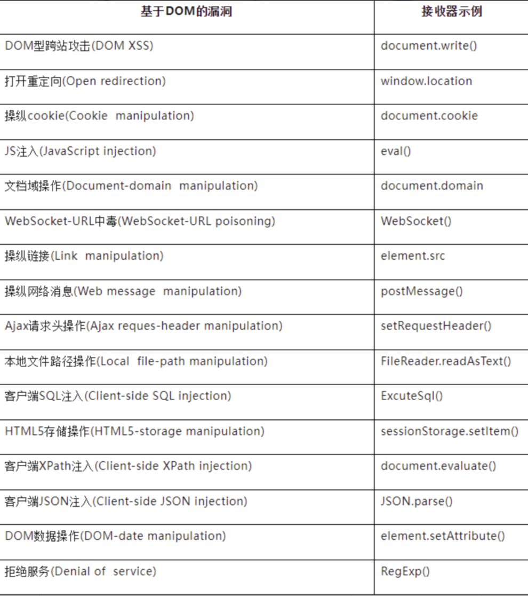

## DOM (Document Object Model)文档对象模型：

1、访问文档：可以动态获取和修改页面上的内容

2、修改文档结构：可以添加、删除、移动或替换元素

3、处理事件：为页面元素绑定和响应交互事件(如点击、悬停等)




DOM案例

```
<a id="a" href="http://www.xiaodi8.com">点我</a>  
<script>  
  document.getElementById('a').href="https://www.baidu.com"  
</script>  
  
<button id="f">点我</button>  
<script>  
  var f = document.getElementById("f");  
  f.onclick=function(){  
    alert("xxx")
```

## BOM (Browser Object Model)浏览器对象模型：

1、使用Window对象对浏览器打开关闭返回新建进行操作。

2、使用Screen对象窗口的screen属性包含有关客户端显示屏的信息。

3、使用Navigator对象指浏览器对象，包含浏览器的信息。

4、使用Location对象Location对象包含有关当前URL的信息

5、使用History对象包含用户访问过的URL，经常使用于页面跳转。

6、使用Document对象指文档对象，既属于BOM对象，也属于DOM对象

```
<script>  
  window.open("http://www.xiaodi8.com")  
  console.log(screen.height)  
  console.log(screen.width)  
  console.log(location)  
  console.log(navigator)  
</script>
```

## 安全问题

DOM-XSS URL重定向等

参考：https://mp.weixin.qq.com/s/iUlMYdBiOrI8L6Gg2ueqLg

## 案例

参考https://xz.aliyun.com/t/12499