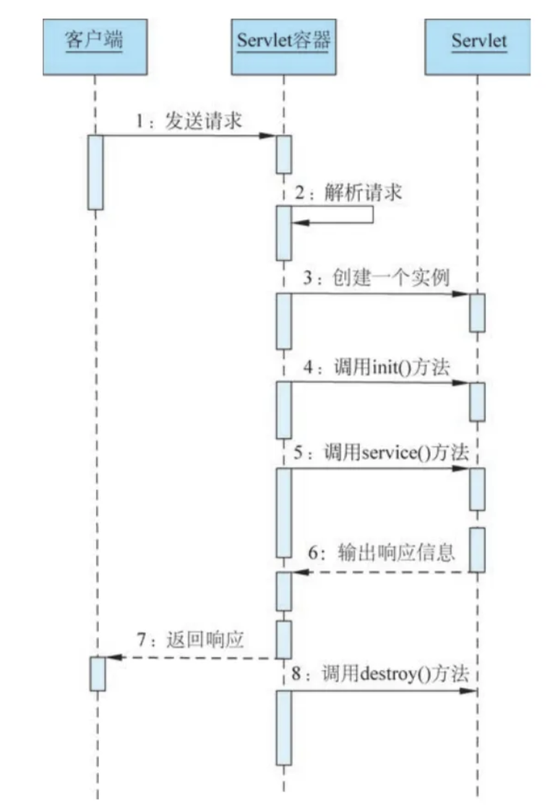
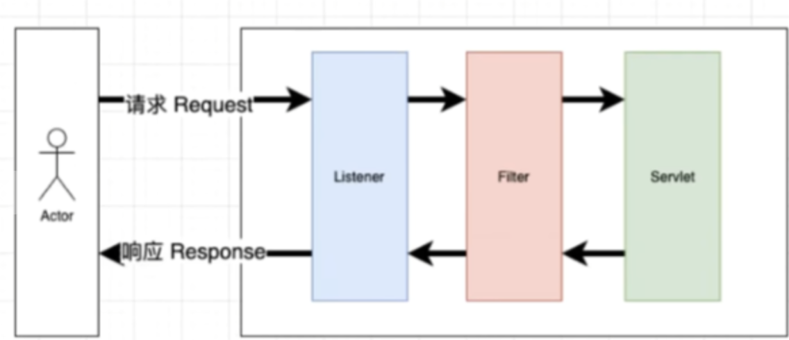

Servlet是运行在Web服务器或应用服务器上的程序,它是作为来自Web浏览器或其他HTTP客户端的请求和HTTP服务器上的数据库或应用程序之间的中间层。使用Servlet可以收集来自网页表单的用户输入，呈现来自数据库或者其他源的记录，还可以动态创建网页。本章内容详细讲解了web开发的相关内容以及servlet相关内容的配置使用,是JAVAEE开发的重中之重

## Servlet



IndexServlet.java

```
package com.example.demo;  
  
import javax.servlet.ServletException;  
import javax.servlet.http.HttpServlet;  
import javax.servlet.http.HttpServletRequest;  
import javax.servlet.http.HttpServletResponse;  
import java.io.IOException;  
  
public class IndexServlet extends HttpServlet {  
    @Override  
    public void init() throws ServletException {  
        System.out.println("初始化信息");  
    }  
  
    @Override  
    protected void doGet(HttpServletRequest req, HttpServletResponse resp) throws ServletException, IOException {  
        System.out.println("get访问完成");  
    }  
  
    @Override  
    protected void doPost(HttpServletRequest req, HttpServletResponse resp) throws ServletException, IOException {  
        System.out.println("post访问完成");  
    }  
  
    @Override  
    public void destroy() {  
        System.out.println("销毁完成");  
    }  
}
```

### 配置路由

配置路由后才可以正确解析访问Servlet，有两种配置路由的方法

#### web.xml配置路由

```
<?xml version="1.0" encoding="UTF-8"?>  
<web-app xmlns="http://xmlns.jcp.org/xml/ns/javaee"  
         xmlns:xsi="http://www.w3.org/2001/XMLSchema-instance"  
         xsi:schemaLocation="http://xmlns.jcp.org/xml/ns/javaee http://xmlns.jcp.org/xml/ns/javaee/web-app_4_0.xsd"  
         version="4.0">  
        <servlet>  
        <servlet-name>index</servlet-name>  
        <servlet-class>com.example.demo.IndexServlet</servlet-class>  
    </servlet>    <servlet-mapping>        <servlet-name>index</servlet-name>  
        <url-pattern>/index</url-pattern>  
    </servlet-mapping>    </web-app>
```

## @WebServlet标签

```
@WebServlet(name="index", value="/index")  
public class IndexServlet extends HttpServlet {  
    @Override  
    public void init() throws ServletException {  
        System.out.println("初始化信息");  
    }  
  
    @Override  
    protected void doGet(HttpServletRequest req, HttpServletResponse resp) throws ServletException, IOException {  
        String name = req.getParameter("name");  
        resp.setContentType("text/html;charset=utf-8");  
        PrintWriter out = resp.getWriter();  
        out.println(name);  
        System.out.println("get访问完成");  
    }  
  
    @Override  
    protected void doPost(HttpServletRequest req, HttpServletResponse resp) throws ServletException, IOException {  
        System.out.println("post访问完成");  
    }  
  
    @Override  
    public void destroy() {  
        System.out.println("销毁完成");  
    }  
}
```

### get&post传参

```
package com.example.demo;  
  
import javax.servlet.ServletException;  
import javax.servlet.annotation.WebServlet;  
import javax.servlet.http.HttpServlet;  
import javax.servlet.http.HttpServletRequest;  
import javax.servlet.http.HttpServletResponse;  
import java.io.IOException;  
import java.io.PrintWriter;  
  
  
@WebServlet(name="index", value="/index")  
public class IndexServlet extends HttpServlet {  
    @Override  
    public void init() throws ServletException {  
        System.out.println("初始化信息");  
    }  
  
    @Override  
    protected void doGet(HttpServletRequest req, HttpServletResponse resp) throws ServletException, IOException {  
        String name = req.getParameter("name");  
        resp.setContentType("text/html;charset=utf-8");  
        PrintWriter out = resp.getWriter();  
        out.println(name);  
        System.out.println("get访问完成");  
    }  
  
    @Override  
    protected void doPost(HttpServletRequest req, HttpServletResponse resp) throws ServletException, IOException {  
        System.out.println("post访问完成");  
        String name = req.getParameter("name");  
        resp.setContentType("text/html;charset=utf-8");  
        PrintWriter out = resp.getWriter();  
        out.println(name);  
    }  
  
    @Override  
    public void destroy() {  
        System.out.println("销毁完成");  
    }  
}
```

### 生命周期

快捷键：alt+insert

写入内置方法(init service(doget dopost等) destroy )

## 过滤器&监听器



### Filter

Filter被称为过滤器，过滤器实际上就是对Web资源进行拦截，做一些处理后再交给下一个过滤器或Servlet处理，通常都是用来拦截request进行处理的，也可以对返回的 response进行拦截处理。开发人员利用filter技术，可以实现对所有Web资源的管理，例如实现权限访问控制、过滤敏感词汇、压缩响应信息等一些高级功能

XssFilter.java
```
package com.example.demo.Filter;  
  
  
import javax.servlet.*;  
import javax.servlet.http.HttpServletRequest;  
import java.io.IOException;  
  
public class XSsFilter implements Filter {  
    @Override  
    public void init(FilterConfig filterConfig) throws ServletException {  
        System.out.println("xssfilter init");  
    }  
  
    @Override  
    public void destroy() {  
        System.out.println("xssfilter destroy");  
    }  
  
    @Override  
    public void doFilter(ServletRequest servletRequest, ServletResponse servletResponse, FilterChain filterChain) throws IOException, ServletException {  
        System.out.println("xssfilter doFilter");  
        HttpServletRequest request = (HttpServletRequest) servletRequest;  
        request.setCharacterEncoding("UTF-8");  
        String name = request.getParameter("name");  
        if(!name.contains("script")){  
            //放行数据  
            filterChain.doFilter(servletRequest, servletResponse);  
        } else {  
            System.out.println("found xss");  
        }  
    }  
}
```

#### 两种配置路由方式

##### web.xml

```
<?xml version="1.0" encoding="UTF-8"?>  
<web-app xmlns="http://xmlns.jcp.org/xml/ns/javaee"  
         xmlns:xsi="http://www.w3.org/2001/XMLSchema-instance"  
         xsi:schemaLocation="http://xmlns.jcp.org/xml/ns/javaee http://xmlns.jcp.org/xml/ns/javaee/web-app_4_0.xsd"  
         version="4.0">  
  
    <filter>  
        <filter-name>xss</filter-name>  
        <filter-class>com.example.demo.Filter.XSsFilter</filter-class>  
    </filter>    <filter-mapping>        <filter-name>xss</filter-name>  
        <url-pattern>/index</url-pattern>  
    </filter-mapping>  
</web-app>
```

##### @WebFilter标签

```
@WebFilter(filterName = "xssfilter", value = "/index")  
public class XSsFilter implements Filter {  
    @Override  
    public void init(FilterConfig filterConfig) throws ServletException {  
        System.out.println("xssfilter init");  
    }  
  
    @Override  
    public void destroy() {  
        System.out.println("xssfilter destroy");  
    }  
  
    @Override  
    public void doFilter(ServletRequest servletRequest, ServletResponse servletResponse, FilterChain filterChain) throws IOException, ServletException {  
        System.out.println("xssfilter doFilter");  
        HttpServletRequest request = (HttpServletRequest) servletRequest;  
        request.setCharacterEncoding("UTF-8");  
        String name = request.getParameter("name");  
        if(!name.contains("script")){  
            //放行数据  
            filterChain.doFilter(servletRequest, servletResponse);  
        } else {  
            System.out.println("found xss");  
        }  
    }  
}
```

***filter的init方法是在程序启动执行***

#### 安全场景

Payload检测，权限访问控制，红队内存马植入，蓝队清理内存马等

### Listener

同过滤器