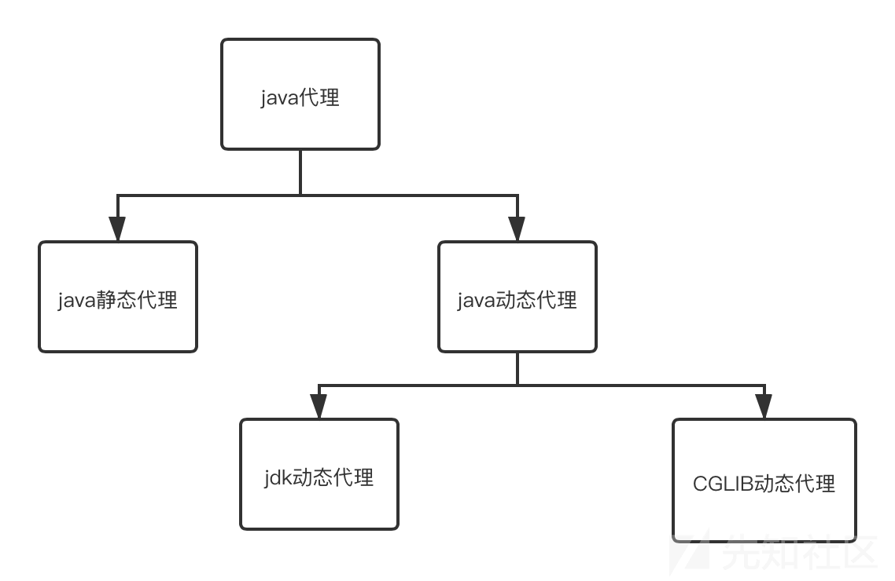
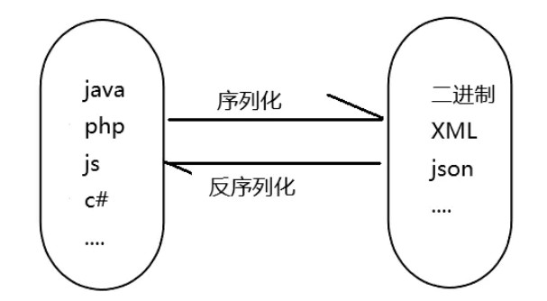
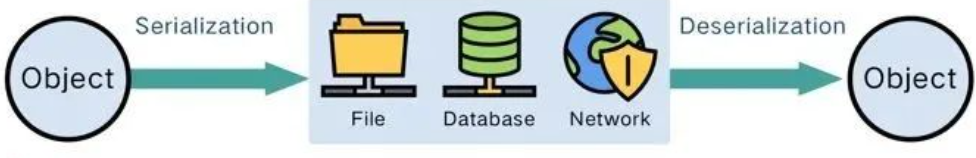

## 动态代理

代理模式Java当中最常用的设计模式之一。其特征是代理类与委托类有同样的接口，代理类主要负责为委托类预处理消息、过滤消息、把消息转发给委托类，以及事后处理消息等。而Java的代理机制分为静态代理和动态代理，而这里我们主要重点学习java自带的jdk动态代理机制

1、创建接口及定义方法

2、实现接口及定义方法操作

3、实现接口及重写invoke方法

4、创建代理对象并调用方法

安全总结：利用条件分析&执行invoke

安全案例：Ysoserial-CC1链-LazyMap

### 例子总结

User

```
public interface User {  
    void sayqiyi(String msg);  
  
}
```

UserImpt

```
import java.lang.reflect.InvocationHandler;  
import java.lang.reflect.Method;  
  
public class UserImpt implements User {  
    @Override  
    public void sayqiyi(String msg) {  
        System.out.println("hi, i am " + msg);  
    }  
}
```

UserImptHandle

```
import java.lang.reflect.InvocationHandler;  
import java.lang.reflect.Method;  
  
public class UserImptHandle implements InvocationHandler {  
  
    Object object;  
    UserImptHandle(Object object) {  
        this.object = object;  
    }  
  
    @Override  
    public Object invoke(Object proxy, Method method, Object[] args) throws Throwable {  
        System.out.println("hello"+"i am" + args[0]);  
        Object invoke = method.invoke(object, args);  
        System.out.println("ok you are my baby");  
        return invoke;  
    }  
}
```

UserProxy

```
import java.lang.reflect.Proxy;  
  
public class UserProxy {  
    public static void main(String[] args) {  
        UserImpt userImpt = new UserImpt();  
        UserImptHandle userImptHandle = new UserImptHandle(userImpt);  
        User proxy = (User) Proxy.newProxyInstance(  
                UserImpt.class.getClassLoader(),  
                new Class<?>[]{User.class},  
                userImptHandle  
        );  
        proxy.sayqiyi("qiyi");  
    }  
}
```

***总结：看proxy最后一个参数调用哪个handle，handle内置invoke方法执行***

## 序列化与反序列化

User类

```
import java.io.Serializable;  
  
public class User implements Serializable {  
    public String name;  
    public int age;  
    public String gender;  
    public String address;  
  
    public User(String name, int age, String gender, String address) {  
        this.name = name;  
        this.age = age;  
        this.gender = gender;  
        this.address = address;  
    }  
  
    @Override  
    public String toString() {  
       return "name" + " " + name + " age" + age + " gender" + gender + " address" + address;  
    }  
}
```
  

   

### 原生序列化代码

```
import java.io.FileOutputStream;  
import java.io.IOException;  
import java.io.ObjectOutputStream;  
import java.io.OutputStream;  
  
public class SerializeTest {  
    public static void main(String[] args) throws IOException {  
        User user = new User("qiyi", 19, "male", "hlju");  
        Serialize(user);  
    }  
  
    public static void Serialize(Object obj) throws IOException {  
        ObjectOutputStream objectOutputStream = new ObjectOutputStream(new FileOutputStream("ser.txt"));  
        objectOutputStream.writeObject(obj);  
    }  
}
```

### 原生反序列化

```
import java.io.FileInputStream;  
import java.io.IOException;  
import java.io.ObjectInputStream;  
  
public class UnSerialize {  
    public static void main(String[] args) throws IOException, ClassNotFoundException {  
        Object deserialize = deserialize("ser.txt");  
        System.out.println(deserialize);  
    }  
    public static Object deserialize(String fileName) throws IOException, ClassNotFoundException {  
        ObjectInputStream objectInputStream = new ObjectInputStream(new FileInputStream(fileName));  
        Object o = objectInputStream.readObject();  
        return o;  
    }  
}
```

### 常见的协议

• JAVA内置的writeObject()/readObject()

• JAVA内置的XMLDecoder()/XMLEncoder

• XStream

• SnakeYaml

• FastJson

• Jackson

### 常见函数

JAVA内置的writeObject()/readObject()内置原生写法分析：

writeObject():主要用于将 Java 对象序列化为字节流并写入输出流

readObject():主要用于从输入流中读取字节序列反序列化为 Java 对象

FileInputStream：其主要作用是从文件读取字节数据

FileOutputStream：其主要作用是将字节数据写入文件

ObjectInputStream：用于从输入流中读取对象，实现对象的反序列化操作

ObjectOutputStream：用于将对象并写入输出流的类，实现对象的序列化操作

### 利用

• 看序列化的对象有没有重写readObject方法（危险代码）

• 看序列化的对象有没有被输出就会调用toString方法（危险代码）

• 其他类的readObject或toString方法（反序列化类可控）

### 利用链

(1) 入口类的readObject直接调用危险方法

(2) 入口参数中包含可控类，该类有危险方法，readObject时调用

(3) 入口类参数包含可控类，该类又调用其他有危险方法类，readObject调用

(4) 构造函数/静态代码块等类加载时隐式执行

### 利用条件

(1) 可控的输入变量进行了反序列化操作

(2) 实现了Serializable或者Externalizable接口的类的对象

(3) 能找到调用方法的危险代码或间接的利用链引发（依赖链）