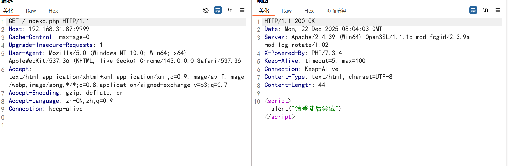
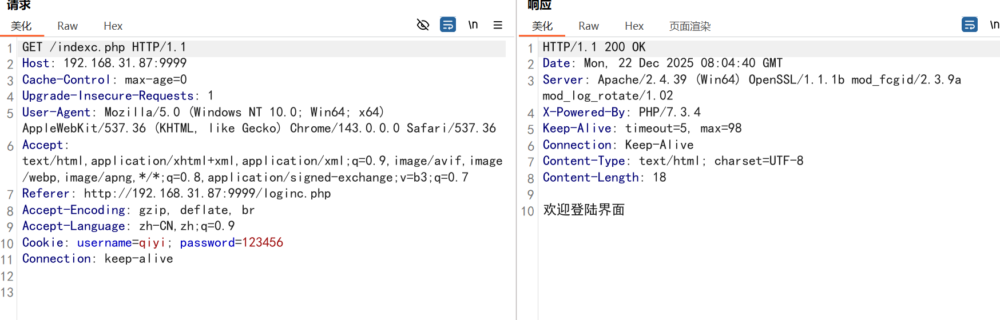
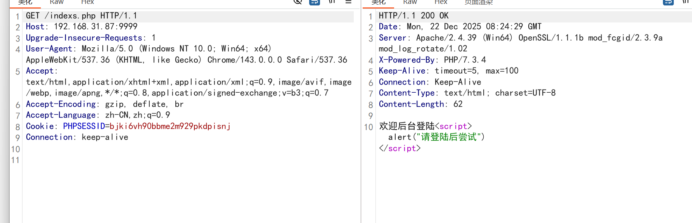
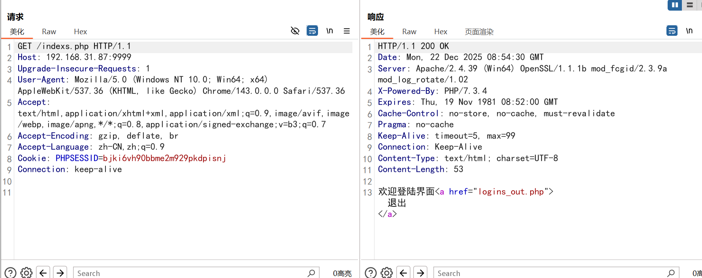
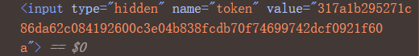
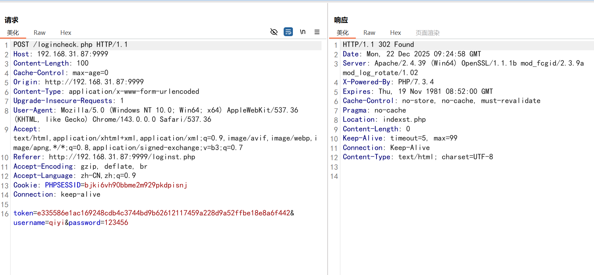

login.php
```
<?php  
/*  
 1.连接数据库  
 2.选择数据库中的表  
 3.选择提交的用户密码  
 4.执行sql语句判断用户密码是否正确  
*/  
include 'config.php';  
$user = @$_POST['username'];  
$pass = @$_POST['password'];  
$coon = mysqli_connect(DB_HOST, DB_USER, DB_PASS, DB_NAME);  
$sql = "SELECT * FROM admin where username = '$user' and password = '$pass';";  
$data = mysqli_query($coon, $sql);  
if($_SERVER["REQUEST_METHOD"] == "POST"){  
    if (mysqli_num_rows($data) > 0) {  
        echo "<script>alert('登陆成功');</script>')";  
        header("Location: index.php");  
        exit();  
    } else {  
        echo "<script>alert('用户名密码错误');</script>')";  
    }  
}
```

index.php
```
<?php  
echo "欢迎后台登陆";
```

直接访问index.php就跳过了登录，后台很多文件登录之后才可以访问呢，怎么判断用户登没登陆过由此引出 *cookie session token*  

## Cookie

loginc.php

```
<?php  
/*  
 1.连接数据库  
 2.选择数据库中的表  
 3.选择提交的用户密码  
 4.执行sql语句判断用户密码是否正确  
*/  
include 'config.php';  
$user = @$_POST['username'];  
$pass = @$_POST['password'];  
$coon = mysqli_connect(DB_HOST, DB_USER, DB_PASS, DB_NAME);  
$sql = "SELECT * FROM admin where username = '$user' and password = '$pass';";  
$data = mysqli_query($coon, $sql);  
if($_SERVER["REQUEST_METHOD"] == "POST"){  
    if (mysqli_num_rows($data) > 0) {  
        //登陆成功  
        $expire = time() + 60 * 60 * 24 * 30;  
        setcookie("username", $user, $expire, '/');  
        setcookie("password", $pass, $expire, '/');  
        echo "<script>alert('登陆成功');</script>')";  
        header("Location: indexc.php");  
        exit();  
    } else {  
        echo "<script>alert('用户名密码错误');</script>')";  
    }  
}
```

indexc.php

```
<?php  
if(@$_COOKIE['username']=='qiyi' and @$_COOKIE['password']=='123456'){  
    echo '欢迎登陆界面';  
    echo '<a href="loginc_out.php">退出</a>';  
} else {  
    echo '<script>alert("请登陆后尝试")</script>';  
}
```

loginc_out.php

```
<?php  
setcookie('username','',time() - 3600,'/');  
setcookie('password','',time() - 3600,'/');  
  
header('location:loginc.php');  
exit;
```

增加cookie验证，一下是数据包

无cookie数据包



有cookie数据包



cookie存储客户端(容易被窃取)

session存储服务端(更安全)

## Session

logins.php

```
<?php  
/*  
 1.连接数据库  
 2.选择数据库中的表  
 3.选择提交的用户密码  
 4.执行sql语句判断用户密码是否正确  
*/  
include 'config.php';  
$user = @$_POST['username'];  
$pass = @$_POST['password'];  
$coon = mysqli_connect(DB_HOST, DB_USER, DB_PASS, DB_NAME);  
$sql = "SELECT * FROM admin where username = '$user' and password = '$pass';";  
$data = mysqli_query($coon, $sql);  
if($_SERVER["REQUEST_METHOD"] == "POST"){  
    if (mysqli_num_rows($data) > 0) {  
        //登陆成功  
        session_start();  
        $_SESSION['username'] = $user;  
        $_SESSION['password'] = $pass;  
        echo "<script>alert('登陆成功');</script>')";  
        header("Location: indexs.php");  
        exit();  
    } else {  
        echo "<script>alert('用户名密码错误');</script>')";  
    }  
}
```

indexs.php

```
<?php  
session_start();  
if (@$_SESSION['username'] == 'qiyi' and @$_SESSION['password'] == '123456') {  
    echo '欢迎登陆界面';  
    echo '<a href="logins_out.php">退出</a>';  
} else {  
    echo '<script>alert("请登陆后尝试")</script>';  
}
```

logins_out.php

```
<?php  
session_start();  
session_unset();  
session_destroy();  
  
header('Location: logins.php');  
exit;
```

***使用session一定要写session_start***

session值存储在服务端

无session数据包



有session数据包



主要看服务端存不存在PHPSESSID值的session文件

## Token

***防爆破***

前端页面存在以下代码



数据包中存在token值



服务端会先存储token值，且每一次用户刷新token值会改变，服务端会先验证token值是否匹配从而防止爆破

只能看代码是否有漏洞(如token值可重复利用，算法可逆向)进行突破