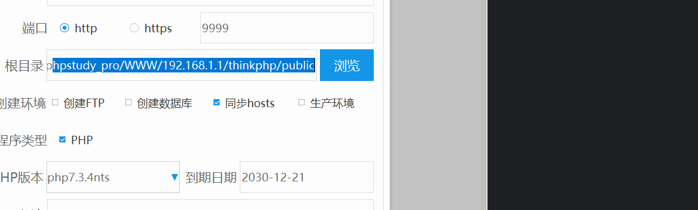
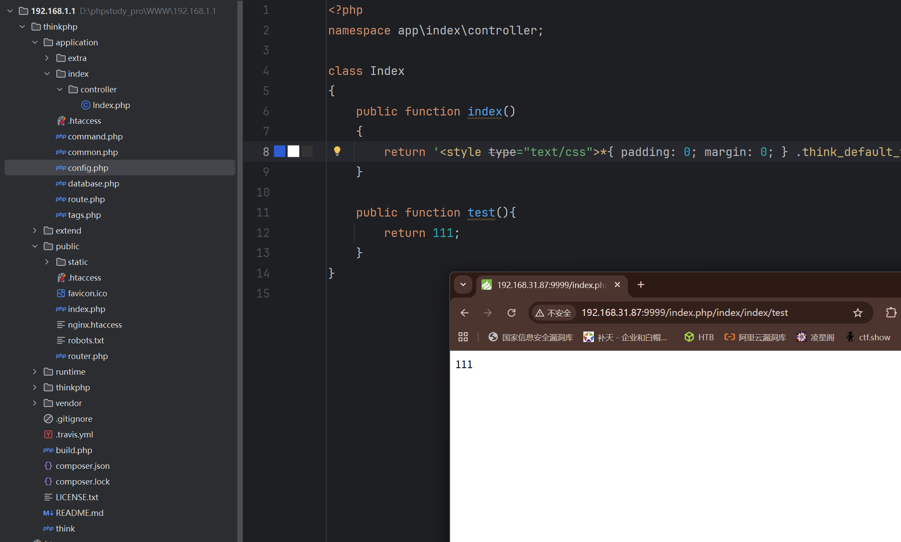
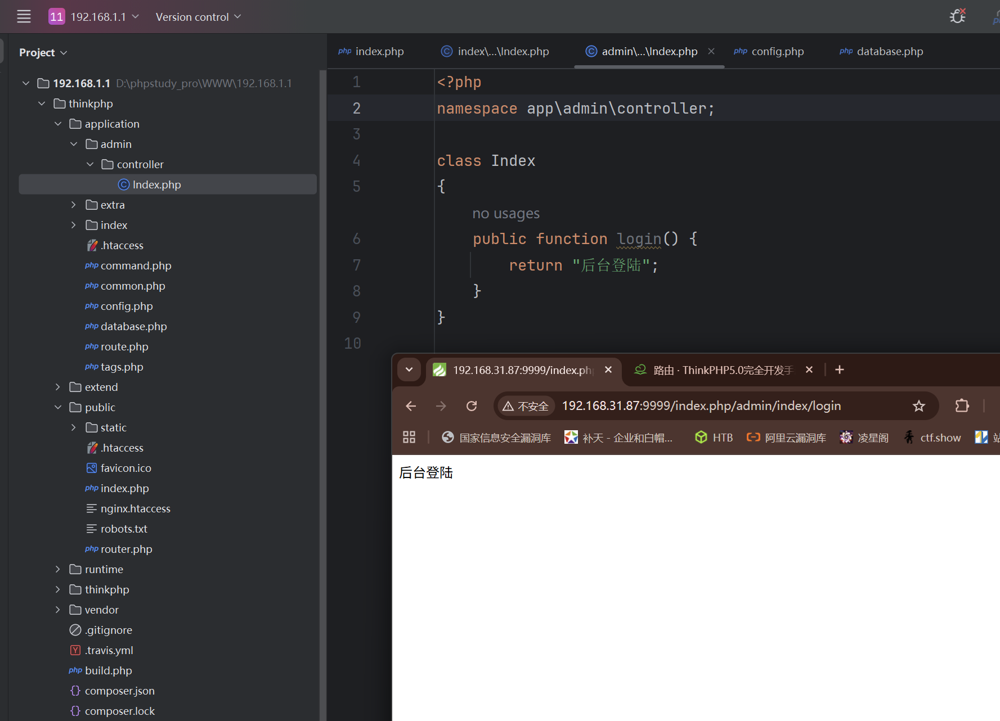
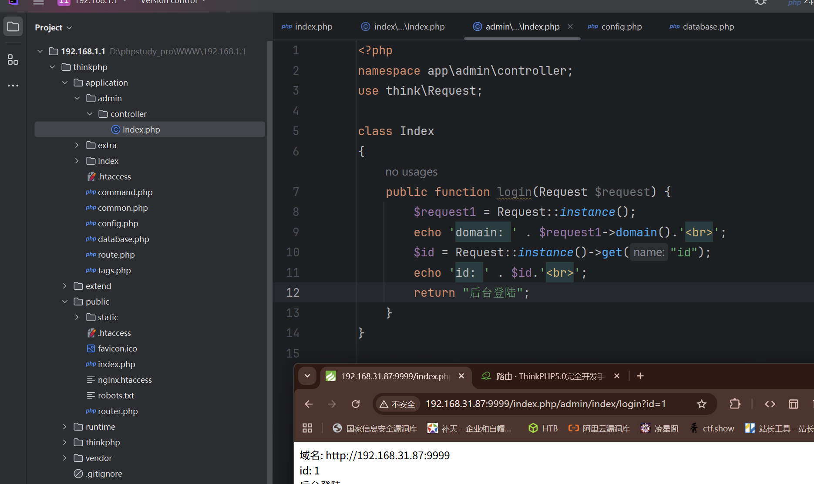
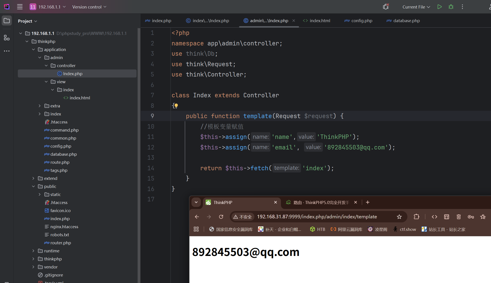

## TP框架-开发技术

参考 https://www.kancloud.cn/manual/thinkphp5/118003

### 配置



配置伪静态 就是系统自动在访问URL后面加.html  

### MVC路由访问

模块/控制器/操作



index文件夹就是模块，index.php就是控制器，test方法就是操作

index.php

```
<?php  
namespace app\index\controller;  
  
class Index  
{  
    public function index()  
    {  
        return '<style type="text/css">*{ padding: 0; margin: 0; } .think_default_text{ padding: 4px 48px;} a{color:#2E5CD5;cursor: pointer;text-decoration: none} a:hover{text-decoration:underline; } body{ background: #fff; font-family: "Century Gothic","Microsoft yahei"; color: #333;font-size:18px} h1{ font-size: 100px; font-weight: normal; margin-bottom: 12px; } p{ line-height: 1.6em; font-size: 42px }</style><div style="padding: 24px 48px;"> <h1>:)</h1><p> ThinkPHP V5<br/><span style="font-size:30px">十年磨一剑 - 为API开发设计的高性能框架</span></p><span style="font-size:22px;">[ V5.0 版本由 <a href="http://www.qiniu.com" target="qiniu">七牛云</a> 独家赞助发布 ]</span></div><script type="text/javascript" src="http://tajs.qq.com/stats?sId=9347272" charset="UTF-8"></script><script type="text/javascript" src="http://ad.topthink.com/Public/static/client.js"></script><thinkad id="ad_bd568ce7058a1091"></thinkad>';  
    }  
  
    public function test(){  
        return 111;  
    }  
}
```



```
<?php  
namespace app\admin\controller;  
  
class Index  
{  
    public function login() {  
        return "后台登陆";  
    }  
}
```

***注意修改命名空间***'

### 数据接收



login.php

```
<?php  
namespace app\admin\controller;  
use think\Request;  
  
class Index  
{  
    public function login(Request $request) {  
        $request1 = Request::instance();  
        echo 'domain: ' . $request1->domain().'<br>';  
        $id = Request::instance()->get("id");  
        echo 'id: ' . $id.'<br>';  
        return "后台登陆";  
    }  
}
```

### 数据库操作

先配置databse.php文件

loginin.php

```
public function loginin(Request $request) {  
    $data = Db::table("admin")->where('id',1)->find();  
    //=select * from admin where id=1  
    var_dump($data);  
}
```


### 模板引擎

模块下面建立view文件夹，view文件夹创建控制器文件夹存放渲染的html文件



index.php

```
<?php  
namespace app\admin\controller;  
use think\Db;  
use think\Request;  
use think\Controller;  
  
class Index extends Controller  
{  
    public function template(Request $request) {  
        //模板变量赋值  
        $this->assign('name','ThinkPHP');  
        $this->assign('email', '892845503@qq.com');  
  
        return $this->fetch('index');  
    }  
}
```

### 安全问题

#### sql注入

```
public function testsqli1(Request $request) {  
    $con = mysqli_connect("localhost","root","root","test","3306");  
    $id=$_GET['id'];  
    $sql = "select * from admin where id=$id";  
    $data = mysqli_query($con,$sql);  
    var_dump($data);  
}
```

无框架写法，容易出现sql注入


```
public function testsqli2(Request $request) {  
    $id=request()->get('id');  
    $data=Db::query("select * from admin where id=$id");  
    var_dump($data);  
}
```

半框架写法，同无框架写法一样


```
public function testsqli3(Request $request) {  
    $id=request()->get('id');  
    $data=Db::table("admin")->where("id",$id)->select();  
    var_dump($data);  
}
```

完全框架写法，不容易出现sql注入，只能找版本漏洞

