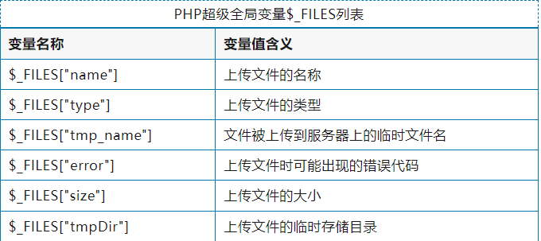
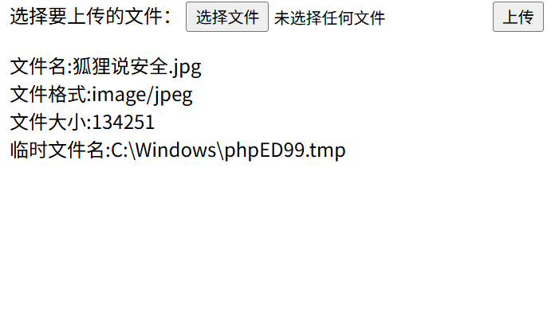
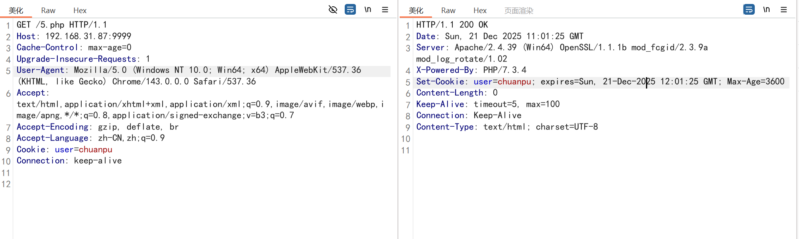
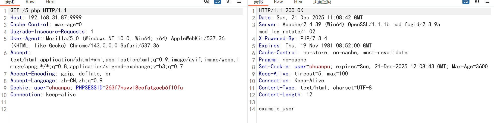

## 全局变量

```
<?php  
$x=2;  
$y=3;  
function add(){  
    //全局变量z=全局变量x+全局变量y  
    $GLOBALS['z']=$GLOBALS['x']+$GLOBALS['y'];  
}  
add();  
echo $z;
```

输出z结果为5

```
<?php  
$x=2;  
$y=3;  
$z=4;  
function add1(){  
    $z=2+3;  
}  
add1();  
echo $z;
```

输出z结果为4

$_GLOBAL可以操控全局变量，引起变量覆盖

$_ GET['x'] 接受get发送数据
$_ POST['x'] 接受post发送数据
$_ REQUEST['x'] 接受html表单提交数据 get和post都能接受
$_ COOKIE['x'] 接受cookie提交数据
$_ SESSION['x'] 接受session提交数据

$_SERVER[] 获取数据包信息
```
<?php  
echo $_SERVER['HTTP_USER_AGENT'].'<br>';  
echo $_SERVER['HTTP_HOST'].'<br>';  
echo $_SERVER['HTTP_ACCEPT'];
```

输出

Mozilla/5.0 (Windows NT 10.0; Win64; x64) AppleWebKit/537.36 (KHTML, like Gecko) Chrome/143.0.0.0 Safari/537.36  
192.168.31.87:9999  
text/html,application/xhtml+xml,application/xml;q=0.9,image/avif,image/webp,image/apng,*/*;q=0.8,application/signed-exchange;v=b3;q=0.7

$_ ENV['x'] 服务器环境变量数组

$_ FILES['x'] 获取提交的文件的数据



```
<form action="4.php" method="post" enctype="multipart/form-data">  
    <label for="file">选择要上传的文件：</label>  
    <input type="file" id="file" name="uploaded_file">  
    <input type="submit" value="上传">  
</form>  
  
<?php  
$filename=@$_FILES['uploaded_file']['name'];  
$filetype=@$_FILES['uploaded_file']['type'];  
$filesize=@$_FILES['uploaded_file']['size'];  
$filetmp_name=@$_FILES['uploaded_file']['tmp_name'];  
  
echo "文件名:".$filename.'<br>';  
echo "文件格式:".$filetype.'<br>';  
echo "文件大小:".$filesize.'<br>';  
echo "临时文件名:".$filetmp_name.'<br>';
```



$_ FILES['upload_file'] \['type']得到的是MIME类型，可以抓包修改

$_ COOKIE

是一个关联数组，包含通过cookie传递给当前脚本的内容。

本地客户端浏览器存储

```
<?php  
$user="chuanpu";  
setcookie(user,$user,time()+3600);
```



客户端和服务端都有存储

$_ SESSION

是一个关联数组，包含当前脚本中的所有session内容。

目标服务端存储，存储记录的数据

```
<?php  
$user="chuanpu";  
setcookie(user,$user,time()+3600);  
  
session_start();  
$_SESSION['username'] = 'example_user';  
echo $_SESSION['username'];
```


***代码中有session_start()才能进行session的接收***

## 挖洞案例

```
<?php  
$a='ccc';  
$b='a';  
$$b = 'xxxxx';  
echo $a;
```

输出 xxxxx

https://blog.csdn.net/qq_59023242/article/details/135080259

