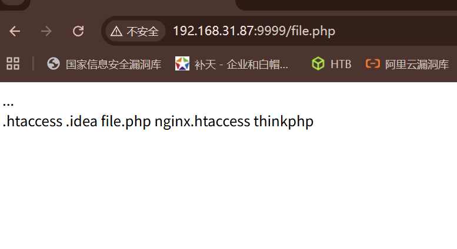
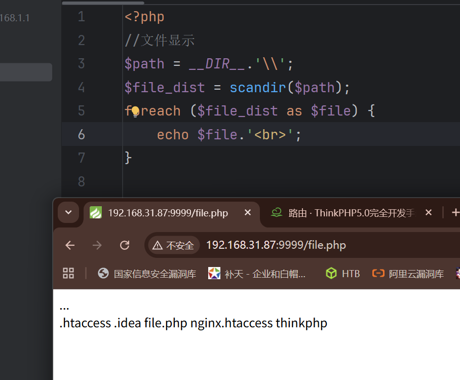
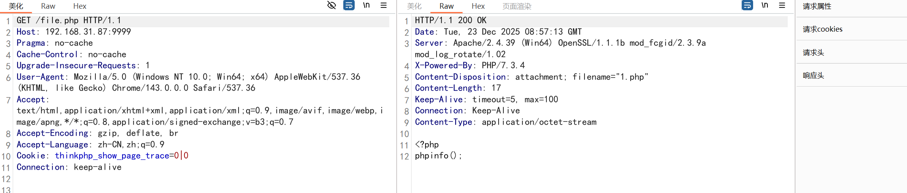

## 文件遍历上传下载删除编辑包含等

$_FILES：PHP中一个预定义的超全局变量，用于在上传文件时从客户端接收文件，并将其保存到服务器上。它是一个包含上传文件信息的数组，包括文件名、类型、大小、临时文件名等信息。

$_FILES\["表单值"]\["name"] 获取上传文件原始名称

$_FILES\["表单值"]\["type"] 获取上传文件MIME类型

$_FILES\["表单值"]\["size"] 获取上传文件字节单位大小

$_FILES\["表单值"]\["tmp_name"] 获取上传的临时副本文件名

$_FILES\["表单值"]\["error"] 获取上传时发生的错误代码

move_uploaded_file() 将上传的文件移动到指定位置的函数

## 文件显示

1.打开目录读取文件列表

2.递归循环读取文件列表

3.判断是文件还是文件夹

4.PHP.INI目录访问控制

is_dir() 函数用于检查指定的路径是否是一个目录

opendir() 函数用于打开指定的目录，返回句柄，用来读取目录的文件和子目录

```
<?php  
//文件显示  
$path = __DIR__.'\\';  
$filehandle = opendir($path);  
while(false !== ($file = readdir($filehandle))){  
    echo $file.'<br>';  
}
```



readdir() 函数用于从打开的目录句柄中读取目录中的文件和子目录

open_basedir：PHP.INI中的设置用来控制脚本程序访问目录

scandir() 函数返回指定目录中的文件和目录列表，以数组形式返回

```
<?php  
//文件显示  
$path = __DIR__.'\\';  
$file_dist = scandir($path);  
foreach ($file_dist as $file) {  
    echo $file.'<br>';  
}
```



ini_set('open_basedir',__DIR__); 设置配置文件中，只能访问本目录

## 文件删除

unlink() 文件删除函数

调用命令删除：system shell_exec exec等

## 文件下载

file.php

```
file = '1.php'
header("Content-Type: application/octet-stream");
header("Content-Disposition: attachment; filename=\"" . $file . "\"");
header("Content-Length: " . filesize($file));
readfile($file);
```

打开file.php，下载1.php



## 文件读取

1、file_get_contents() 读取文件内容

```
echo file_get_contents('1.php');
```

2、fopen() fread() 文件打开读入

```
<?php  
$file=fopen("1.php","r");  
$data=fread($file,filesize("1.php"));  
echo $data;
```

## 文件包含

include、require、include_once、require_once等

类似于python的import java的Maven 但是 **php包含及执行, 且任何后缀文件都会解析成php文件***

## 审计案例

1、Rrzcms遍历读取

https://xz.aliyun.com/t/10932

2、Metinfo文件下载

https://mp.weixin.qq.com/s/te4RG0yl_truE5oZzna3Eg

3、Xhcms文件包含

https://xz.aliyun.com/t/11310

观察参数是否可控，利用../跳级