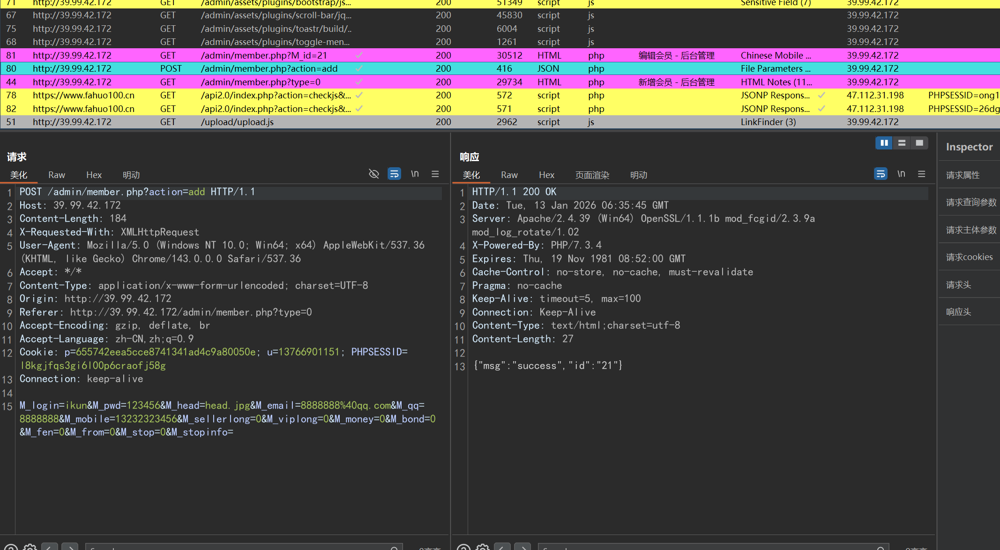
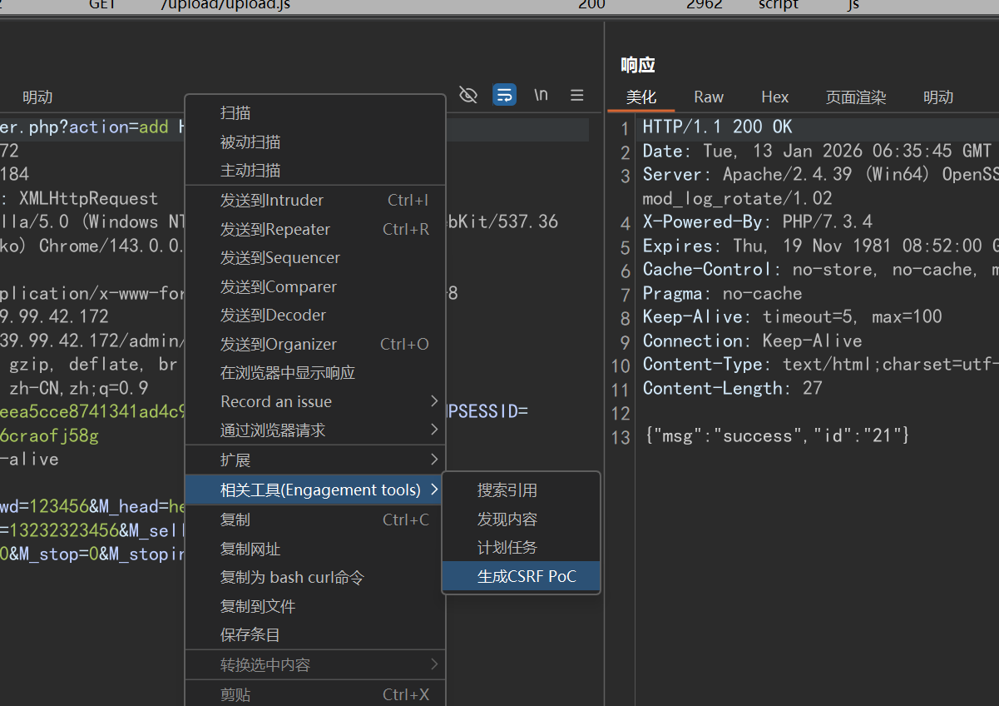
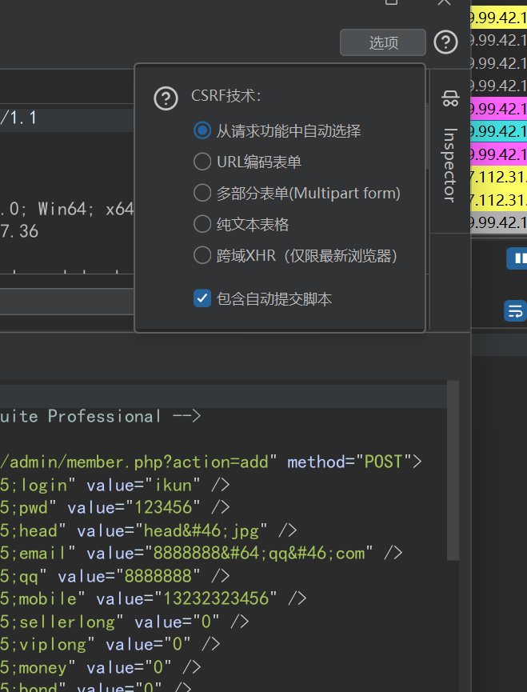
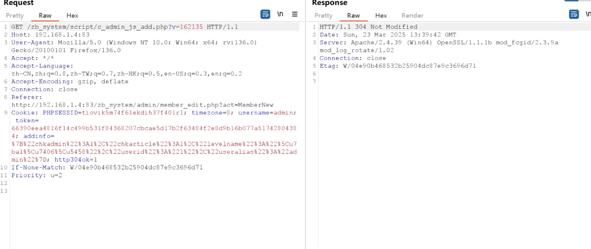

## CSRF功能点

删除帐户

更改电子邮件

如果不需要旧密码，请更改密码

如果您的目标支持角色，请添加新管理员

更改正常信息，名字，姓氏等......

类似复选框的接收通知

更改个人资料图片/删除它

## 操作

抓到网站内某一操作数据包



右键，点击创建csrfpoc





将复制的poc和粘贴到html文件中，再将html文件上传到攻击服务器中

让受害者访问服务器上的html文件

## CSRF绕过

### 同源策略防护

在html文件最顶部加
```
<meta name="referrer" content="no-referrer">
```
可让referer滞空

同源策略防护因为业务需要多是匹配判断而不是等于判断

1. 申请一个存在目标网站域名的域名，如目标网站域名 baidu.com，申请qqhedkujbaidu.com绕过
2. 创建一个存在目标网站域名的文件夹，如/http://baidu.com文件夹

### CSRF利用-Token校验防护

绕过1：将Token参数值复用（代码逻辑不严谨）

绕过2：将Token参数删除（代码逻辑不严谨）

绕过3：将Token参数值置空（代码逻辑不严谨）

除此以外直接跑路

#### 判断网站是否存在csrf-token防护

数据包中是否包含token或者csrf-token字样



从自己搭建网站和受害者访问的网站提取的csrfpoc中的token值不同


