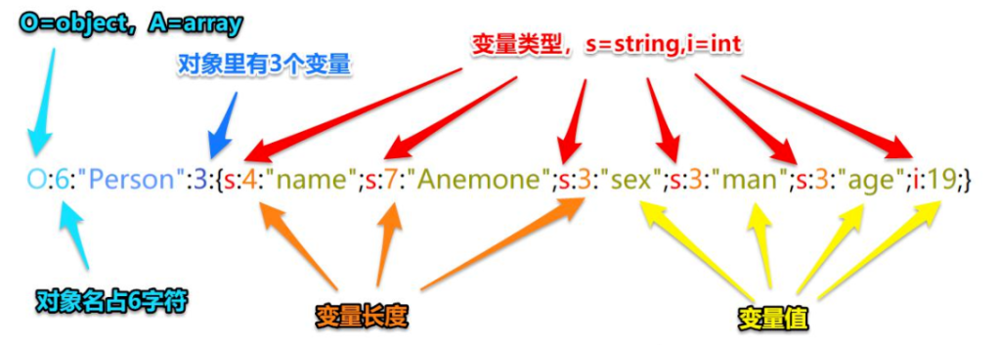

## PHP版本漏洞

CVE-2016-7124（__wakeup绕过）
漏洞编号：CVE-2016-7124
影响版本：PHP 5<5.6.25; PHP 7<7.0.10

漏洞危害：如存在__wakeup方法，调用unserilize()方法前则先调用__wakeup方法，但序列化字符串中表示对象属性个数的值大于真实属性个数时会跳过__wakeup执行

Demo：见CVE.PHP与版本切换演示

修改Person后面的3改为更大的数

## PHP版本绕过机制

影响版本 php7.1+

public(公共的):在本类内部、外部类、子类都可以访问

protect(保护的):只有本类或子类或父类中可以访问

private(私人的):只有本类内部可以使用

*序列化数据显示：

public属性序列化的时候格式是正常成员名

private属性序列化的时候格式是%00类名%00成员名

protect属性序列化的时候格式是%00*%00成员名

***php7.1之前对序列化访问属性敏感，7.1之后不敏感，攻击代码可以修改属性访问权限***

## PHP字符增多减少

1.  字符变多-str1.php str1-pop.php
	运算思路：字符个数多了1个
	后续有47个就写47个覆盖后续

2.  字符变少-str2.php str2-pop.php
	运算思路：字符个数少了1个（5位变4位）
	思考写多个就截取后续多少个，如23个等

案例：

CTFSHOW-Web262（逃逸解法）
解题思路：提示有message.php
其中获取msg获取f,m,t 要求token=admin
字符增多通过本地序列化发现62位需要覆盖