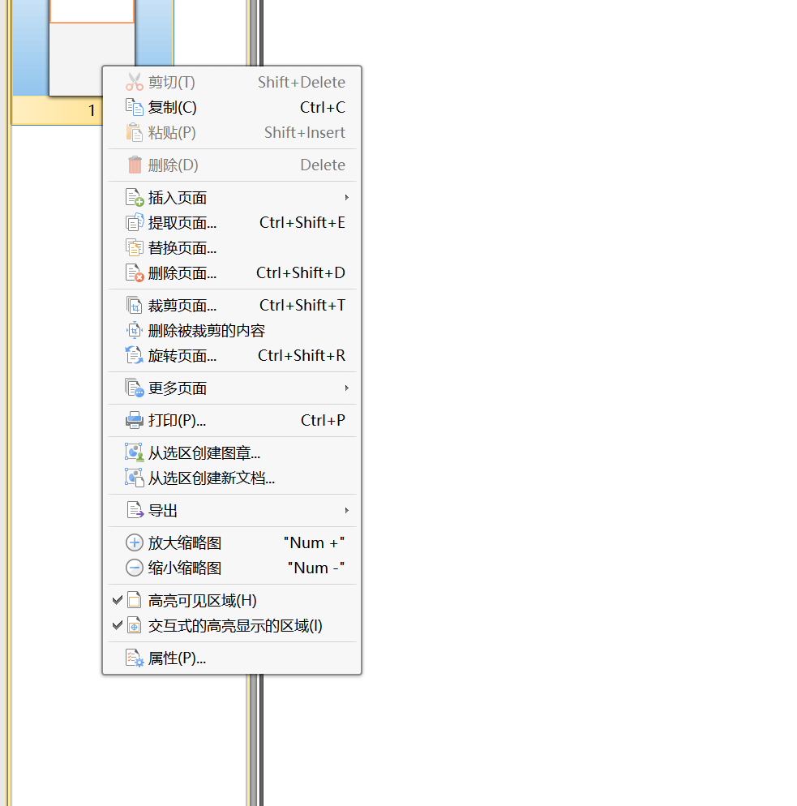
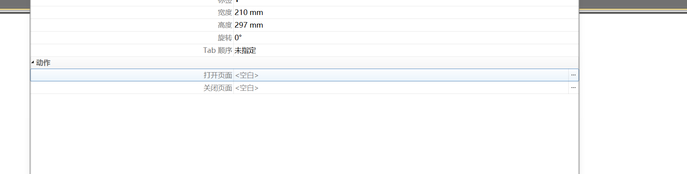
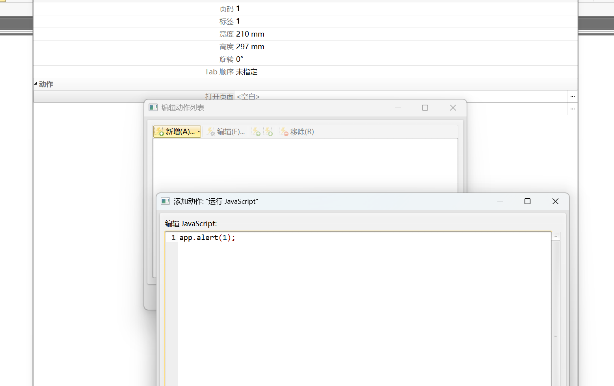

## 文件触发XSS

### SVG-XSS

SVG(Scalable Vector Graphics)是一种基于XML的二维矢量图格式，和我们平常用的jpg/png等图片格式所不同的是SVG图像在放大或改变尺寸的情况下其图形质量不会有所损失，并且我们可以使用任何的文本编辑器打开SVG图片并且编辑它，目前主流的浏览器都已经支持SVG图片的渲染

```
<svg xmlns="http://www.w3.org/2000/svg" version="1.1">
<circle cx="100" cy="50" r="40" stroke="black" stroke-width="2" fill="red" />
<script>alert(1)</script>
</svg>
```

### PDF-XSS

1、创建PDF，加入动作JS







2、通过文件上传获取直链

3、直链地址访问后被触发

### SWF-XSS

-制作swf-xss文件：

1、新建swf文件

2、F9进入代码区域

3、属性发布设置解析

//取m参数

var m=_root.m;

//调用html中Javascript中的m参数值

flash.external.ExternalInterface.call(m);

触发：?m=alert(/xss/)

项目：Adobe Flash Professional CS6

-测试swf文件xss安全性：

1、反编译swf文件

2、查找触发危险函数

3、找可控参数访问触发

xss一是指执行恶意js，那么为什么说flash xss呢？是因为flash有可以调用js的函数，也就是可以和js通信，因此这些函数如果使用不当就会造成xss。常见的可触发xss的危险函数有：getURL，navigateToURL，ExternalInterface.call，htmlText，loadMovie等等


***1、上传swf文件可以做xss漏洞
2、找到目标上存在的swf进行反编译后找xss漏洞***

### HTML-XSS

单纯在HTML代码中写XSS代码即可

### 其他XML格式等

挖掘：从安全文件上传到XSS的转换（红队玩法还可以配合钓鱼）
利用文件上传获取文件访问地址，访问触发（浏览器格式解析问题会导致失效）

## 功能触发XSS

#### PostMessage Xss

一个用于在网页间安全地发送消息的浏览器API。它允许不同的窗口（例如，来自同一域名下的不同页面或者不同域名下的跨域页面）进行通信，而无需通过服务器。通常情况下，它用于实现跨文档消息传递（Cross-Document Messaging），这在一些复杂的网页应用和浏览器插件中非常有用

安全原因：当发送参数可控且接收方处理不当时，将导致XSS

模拟漏洞挖掘场景：

打开 [http://192.168.1.4:82/60/xssreceive.html](http://192.168.1.4:82/60/xssreceive.html)

分析源码：

```
<script>
// 添加事件监控消息
window.addEventListener("message", (event) => {
location.href = `${event.data.url}`;
});
</script>
```

黑盒挖掘：

如何去挖这种隐藏比较深的漏洞，这里强推一个国外白帽写的谷歌浏览器插件：

[https://github.com/fransr/postMessage-tracker](https://github.com/fransr/postMessage-tracker)
安装之后，只要是当前页面创建了message事件监听，这个插件就会定位到其代码

#### localStorage型xss

Web应用使用localStorage在用户浏览器中存储数据。localStorage允许网页在本地存储键值对，这些数据可以在浏览器关闭后仍然保留，并且在同一域名下的不同页面之间共享。当应用程序从localStorage中读取数据并将其显示在页面上时，如果没有对数据进行充分的验证和过滤，攻击者就有可能通过修改localStorage中的数据来注入恶意脚本实现XSS

安全原因：当localStorage可控且有页面有操作其数据，将导致XSS

黑盒挖掘：寻找输入点（如表单、搜索框、评论区等），构造测试用例找页面调用

白盒挖掘：查找与localStorage相关的代码段分析数据存储及数据读取

挖掘：先看目标应用localStorage

1、先找能控制的键名键值（怎么找）

2、再找对键名键值做输出操作（怎么找）