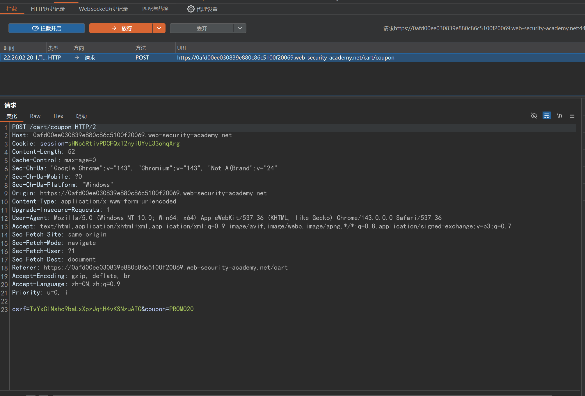
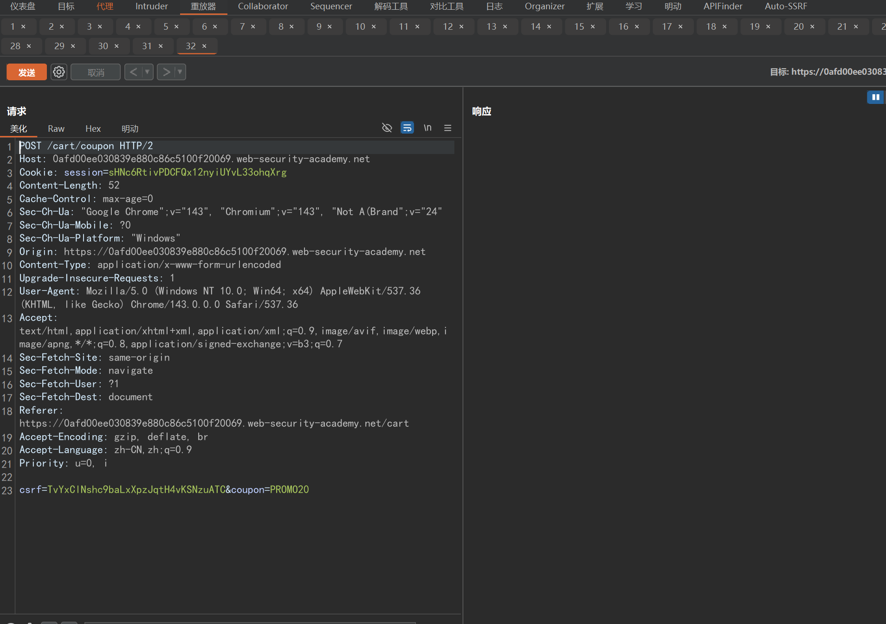
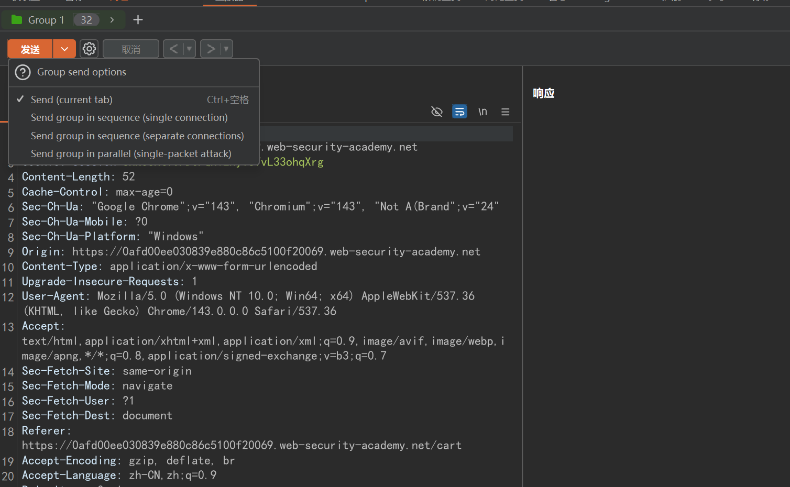

## Fuzz

是一种基于黑盒的自动化软件模糊测试技术,简单的说一种懒惰且暴力的技术融合了常见的以及精心构建的数据文本进行网站、软件安全性测试

- 核心思想

	口令Fuzz(弱口令)
	目录Fuzz(漏洞点)
	参数Fuzz(利用参数)
	PayloadFuzz(Bypass)

## 应用场景

- 爆破用户口令
- 爆破敏感目录
- 爆破文件地址
- 爆破未知参数名
- Payload测漏洞（绕过等也可以用）
在实战黑盒中，目标有很多没有显示或其他工具扫描不到的文件或目录等，我们就可以通过大量的字典Fuzz找到的隐藏的文件进行测试

## 项目

https://wordlists.assetnote.io/
https://github.com/fuzzdb-project/fuzzdb
https://github.com/TheKingOfDuck/fuzzDicts
https://github.com/danielmiessler/SecLists

## 并发

通常发生在多线程或多进程并发执行的环境中。这种漏洞主要源于在并发执行时，由于缺乏适当的同步机制或同步不当，导致多个线程或进程在访问和修改共享资源时出现冲突或不一致的状

## 应用场景

包括但不限于点赞、投票、签到、代金券、领积分、获取验证码

## Demo

用购物券购买物品

1. 抓取使用券的数据包

	

2. 发到重放器，Ctrl+r复制数据包,并给数据包分组
	

3. 选择Send group in parallel按组发包
		

## SRC报告

[[实战SRC并发&FUZZ技术案例挖掘]]