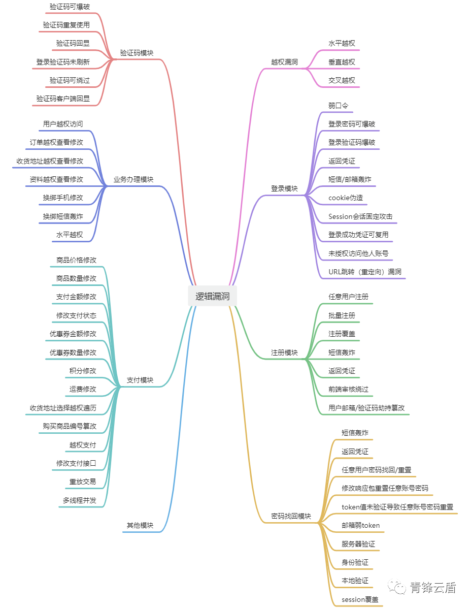

为了防止用户遗忘密码，大多数网站都提供了找回密码功能。常见的找回密码方式有：邮箱找回密码、根据密码保护问题找回密码、根据手机号码找回密码等。其中密码找回漏洞在逻辑漏洞中占了较大的比例。测试密码找回漏洞与其他逻辑漏洞的方法相同，其中必经的两个步骤是：熟悉业务流程（密码找回过程）与对流程中的HTTP数据包请求进行分析

## 重定向用户

在某一个步骤修改匹配用户的值从而影响其他用户

- Demo

用邮箱找回密码，先输入自己的邮箱，拿到验证码，输入验证码抓包，把邮箱改为要攻击用户的邮箱，从而修改受害者的密码

## 重定向地址

在输入邮箱的地方输入一个监听的地址，邮件就会发送到监听的地址上面

找参数

## 流程跳过

例如在找回密码时都是好几个操作，形成几个数据包，攻击者直接重放数据包，跳过之前的步骤

## 修改响应包

比对成功和失败的响应包，如果只使用前端校验，就可以跳过验证

## 回显验证码

验证码在返回包中回显

## 验证码爆破

## SRC复盘

https://mp.weixin.qq.com/s/iFsEa2IYLo9gOZBPYIHssw
https://mp.weixin.qq.com/s/6cR7DVQaZYSs131Y3TvVLA
https://mp.weixin.qq.com/s/u6PC_ZR-QCJhZOuBEOL4Cg
https://mp.weixin.qq.com/s/hnEwAJpcbe7FsSlQOWuNUw
https://mp.weixin.qq.com/s/5A5L1MHJh9JtokyYRrfqeg
https://mp.weixin.qq.com/s/DHFQ5tZ7nmLzThE0zJz6qA
[[SRC验证逻辑挖掘分享案例]]