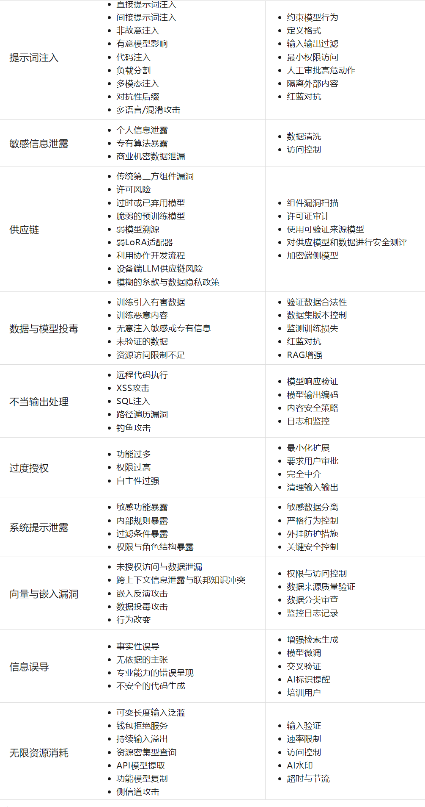

Web LLM（Large Language Model）攻击指针对部署在Web端的AI大语言模型的攻击行为。攻击者通过恶意提示词注入、训练数据窃取、模型逆向工程等手段，操控AI输出敏感信息或执行危险操作

## API接口使用

利用已知的API接口完成未授权操作

## 远程通讯利用

关注到有利用的远程调用，尝试写入管道命令等，是否会带出

## 提示词注入

Prompt Injection漏洞是指攻击者通过精心设计的输入操纵大型语言模型（LLM），导致LLM无意中执行攻击者的意图。这种攻击可以是直接的，例如通过“越狱”系统提示；也可以是间接的，通过操纵外部输入来实现。成功的提示注入攻击可能导致数据泄露、社会工程攻击等多种后果

1. 直接方式（Directly），譬如通过向聊天机器人发送消息。

	项目：https://github.com/kk12-30/LLMs-PromptAttacks

2. 间接提示注入：通常使得针对其他用户的Web LLM攻击成为可能。

	例如，如果用户要求LLM描述一个网页，该页面内的隐藏提示可能会使LLM回复一个设计用于利用用户的XSS（跨站脚本）有效载荷。

3. 提示词注入靶场：

	https://gandalf.lakera.ai/

	参考 https://mp.weixin.qq.com/s/sT9TxOR7jC5U4tHPRFT9WQ

## 不安全的输出处理

不安全的输出处理指的是在将LLM生成的输出传递给下游组件和系统之前，对其进行的验证、清理和处理不足。这可能导致跨站脚本攻击（XSS）、服务器端请求伪造（SSRF）等严重后果

```
""
```

## 复盘文章

https://mp.weixin.qq.com/s/6SVInWxwJ34ucjqNYPp3fw

https://mp.weixin.qq.com/s/CbJf3Tr9sy8U1r0T5xv1yg