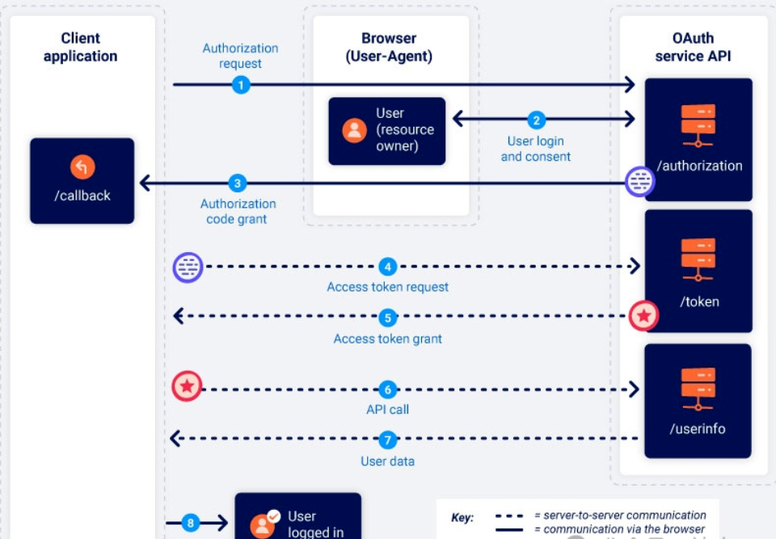
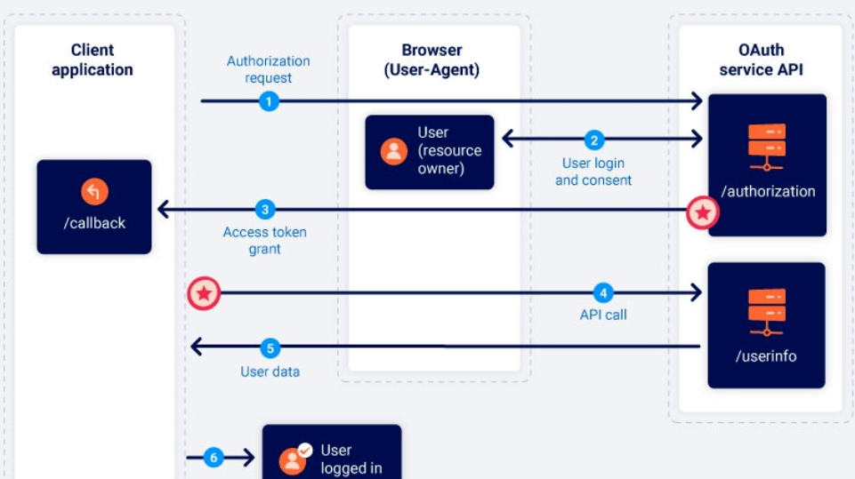

## OAuth

种常用的授权框架，它允许网站和Web应用程序请求对另一个应用程序上的用户帐户的有限访问权限，像那种允许使用第三方账号（QQ、微信等）登录的网站，可能就是使用的OAuth框架

## 类型

授权类型：授权码模式，隐式授权类型等

https://mp.weixin.qq.com/s/TSsRNZtpttqXBviLwtYT9A

https://mp.weixin.qq.com/s/ATjdIxSOruY-_lCCs2kcGg

## 安全

1、OAuth隐式认证绕过

2、注册资源SSRF被利用

3、存在CSRF缺陷用户被绑定 无state

4、CSRF缺陷redirect_uri劫持code帐户

5、scope篡改升级范围信息获取

portswigger.net/web-security/all-labs#oauth-authentication

参考 blog.csdn.net/weixin_39190897/article/details/139885599

## SRC复盘

https://mp.weixin.qq.com/s/TSsQ_mWGsFYZiF_RBdfbKg

https://mp.weixin.qq.com/s/NuNkzax8nb72qb-S1RvTnQ

https://mp.weixin.qq.com/s/QuhNuVyb2uy2T-br-mxAJw

https://mp.weixin.qq.com/s/TSsRNZtpttqXBviLwtYT9A

## 例子

- 如何测试 OAuth 换绑实现账户接管漏洞

1. 分别在两个浏览器上注册两个账号，分别为账号 A 和账号 B

2. 在账号A上走完一遍绑定第三方平台的流程，抓住最后绑定的那个数据包，Send to Repeater然后Drop掉

3. 在登陆了账号B的浏览器上，直接去访问账号A先前绑定的URL，观察B是否新绑定了第三方平台，如果是，则存在该漏洞，否则就不存在
