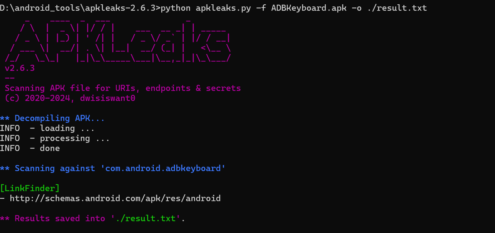
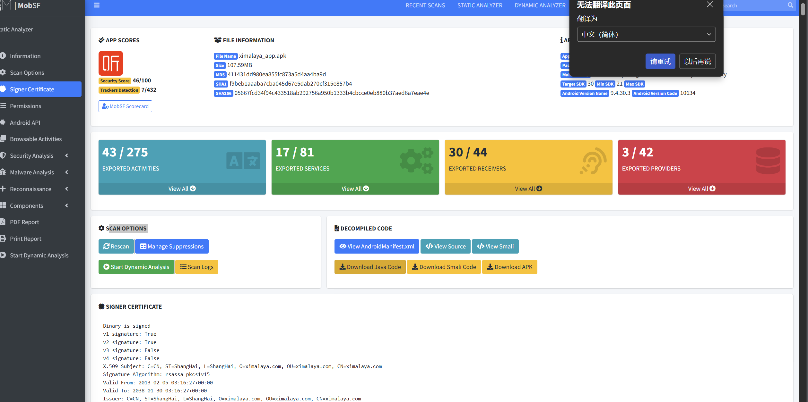

## 移动安全

### 逆向角度

有无保护，源码修改打包HOOK

删除验证代码 证书 代理 抓包

删除验证代码 破解版（突破会员制度等）

翻到密钥 接口 密码等关键敏感

### 渗透角度

APP架构资产-表现，源码，调试逻辑

web 域名 cms api接口 web安全问题

ip 端口 服务 web服务（见上） 数据库 中间件 等服务测试

API 接口 测试

## 逆向提取资产工具

### appleak

### mobsf

搭建命令

docker run -it --rm \
  -p 8000:8000 \
  opensecurity/mobile-security-framework-mobsf

***通过获取App配置、数据包，去获取url、api、osskey、js等敏感信息。
1、资产信息-IP 域名 网站 -转到对应Web测试 API接口测试 服务测试
2、泄露信息-配置key 资源文件 - key（osskey利用，密钥配置等）
3、代码信息-代码安全 HOOK绕过限制（证书，代理，脱壳等）- 逆向相关
APP中收集资产：通讯抓包，静态提取，动态调试***

## 公开信息搜集

通过搜索引擎、社交媒体、应用商店等渠道，收集目标APP信息，如APP名称、版本、开发者、下载量等。名称获取APP信息（爱企查/小蓝本/七麦/点点）

1、查备案信息在搜

2、网站上有APP下载

3、市场直接搜单位名称

https://www.qimai.cn/

https://app.diandian.com/

https://aiqicha.baidu.com/

https://www.xiaolanben.com/