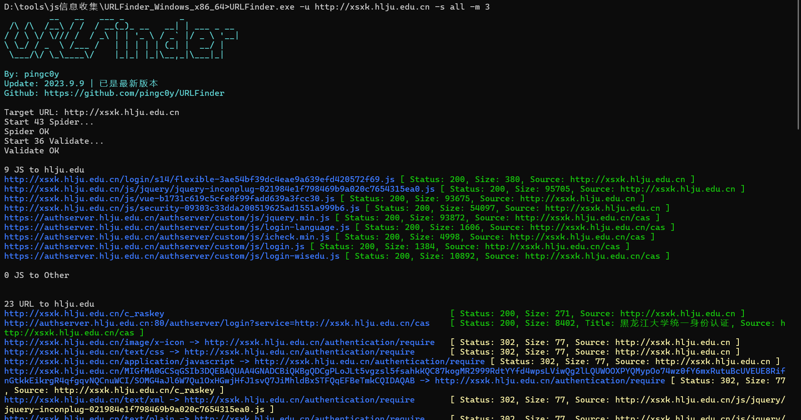
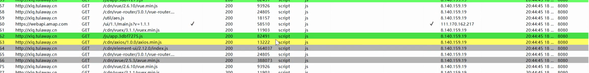
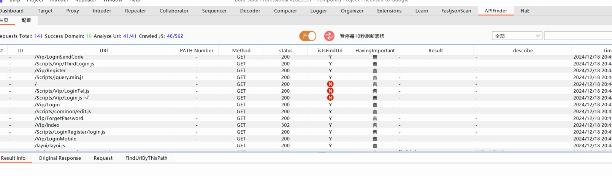
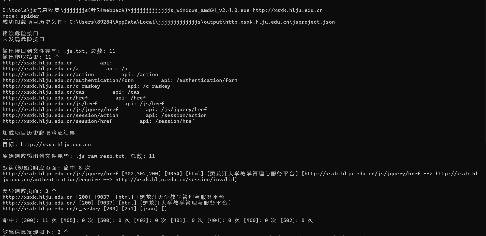
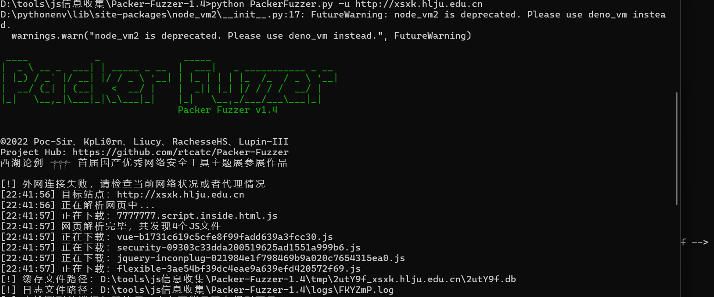

在日常渗透测试中，从JavaScript(JS)文件中提取信息是一项关键的步骤，以往有些案例就是通过JS文件中发现的敏感信息从而拿下重要的系统。在JS开发的WEB应用和PHP，JAVA,NET等区别在于即没有源代码，也可以通过浏览器的查看源代码获取部分源代码逻辑。从而获取URL，获取JS敏感信息，获取代码传参等，所以相当于JS开发的WEB应用大部分属于白盒测试（默认有大量源码参考），一般会在JS中寻找更多的URL地址，在JS代码逻辑（加密算法，APIkey配置，验证逻辑等）进行后期安全测试

## JS信息收集

接口URL提取

后端地址提取

敏感信息提取

配置信息提取

其他信息提取（环境，注释，用途等）

## 安全问题

源码泄漏，代码审计，JS逆向分析

未授权访问=JS里面分析更多的URL访问确定接口路径

敏感Key泄漏=JS文件中配置接口信息（云应用，短信，邮件，数据库等）

API接口安全=（代码中加密提交参数传递，更多的URL路径）

## 框架

Vue NodeJS jQuery Angular等

## 判断JS开发应用

插件wappalyzer

源程序代码简短

引入多个js文件

一般有/static/js/app.js等顺序的js文件

一般cookie中有connect.sid

## 获取更多JS文件

手工-浏览器搜索

半自动-Burpsuite插件

工具化-各类提取&FUZZ项目

## 快速获取有价值信息

src=

path=

method:"get"

http.get("

method:"post"

http.post("

```
$.ajax
http://service.httppost
http://service.httpget
```

## 项目

### URLFinder



### Hae



### APIFinder



***找接口去源代码里找测试，如/change/password***

## WebPack打包JS信息提取

##### jjjjs



##### packerfuzzer


