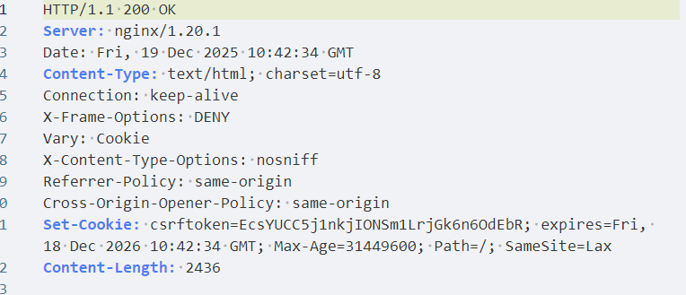
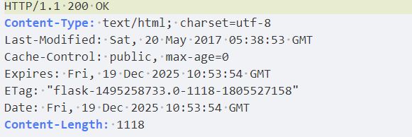
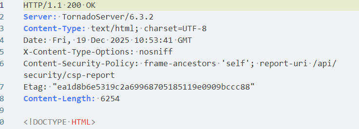
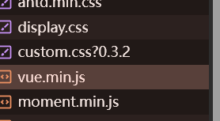
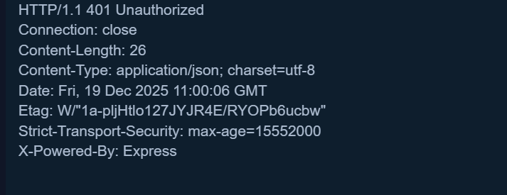
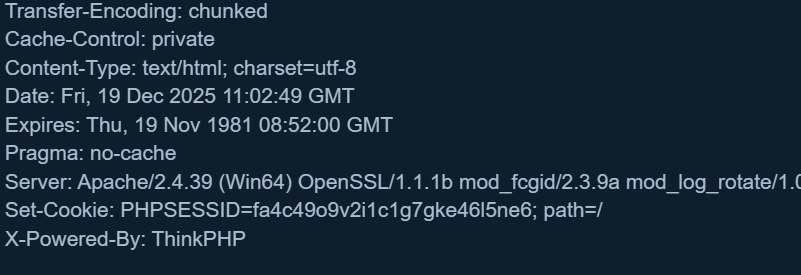

实现功能：

1 从语言最初写功能 
2 使用框架 借助框架语法实现
3 利用框架和组件实现
4 在一套源码基础上添加新功能 xxx xxxcms xxxOA 等
开发就像搭积木，拼图，组装电脑

## ICO图标

某应用系统标志
某公司/机构/个人标志

## 开发框架识别

### Python

#### Django

固定返回数据包格式 Set-Cookie:expires=

#### Flask

固定返回数据包格式 Etag: "flask X-Powered-By: Flask

#### Tornado

固定返回数据包格式 Server: TornadoServer

### JavaScript

#### Vue

js语法加载文件

#### Node.js

固定返回数据包格式 ETag: W/"

#### ThinkPHP

固定返回数据包格式 X-Powered-By: ThinkPHP

#### Laravel

Set-Cookie中特征的格式 XSRF-TOKEN= laravel_session=

#### Yii

Set-Cookie中特征的格式 YII_CSRF_TOKEN=

### Java

#### Struts2

一般使用struts2框架后缀带do或action，可以尝试进行利用

#### SpringBoot

1、默认web应用标签小绿叶图标

2、通过springboot框架默认页面

3、ICO源码体系采用SpringBoot开发

## 组件

### FastJson/Jackson

在提交JSON数据包中修改测试：

-FastJson组件会把01解析成1

-Jackson组件在解析01时会抛出异常

https://forum.butian.net/share/1679

### Shiro

请求包的cookie中存在rememberMe字段。

返回包中存在set-Cookie：remeberMe=deleteMe。

请求包中存在rememberMe=x时，响应包中存在rememberMe=deleteMe。

有时候服务器不会主动返回remeberMe=deleteMe，直接发包即可，将Cookie内容改为remember Me=1，若相应包有rememberMe=deleteMe，则基本可以确定网站apache shiro搭建的。

### Solr

一般开放8983端口,访问页面也可以探针到