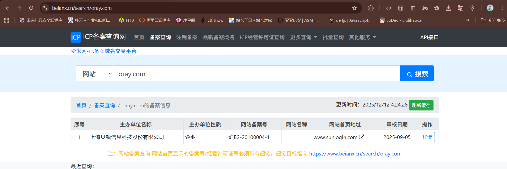
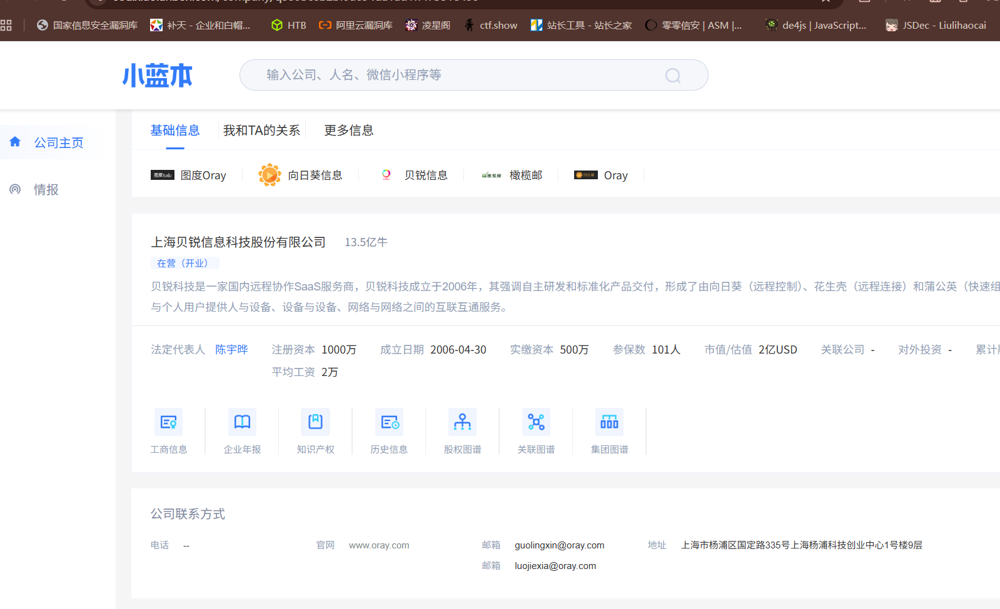
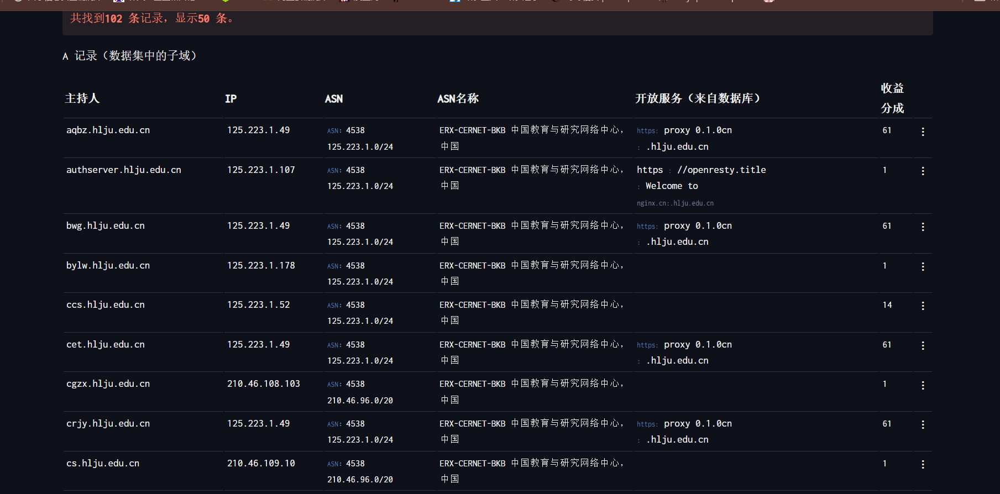
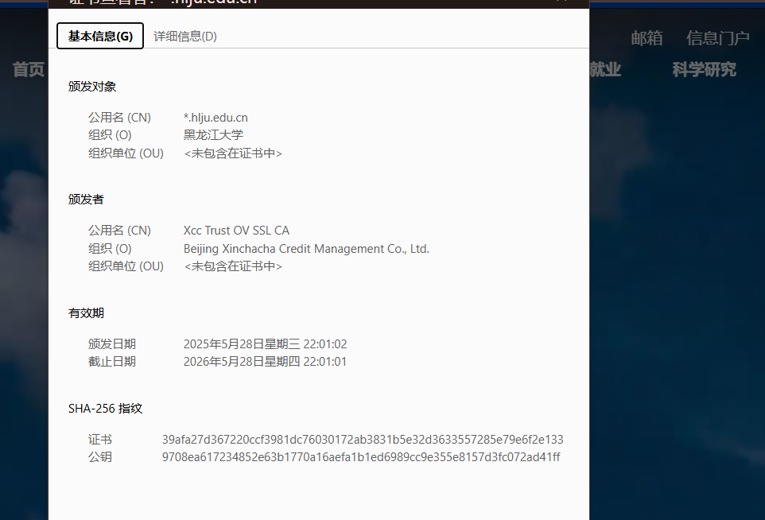
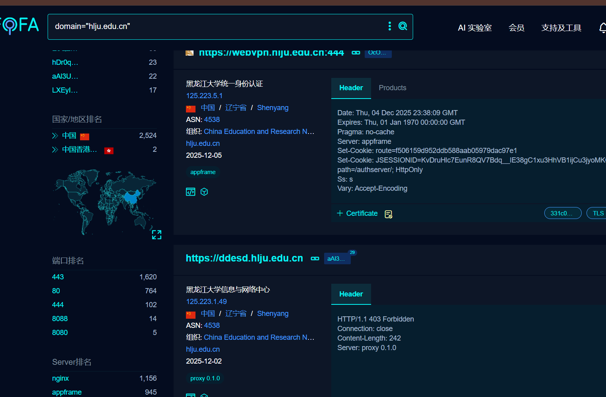
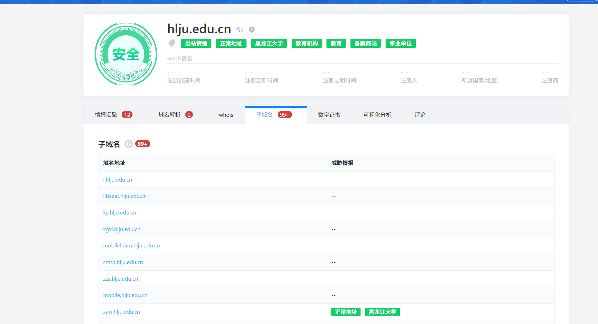
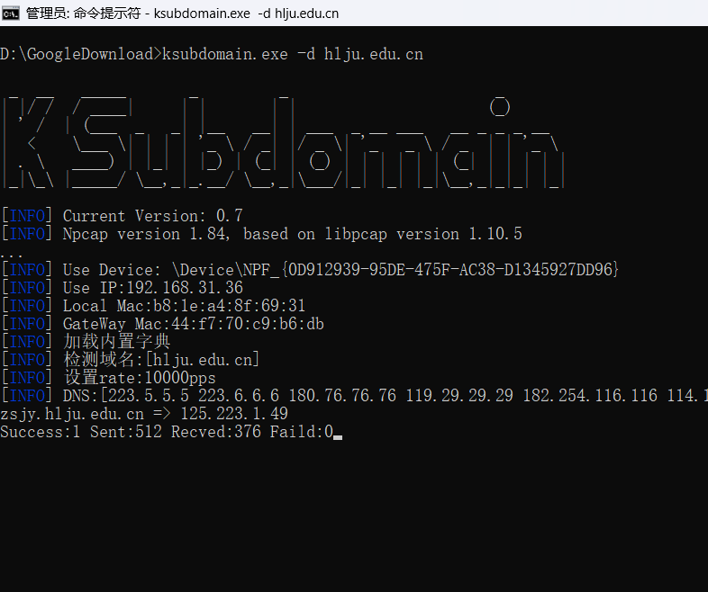
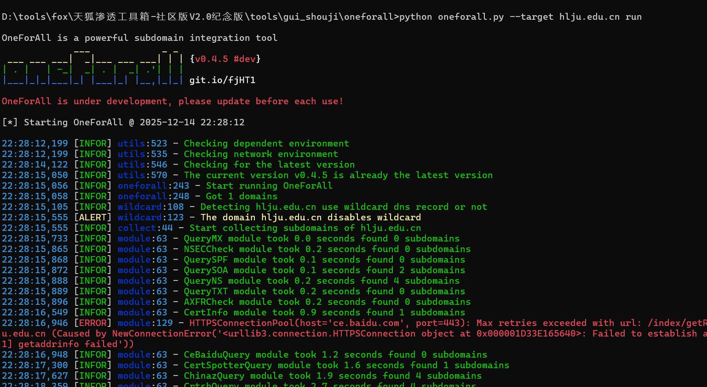

|      |        |                                                                              |
| ---- | ------ | ---------------------------------------------------------------------------- |
| 标签   | 名称     | 地址                                                                           |
| 企业信息 | 天眼查    | [https://www.tianyancha.com/](https://www.tianyancha.com/)                   |
| 企业信息 | 小蓝本    | [https://www.xiaolanben.com/](https://www.xiaolanben.com/)                   |
| 企业信息 | 爱企查    | [https://aiqicha.baidu.com/](https://aiqicha.baidu.com/)                     |
| 企业信息 | 企查查    | [https://www.qcc.com/](https://www.qcc.com/)                                 |
| 企业信息 | 国外企查   | [https://opencorporates.com/](https://opencorporates.com/)                   |
| 企业信息 | 启信宝    | [https://www.qixin.com/](https://www.qixin.com/)                             |
| 备案信息 | 备案信息查询 | [http://www.beianx.cn/](http://www.beianx.cn/)                               |
| 备案信息 | 备案管理系统 | [https://beian.miit.gov.cn/](https://beian.miit.gov.cn/)                     |
| 注册域名 | 域名注册查询 | [https://buy.cloud.tencent.com/domain](https://buy.cloud.tencent.com/domain) |
| IP反查 | IP反查域名 | [https://x.threatbook.cn/](https://x.threatbook.cn/)                         |

|       |                   |                                                                                  |
| ----- | ----------------- | -------------------------------------------------------------------------------- |
| 标签    | 名称                | 地址                                                                               |
| DNS数据 | dnsdumpster       | [https://dnsdumpster.com/](https://dnsdumpster.com/)                            |
| 证书查询  | CertificateSearch | [https://crt.sh/](https://crt.sh/)                                               |
| 网络空间  | FOFA              | [https://fofa.info/](https://fofa.info/)                                         |
| 网络空间  | 全球鹰               | [http://hunter.qianxin.com/](http://hunter.qianxin.com/)                         |
| 网络空间  | 360               | [https://quake.360.cn/quake/](https://quake.360.cn/quake/#/index)                |
| 威胁情报  | 微步在线 情报社区         | [https://x.threatbook.cn/](https://x.threatbook.cn/)                             |
| 威胁情报  | 奇安信 威胁情报中心        | [https://ti.qianxin.com/](https://ti.qianxin.com/)                               |
| 威胁情报  | 360 威胁情报中心        | [https://ti.360.cn/#/homepage](https://ti.360.cn/#/homepage)                     |
| 枚举解析  | 在线子域名查询           | [http://tools.bugscaner.com/subdomain/](http://tools.bugscaner.com/subdomain/)   |
| 枚举解析  | DNSGrep子域名查询      | [https://www.dnsgrep.cn/subdomain](https://www.dnsgrep.cn/subdomain)             |
| 枚举解析  | 工具强大的子域名收集器       | [https://github.com/shmilylty/OneForAll](https://github.com/shmilylty/OneForAll) |

|   |   |   |
|---|---|---|
|标签|名称|地址|
|网络空间|钟馗之眼|[https://www.zoomeye.org/](https://www.zoomeye.org/?R1nG)|
|网络空间|零零信安|[https://0.zone/](https://0.zone/)|
|网络空间|Shodan|[https://www.shodan.io/](https://www.shodan.io/)|
|网络空间|Censys|[https://censys.io/](https://censys.io/)|
|网络空间|ONYPHE|[https://www.onyphe.io/](https://www.onyphe.io/)|
|网络空间|FullHunt|[https://fullhunt.io/](https://fullhunt.io/)|
|网络空间|Soall Search Engine|[https://soall.org/](https://soall.org/)|
|网络空间|Netlas|[https://app.netlas.io/responses/](https://app.netlas.io/responses/)|
|网络空间|Leakix|[https://leakix.net/](https://leakix.net/)|
|网络空间|DorkSearch|[https://dorksearch.com/](https://dorksearch.com/)|
|威胁情报|VirusTotal在线查杀平台|[https://www.virustotal.com/gui/](https://www.virustotal.com/gui/)|
|威胁情报|VenusEye 威胁情报中心|[https://www.venuseye.com.cn/](https://www.venuseye.com.cn/)|
|威胁情报|绿盟科技 威胁情报云|[https://ti.nsfocus.com/](https://ti.nsfocus.com/)|
|威胁情报|IBM 情报中心|[https://exchange.xforce.ibmcloud.com/](https://exchange.xforce.ibmcloud.com/)|
|威胁情报|天际友盟安全智能平台|[https://redqueen.tj-un.com](https://redqueen.tj-un.com/IntelHome.html)|
|威胁情报|华为安全中心平台|[https://isecurity.huawei.com/sec](https://isecurity.huawei.com/sec/web/intelligencePortal.do)|
|威胁情报|安恒威胁情报中心|[https://ti.dbappsecurity.com.cn/](https://ti.dbappsecurity.com.cn/)|
|威胁情报|AlienVault|[https://otx.alienvault.com/](https://otx.alienvault.com/)|
|威胁情报|深信服|[https://sec.sangfor.com.cn/](https://sec.sangfor.com.cn/analysis-platform)|
|威胁情报|丁爸情报分析师的工具箱|[http://dingba.top/](http://dingba.top/)|
|威胁情报|听风者情报源 start.me|[https://start.me/p/X20Apn](https://start.me/p/X20Apn)|
|威胁情报|GreyNoise Visualizer|[https://viz.greynoise.io/](https://viz.greynoise.io/)|
|威胁情报|URLhaus 数据库|[https://urlhaus.abuse.ch/browse/](https://urlhaus.abuse.ch/browse/)|
|威胁情报|Pithus|[https://beta.pithus.org/](https://beta.pithus.org/)|

主动信息收集：

通过直接经过目标服务器网络流量的信息收集方式

被动信息收集：

不与目标系统直接交互的情况下获取信息收集方式

## 域名

### 备案信息

通过域名查备案信息，备案信息获取更多域名

### 企业产权

通过企业产权查询Web,APP,小程序等版权资产

### 域名相关性

Whois信息：例如域名所有人、域名注册商、邮箱等。

通过域名注册接口获取后缀

查询域名注册邮箱

通过域名查询备案号

通过备案号查询域名

反查注册邮箱

反查注册人

通过注册人查询到的域名在查询邮箱

通过上一步邮箱去查询域名

查询以上获取出的域名的子域名

在备案信息查公司名

在企业信息查资产

## 子域名

在后续测试中，还要注意对子域名进行筛选整理，太多的垃圾子域名和没用的子域名，主要看你的收集的子域名方法决定。

1、DNS数据

以DNS解析历史记录查询域名资产

查询网址 [https://dnsdumpster.com/](https://dnsdumpster.com/)

2、证书查询

以SSL证书解析查询域名资产

3、网络空间

多网络空间综合型获取的记录

4、威胁情报

各类接口的集成的记录

5、枚举解析

结果主要以字典决定

##### ksubdomain

https://github.com/knownsec/ksubdomain

##### oneforall

python oneforall.py --target [target] run

https://github.com/shmilylty/OneForAll

6、JS提取子域名

