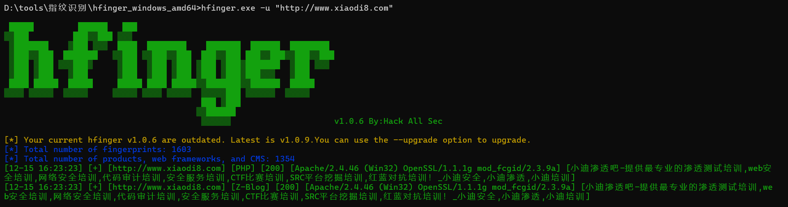
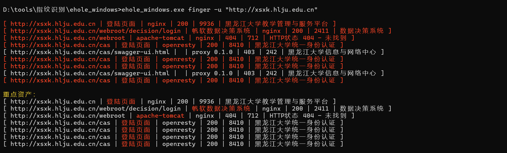
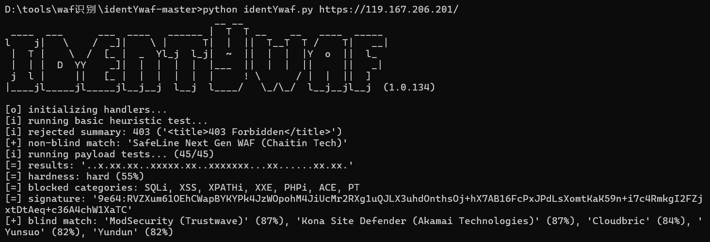
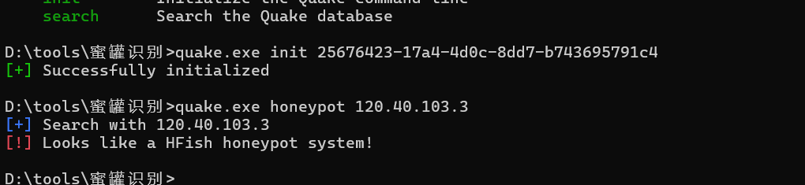

|                      |                            |
| -------------------- | -------------------------- |
| 蜜罐                   | Quake系统搜索语法                |
| STRUTSHONEYPOT       | app:"StrutsHoneypot"       |
| CONPOT HTTP 蜜罐       | app:"Conpot Http 蜜罐"       |
| CONPOT MODBUS 蜜罐     | app:"Conpot modbus 蜜罐"     |
| CONPOT S7 蜜罐         | app:"Conpot s7 蜜罐"         |
| KIPPO 蜜罐             | app:"kippo 蜜罐"             |
| HONEYPY HTTP 蜜罐      | app:"Honeypy Http 蜜罐"      |
| HONEYPY ES蜜罐         | app:"Honeypy ES蜜罐"         |
| AMUN IMAP 蜜罐         | app:"amun imap 蜜罐"         |
| AMUN HTTP蜜罐          | app:"amun http蜜罐"          |
| NEPENTHES NETBIOS蜜罐  | app:"Nepenthes netbios蜜罐"  |
| NEPENTHES FTP 蜜罐     | app:"Nepenthes FTP 蜜罐"     |
| SSHESAME SSH 蜜罐      | app:"sshesame ssh 蜜罐"      |
| OPENCANARY蜜罐管理后台     | app:"opencanary蜜罐管理后台"     |
| DIONAEA SIPD 蜜罐      | app:"Dionaea sipd 蜜罐"      |
| DIONAEA SMBD 蜜罐      | app:"Dionaea smbd 蜜罐"      |
| DIONAEA HTTP 蜜罐      | app:"Dionaea Http 蜜罐"      |
| DIONAEA MSSQL 蜜罐     | app:"Dionaea MSSQL 蜜罐"     |
| DIONAEA FTP 蜜罐       | app:"Dionaea ftp 蜜罐"       |
| DIONAEA MEMCACHED 蜜罐 | app:"Dionaea Memcached 蜜罐" |
| KOJONEY SSH 蜜罐       | app:"Kojoney SSH 蜜罐"       |
| WEBLOGIC蜜罐           | app:"weblogic蜜罐"           |
| MYSQL蜜罐              | app:"MySQL蜜罐"              |
| HFISH蜜罐              | app:"HFish蜜罐"              |
| HFISH蜜罐管理后台          | app:"HFish蜜罐管理后台"          |
| HONEYTHING物联网蜜罐      | app:"honeything物联网蜜罐"      |
| ELASTICSEARCH蜜罐      | app:"elasticsearch蜜罐"      |
| HOSTUS蜜罐             | app:"HostUS蜜罐"             |
| WHOISSCANME蜜罐        | app:"whoisscanme蜜罐"        |
| 未知蜜罐                 | app:"未知蜜罐"                 |
| COWRIE TELNETD蜜罐     | app:"Cowrie telnetd蜜罐"     |
| GLASTOPF蜜罐           | app:"glastopf蜜罐"           |

## Web架构

### 开源CMS

Discuz、WordPress、PageAdmin、蝉知等

### 前端技术

HTML5、Jquery、Bootstrap、Vue、NodeJS等

### 开发语言

PHP、JAVA、Ruby、Python、C#、JS、Go等

### 框架组件

SpringMVC、Thinkphp、Yii、Tornado、Vue等

### Web服务器

Apache、Nginx、IIS、Lighttpd等

### 应用服务器

Tomcat、Jboss、Weblogic、Websphere等

### 数据库类型

端口扫描，组合判断，应用功能

Mysql、SqlServer、Oracle、Redis、MongoDB等

### 操作系统信息

Linux、Windows、Mac等

### 应用服务信息

FTP、SSH、RDP、SMB、SMTP、LDAP、Rsync等

### CDN信息

帝联、Cloudflare、网宿、七牛云、阿里云等

### WAF信息

创宇盾、宝塔、ModSecurity、玄武盾、OpenRASP等

### 蜜罐信息

HFish、TeaPot、T-Pot、Glastopf等

### 其他组件信息

FastJson、Shiro、Log4j、Solr、XStream等

## 指纹识别

### 平台

https://www.yunsee.cn/
http://finger.tidesec.net/
https://fp.shuziguanxing.com/

### 项目

https://github.com/AliasIO/wappalyzer

##### hifiger

https://github.com/HackAllSec/hfinger

https://github.com/Tuhinshubhra/CMSeeK

##### ecole

ehole_windows.exe finger -u "http://xsxk.hlju.edu.cn"

https://github.com/lemonlove7/EHole_magic

https://github.com/emo-crab/observer_ward

### 空间ico

借助目标的ico图标进行识别

icon图标默认没有被修改的情况

## WAF识别

拦截页面，identywaf项目内置

##### identYwaf

https://github.com/stamparm/identYwaf

https://github.com/EnableSecurity/wafw00f

## 蜜罐识别

### 项目识别

https://github.com/graynjo/Heimdallr

##### quake

https://github.com/360quake/quake_rs

quake.exe init apikey值

quake.exe honeypot 目标

### 人工识别

*端口多而有规律性（针对多服务蜜罐）

*Web访问协议就下载（针对多服务蜜罐）

*设备指纹分析（见上图，针对蜜罐特征

## 框架组件识别

例子 

FastJson https://forum.butian.net/share/1679

Shiro https://mp.weixin.qq.com/s/j1nDnb0Ub5bk2-Tq5tt2pg
