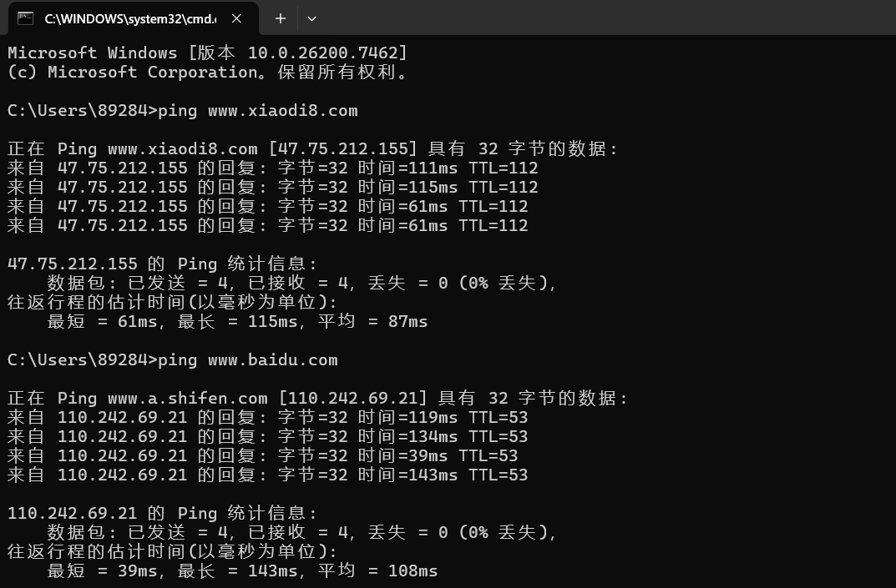
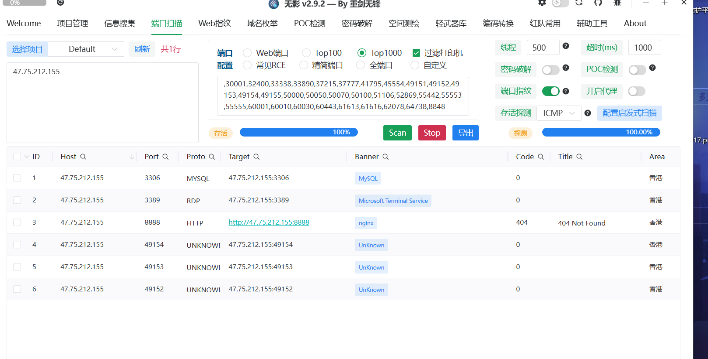
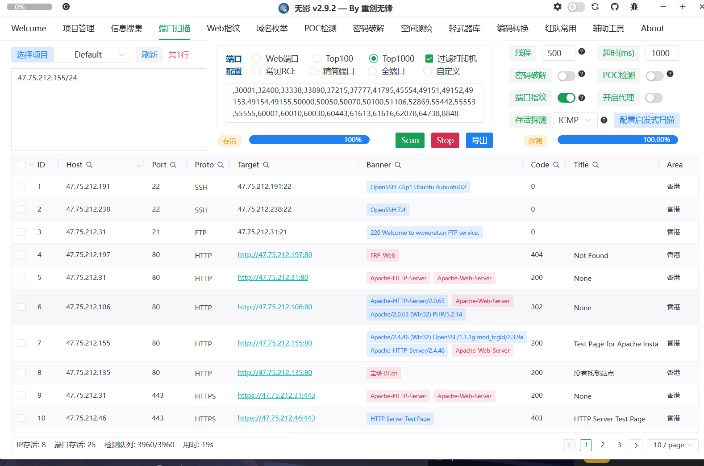
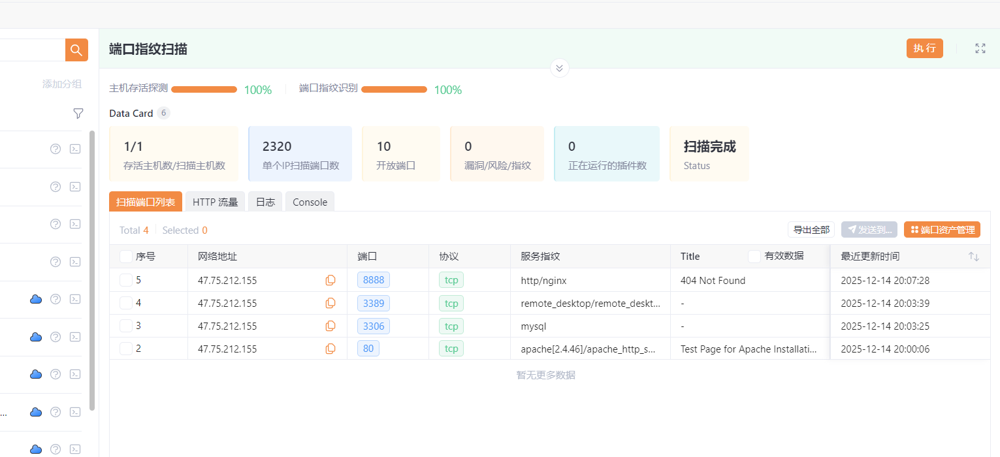
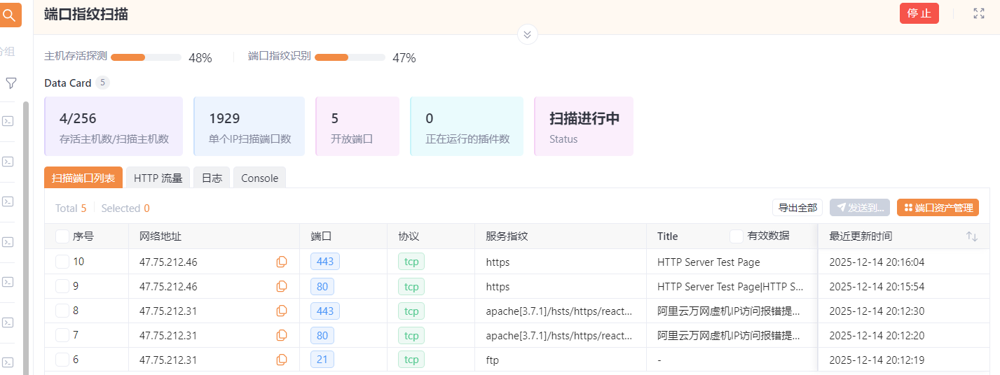
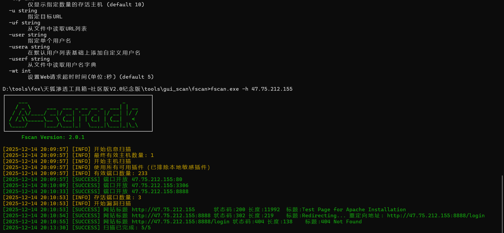
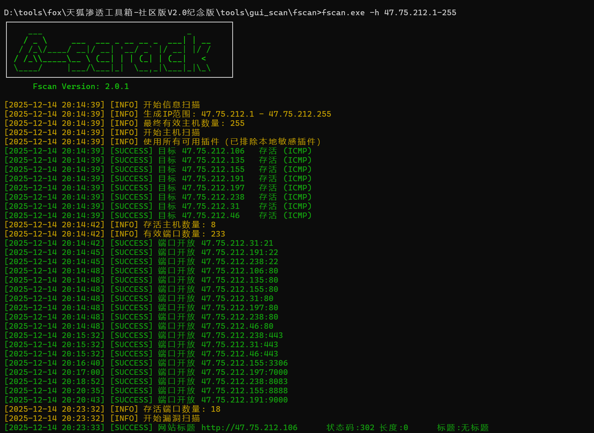
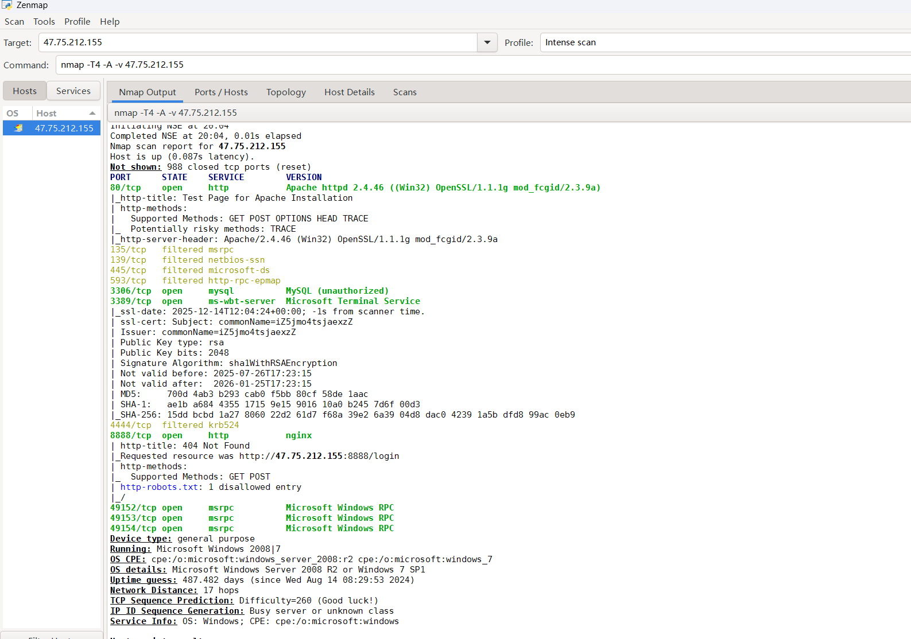
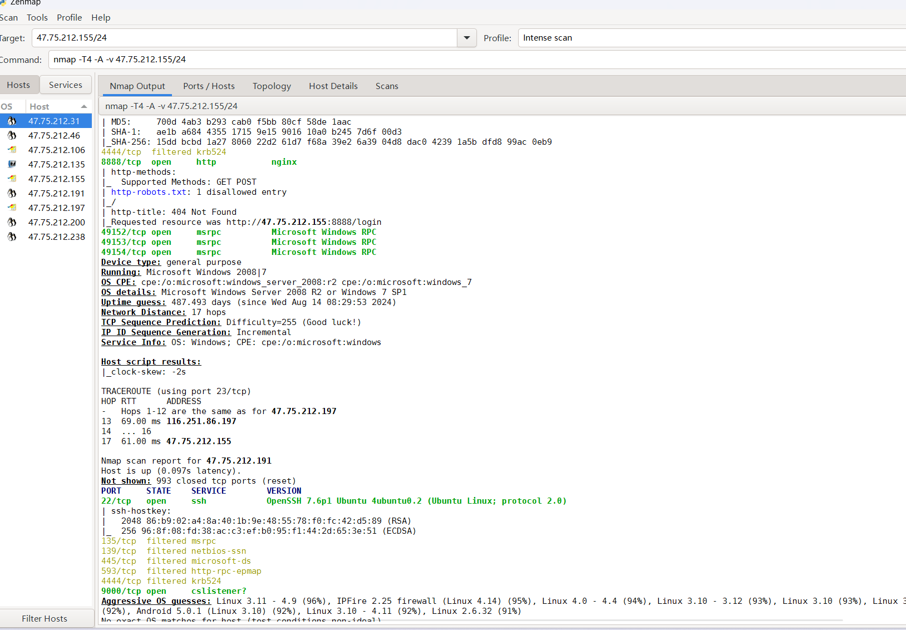

## 操作系统识别

Windows不区分大小写
Linux区分大小写

端口特征识别，根据windows和Linux开放端口判断操作系统

TTL值判断
越大越有可能是linux，越小越有可能是Windows

## IP资产

归属地查询
归属云厂商
IP反查域名
IP反查机构
IP-C段查询

判断是否为核心资产，寻找其他资产，后期利用，这里可以转换成Web上，机构上，从而获取更多信息

利用网上接口，空间引擎，ping查询

## 端口资产

[[常见服务端口]]

### 网络空间引擎

直接使用网络测绘引擎(Fofa、Hunter、Quake、00信安等搜索IP；此类网络资产测绘引擎都是每隔一段时间会对全网的网络资产去做一个轮询，那可能每个引擎的轮询周期、扫描精准度都不同，故建议可使用不同的搜索引擎以获取更多资产

地址导航 https://dh.aabyss.cn/
参考链接 https://mp.weixin.qq.com/s/FRgPQKJDj2xRCduwPfZrTw

***网络空间引擎定期爬网上数据，如果是较新的资产，搜集不到***

### 在线端口扫描 *不推荐*

百度或google直接搜索在线端口扫描就会有一些网站，同理很多功能都可以直接搜索在线xxx；例如在线正则提取解析、在线编码转换等

### 本地离线工具

*Nmap最为准确，但最慢；Masscan最快，误报相对更高*

*工具测评  https://xz.aliyun.com/t/15753 

#### 工具演示

##### Tscan

c段端口扫描 在ip地址后面加/24

##### Yakit

c段端口扫描 在ip后加/24

##### Fscan

fscan.exe -h 47.75.212.1-255

fscan.exe -h 47.75.212.1-255

##### Nmap

c段扫描 ip后面加/24

[[Nmap使用说明]]

##### 可能遇到的问题

1 扫描不到 防火墙 白名单或者入站策略导致

解决办法 换扫描协议(几率性绕过)

2 目标在内网环境 你看到的就是一个转发机器 扫转发机器的端口和目标不一致

## 角色定性判定

1、网站服务器

2、数据库服务器

3、邮件系统服务器

4、文件存储服务器

5、网络通信服务器

6、安全系统服务器

