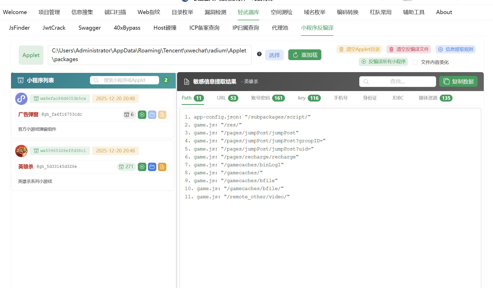

## 源码解析

1 主体结构

小程序包含一个描述整体程序的app和多个描述各自页面的page
一个小程序主体部分有三个部分组成，必须放在项目的根目录下

app.js 小程序逻辑
app.json 小程序公共配置
app.wxss 小程序公共样式表

2 一个小程序页面由四个文件组成

xxx.js 页面逻辑
xxx.json 页面配置
xxx.wxml 页面结构
xxx.wxss 页面样式

3 项目整体目录结构

pages 页面文件夹
index 首页
logs 日志
utils 写的工具
util 同上
app.js 入口js (类似于Java的main方法，全局js)
app.json 全局配置文件
app.wxss 全局样式文件
project.config.json 跟你在详情中勾选的配置一样
sitemap.json 用来配置小程序及其页面是否允许被微信索引

## 小程序抓包

利用proxifier转发流量

## 小程序逆向

对源码架构进行分析

-更多的资产信息

-敏感的配置信息

-未授权访问测试

-源码中的安全问题

### Tscan

