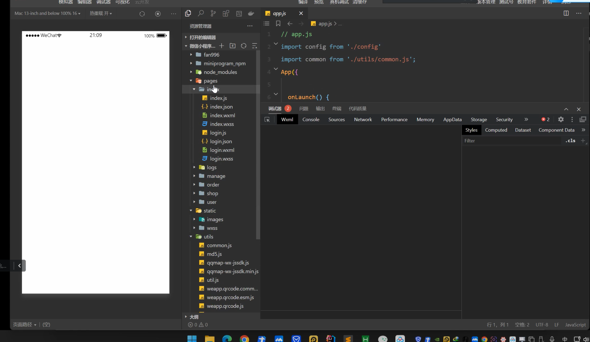

# APP应用开发架构

## 原生开发

*安卓一般使用java语言开发，当然现在也有kotlin语言进行开发。如何开发就涉及到具体编程了，这里就不详说了。简单描述就是使用安卓提供的一系列控件来实现页面，复杂点的页面可以通过自定义控件来实现*

用NP或者MT管理器去反编译源码修改源代码（Smile语法）

利用抓包工具抓包（http或者https），同WEB渗透测试思路一样

两种方式关键点在于app的源码怎么设计的

## Web封装

*Web App软件开发简单地说，就是开发一个网站，然后加入app的壳。Web App一般非常小，内容都是app内的网页展示，受制于网页技术本身，可实现功能少，而且每次打开，几乎所有的内容都需要重新加载，所以反应速度慢，内容加载过多就容易卡死，用户体验差，而且app内的交互设计等非常有效。但开发周期长端，需要的技术人员少，成本低*

封装平台 https://ofcms.com/

只是有个app的外壳，接收端还是那个网站

常规Web渗透测试为主

## H5&Vue-HBuilderX（低代码）

*使用H5开发的好处有很多，可多端复用，比如浏览器端，ios端，当然H5开发的体验是没有原生好的。结合我做过的项目来说，一般是这个页面需要分享出去的话，就用H5开发*

HBuilder需要证书密钥

反编译什么都编译不出来，只用一些前端源码做数据传输

测试思路就是api接口测试，JS框架安全问题，JS前端测试

## flutter开发

*flutter是近年来谷歌推出的一款UI框架，使用dart语言进行开发，支持跨平台，weight渲染直接操作硬件层，体验可媲美原生。但是flutter技术比较新，生态还不完善，开发起来效率相对偏低*

生态不完善，应用少

# 小程序开发架构

小程序开发架构 https://mp.weixin.qq.com/s/dXTb0wk57-bLA3tUuvOFSw

## Web封装

常规Web渗透测试思路

封装平台 https://ofcms.com/

## 小程序-开发架构-H5&Vue-HBuilderX（低代码开发）

反编译小程序提取关键资产信息，测试api接口，抓包测试

***反编译-源码-提取资产（泄漏的配置信息）-安全测试***

***抓包-资产-安全测试***

