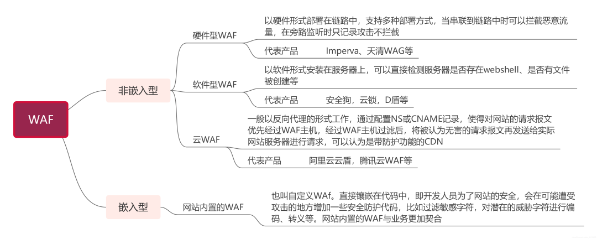
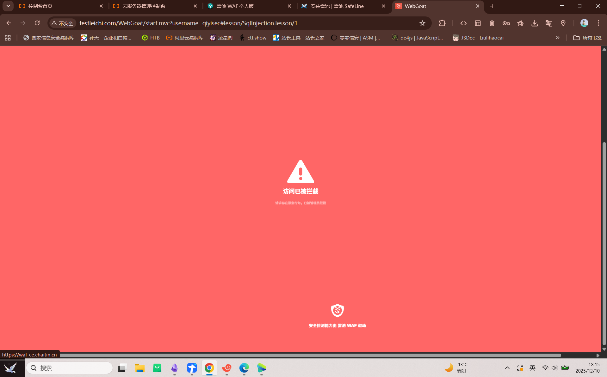

# Web+WAF

搭建方法 https://help.waf-ce.chaitin.cn/node/01973fc8-8206-7c7e-8089-598396f562dd 在管理页面配置域名和上有代理 *例如http://127.0.0.1:8080*

常规安全测试手段会被拦截

大型安全公司WAF绕过可能性不高，早几年WAF可以尝试绕过，早几年WAF *如安全狗* 已经逐步被淘汰 *支持太少*

# Web+CDN

内容分发服务，提高访问速度，作用对象为网站静态资源

对安全影响在于隐藏真实ip地址

判断方法 *超级ping 站长工具 就近原则*

# Web+OSS

云存储服务，提高访问效率

只提供存储服务，不提供代码解析。 *影响文件上传漏洞*

新的安全问题，OSS域名接管，AK/SK泄露隐患

# 反向代理

正代理为客户端服务,客户端主动建立代理访问目标 *例如翻墙*

反向代理为服务端服务,服务端主动转发数据给可访问地址

原理 通过网络反向代理转发真实服务达到访问目的

目前没有方法准确判断服务器是否用了反向代理 *尽可以从nginx等特征判断*

# 负载均衡

分摊到多个操作单元上进行执行，共同完成工作任务

可能有多个资产目标

**CDN作用对象针对网站静态资源，负载均衡可以完全看成一个资产**

***常用web技术架构 https://mp.weixin.qq.com/s/SEjxrUgiIIK2bveSBz6mTg