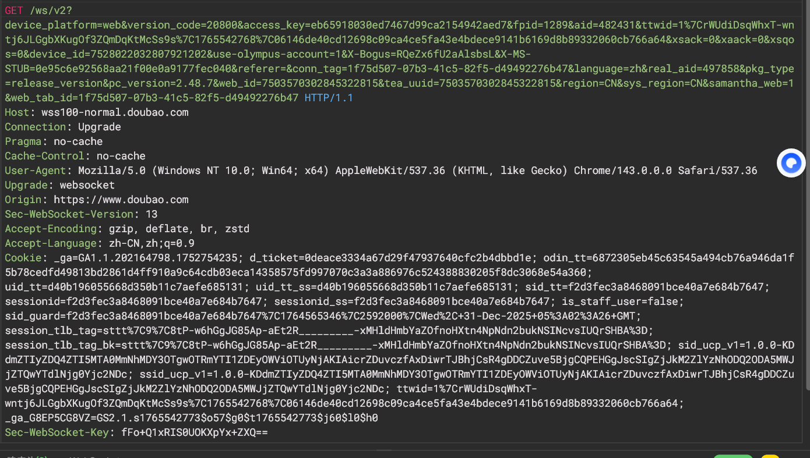

## 传输格式

*JSON XML WebSocket HTML 二进制 自定义*

WebSockets：聊天交互较常见（豆包等应用）

参考文章 https://zhuanlan.zhihu.com/p/712032652

**安全后渗透测试必须要统一格式发送**

## 加密和编码

数据在传输过程中通常会被加密或编码

加密和编码有可逆向的也有不可逆向的，不可逆向的较多

不可逆向传输数据的方式采用对比碰撞的校验,服务端存储密文

在渗透测试时需要知道对方使用什么加密或者编码，在以对应的加密编码发送，否则后端不解析

一般加密编码在前端完成

## 代码混淆

-PHP&JS混淆加密

-DLL&JAR代码保护

影响：代码审计，逆向破解

