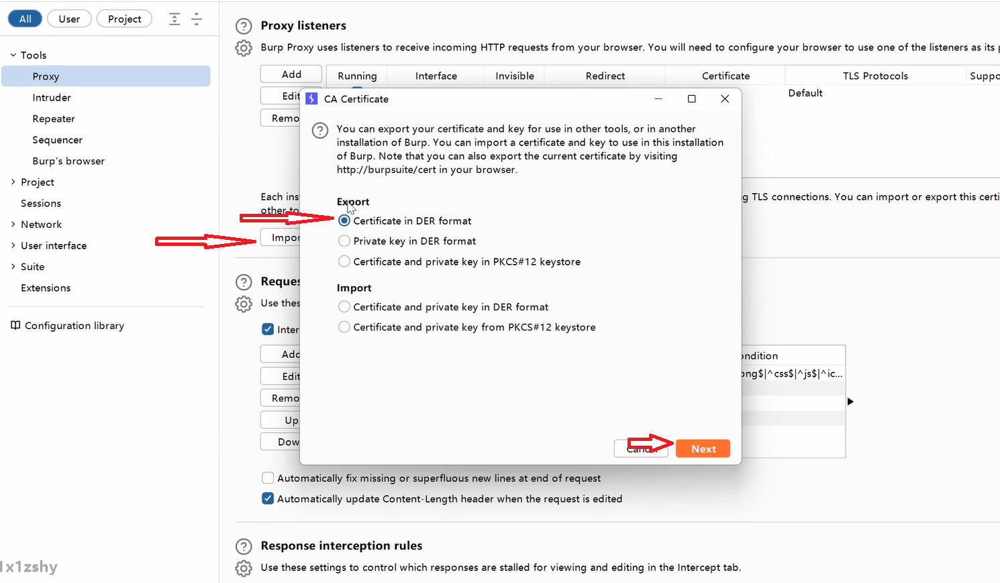
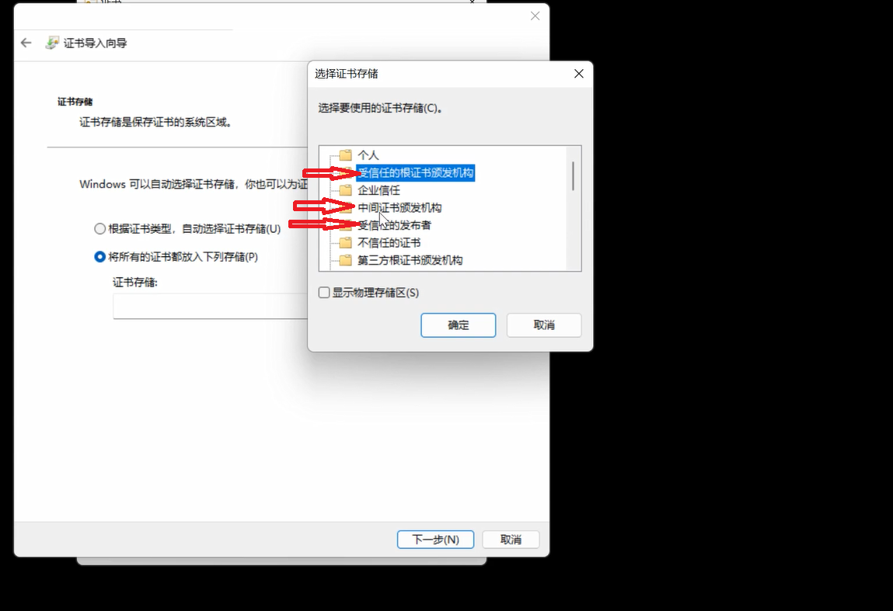
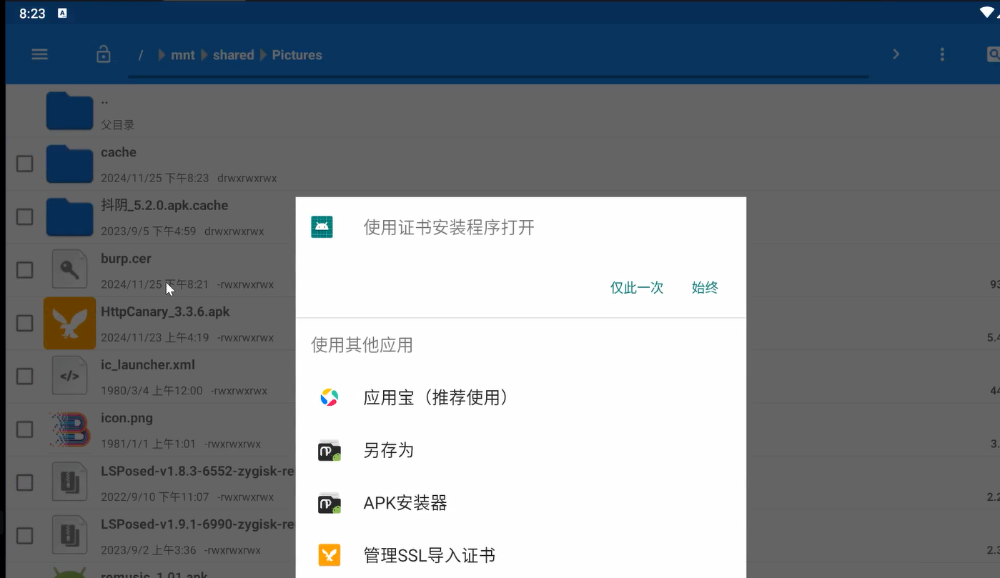
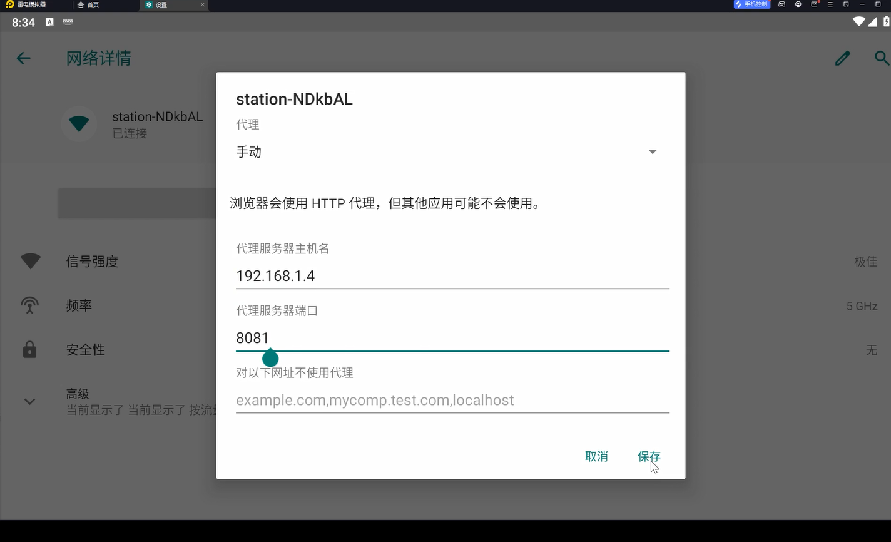
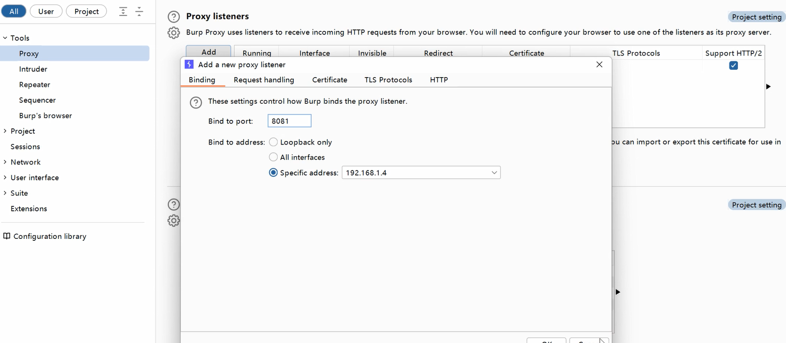
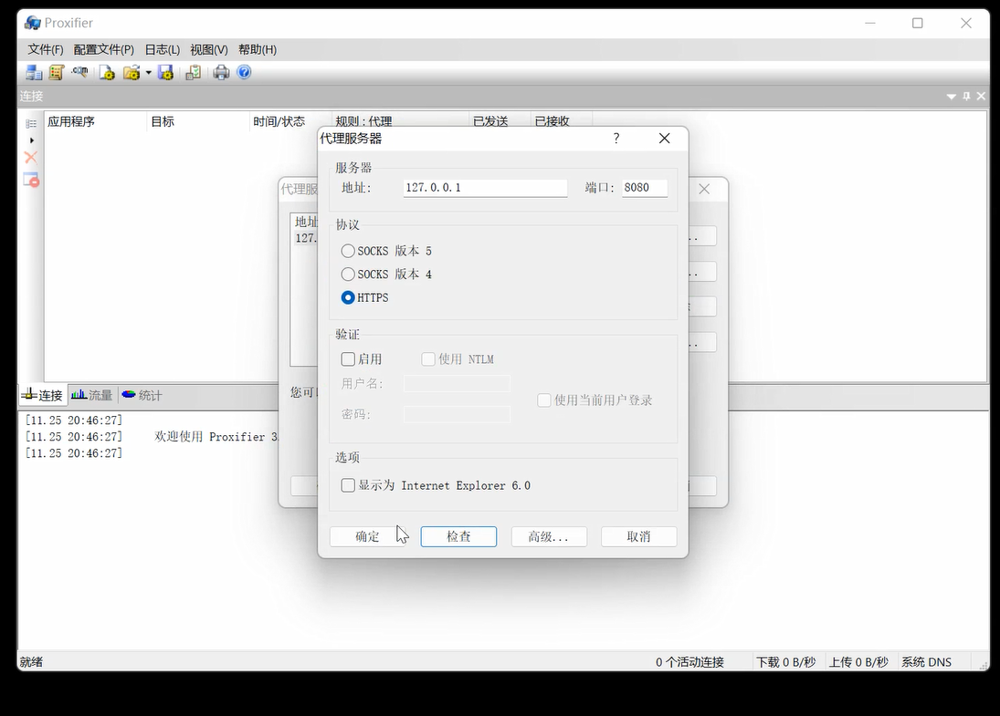
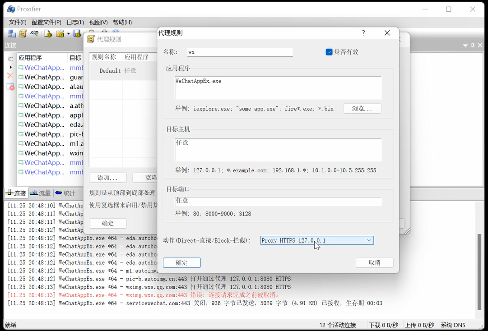

# Burp

## 证书安装

解决https抓不到包的问题

以.cer格式保存到一个地方，双击证书

分别安装三个证书

## 安卓模拟器证书安装

将burp导出的证书上传到模拟器文件夹中

双击证书

点击仅此一次设置PIN码，随意去一个名字安装证书

## 模拟器抓包

在模拟器中设置代理网络，ip地址为主机网络地址，端口任意

在burp上添加监听器

## 小程序抓包

利用代理流量转发工具(Proxifier)将小程序数据包转发到burp上

点击配置文件，配置服务器，ip地址和端口号与burp拦截的ip和端口一致

配置完可以检查是否可用

添加代理规则，将小程序运行进程名称添加到应用程序，动作选择配置的服务器

***注意 Default规则的动作一定不要选择配置的服务器，不然所有进程的包都会流经配置的服务器

## PC端抓包

同小程序一样就是把代理规则的进程改为要抓的PC端进程，在有网络设置的PC端应用直接添加代理

# Yakit

## 证书安装

同burp

## 安卓模拟器证书安装

同burp

## 模拟器抓包

yakit添加监听时网卡选择0.0.0.0，剩余同burp

## 小程序抓包

同burp

## PC端抓包

同burp

# Reqable

安装证书方便，测试接口比较好用，无安全插件

