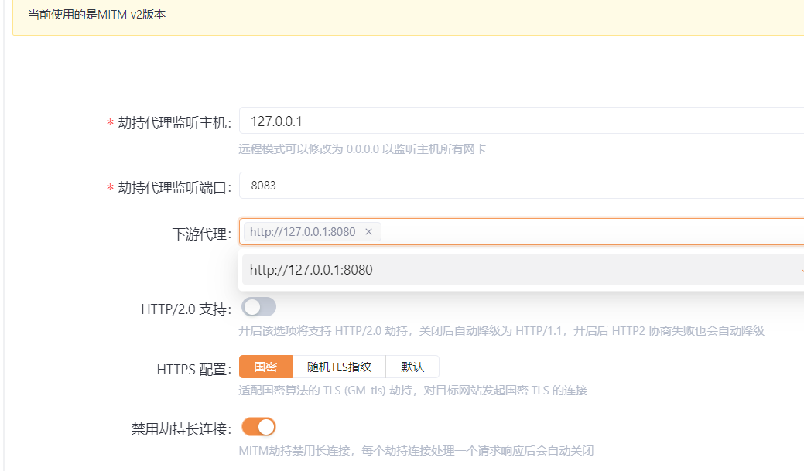
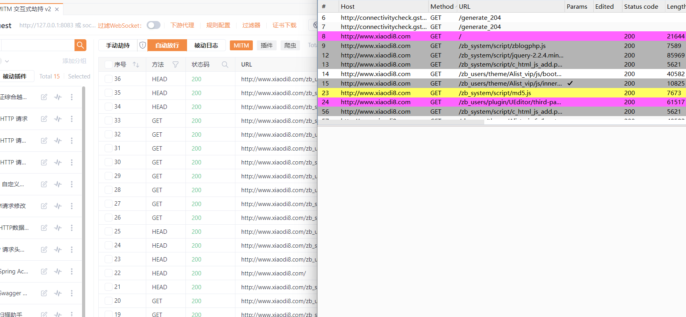
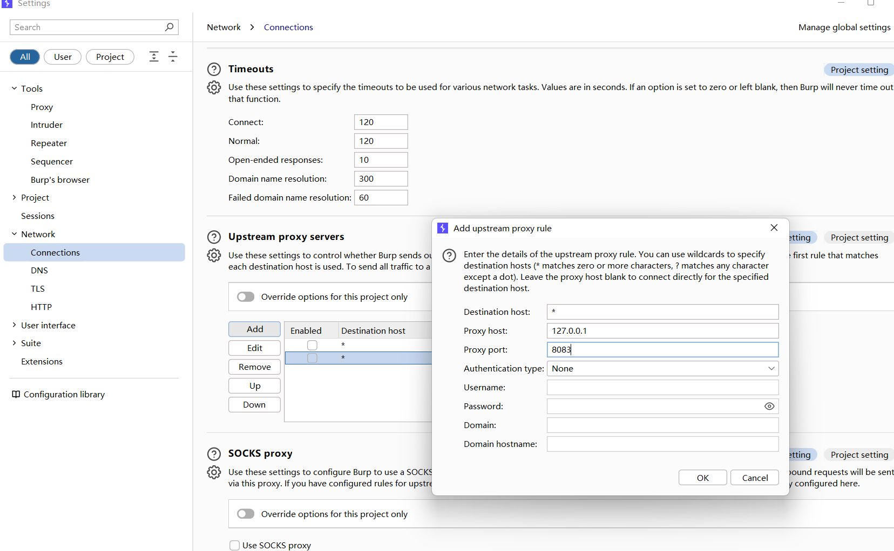
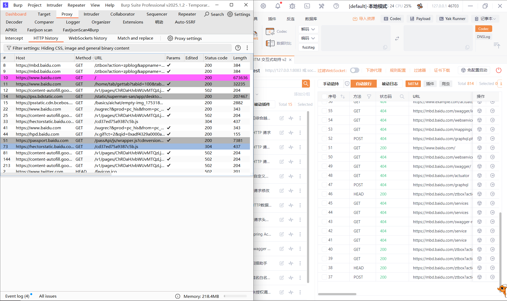
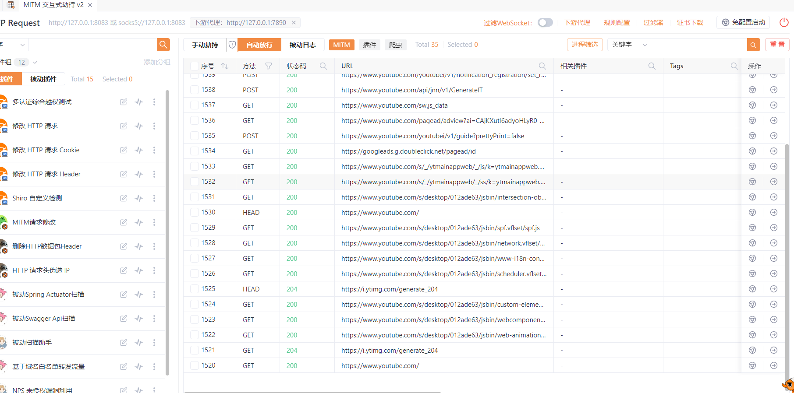

## 工具联动

*上游代理靠近服务器 下游代理靠近客户端*

yakit -> burp

yakit 127.0.0.1:8083 burp 127.0.0.1:8080

yakit设置下游 127.0.0.1:8080

系统代理 127.0.0.1:8083

联动效果

burp -> yakit

burp 127.0.0.1:8080 yakit 127.0.0.1:8083

burp设置下游 127.0.0.1:8083

系统代理127.0.0.1:8080

联动效果

其他工具操作类似

## 科学上网抓包

与工具联动类似，配置抓包工具的下游代理为VPN的ip和端口

## 全局协议抓包

WireShark 科来网络系统
### 解决部分代理校验

有部分app web 小程序 当设置代理之后无法抓包

校验 检测到了当前机器的代理设置 做了一个策略防止

做了代理的设置数据走向：本身应用-代理-还没有到网卡-给到监听抓包工具

没有做代理的数据走向：本身应用-服务器（网卡抓包） 代理是在网卡之前产生

### APP/小程序/PC应用

由于应用类型不同，不是说所有的应用都有https协议的数据

### 蓝队分析TCP/UDP应用
