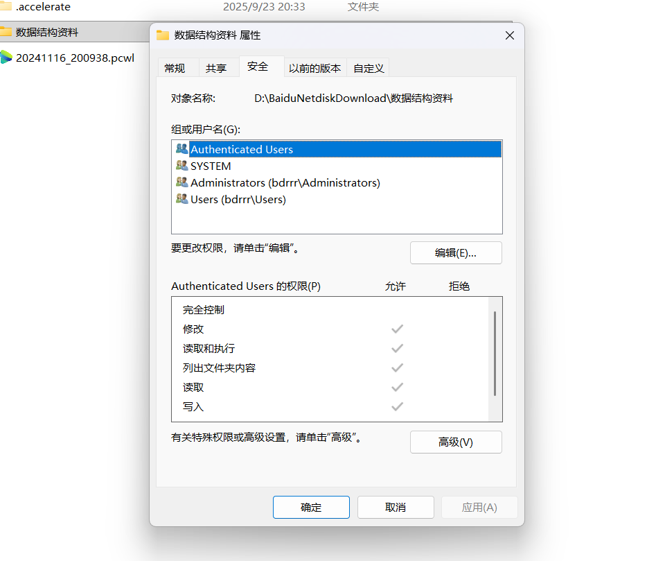

## 域名

主站：www.baidu.com
分站：nihao.baidu.com
端口站：www.baidu.com:88
目录站：www.baidu.com/bbs/
子站：123.nihao.baidu.com

渗透目标可能是ip地址或者域名，多个域名可以解析同一个ip地址
http 80端口
https 443端口
不同端口下开放服务不同，对应源码可能不同

www.xiaodi8.com/ 博客 php
www.xiaodi8.com/hack 论坛 java

如果分站和主站解析同一个ip地址，从分站渗透目标也可以打入主站点

## 源码

后台目录，文件目录，逻辑目录，前端目录，数据目录，配置文件等
*根据目录名字判断*

源码开发语言类型：ASP,ASPX,PHP,Java,Python,Go,JavaScript

开发框架组件
PHP *Thinkphp Laravel YII CodeIgniter CakePHP Zend等*
Java *Spring MyBatis Hibernate Struts2 Springboot等*
python *Django Flask Bottle Turbobars Tornado Web2py等*
JavaScript *Vue.js Node.js Bootstrap JQuery Angular等*

开源-如zblog
闭源-内部开发
加密-如通达OA *源码加密，打开乱码*

## 数据

数据库类型 *Access MySQL SqlServer Oracle Redis DB2 Postgresql MogoDB*

本地数据：本地服务器搭建
分离数据：另外服务器搭建
云数据库：RDS等 **白名单连接，只允许白名单内的ip地址连接数据库**

拿到云数据库的办法：
1.上传一个数据库连接脚本到网站上，访问脚本让脚本去练数据库
2.利用网站权限上传一个代理流量工具，做数据中转操作

## 平台

系统 *Windows Linux MacOS等（提权）*
容器 *Docker K8s Vmware VirtualBox等（容器逃逸）*
中间件 *Apache Nginx IIS lighttpd Tomcat Jboos Weblogic Websphere Jetty等（利用中间件漏洞）*

## 路径

相对绝对：相对当前目录，完整的目录路径 *./home/usr/*
绝对路径：*/etc/passwd*

格式权限 后门解析格式 *例如.jpg只能当成图片解析*
         代码正常执行 *对应环境上传对应文件*
         脚本执行权限 **文件夹内文件的权限控制** *后门文件上传其他目录*
    

框架开发和MVC路由模型源码：根据框架的路由决定
