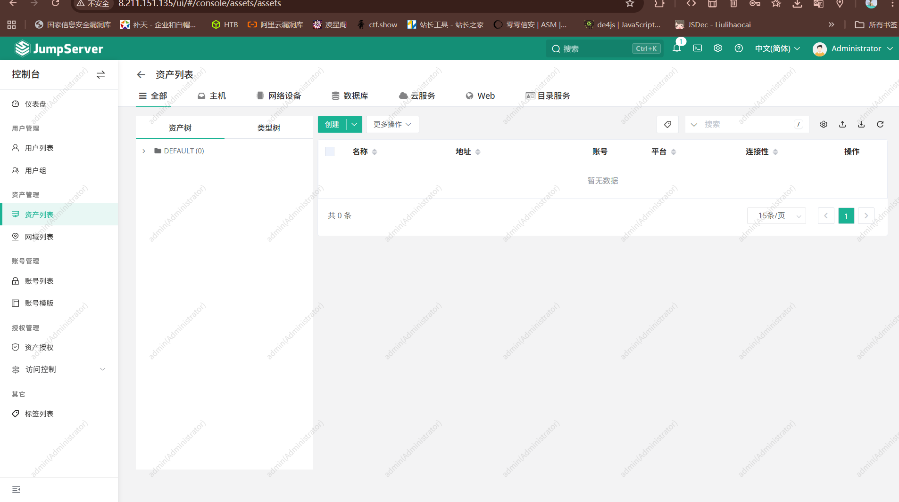
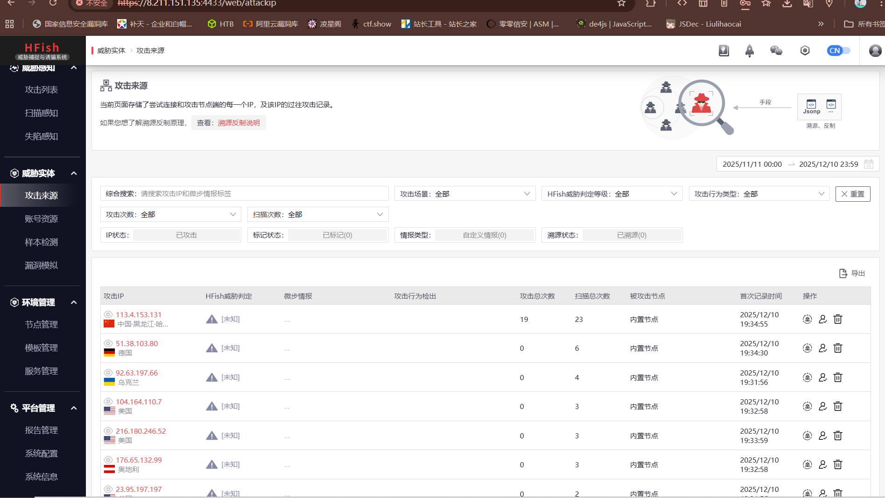

==***常用web技术架构 https://mp.weixin.qq.com/s/SEjxrUgiIIK2bveSBz6mTg==
2024护网 https://www.yuque.com/u25571586/dyaqbugs?# 密码：xnzx

## 堡垒机

搭建 https://www.jumpserver.com/docs/installation

运维人员用来运维的，就是个资产管控平台

对渗透测试有利影响 Web应用或其他应用提供给测试人员一个能获取到价值信息的系统，堡垒机可能曝过漏洞

## 蜜罐

搭建方法 https://hfish.net/#/README?id=%e5%a6%82%e4%bd%95%e5%ae%89%e8%a3%85

开放服务通过钓鱼手机攻击者信息

*题外话 测WEB应用时要把思路打开，不要局限于网页，app，小程序，硬件方面只要涉及WEB都可以测*

# API接口

是一个允许不同软件应用程序之间进行通信和数据交换的接口。API定义了一组规则和协议，软件开发者可以使用这些规则和协议来访问操作系统、库、服务或其他应用程序的功能。

内部API：比如我自己开发了一个收银系统，使用API接口可以查询到顾客数据，收入支付，销售提成等

外部API：比如我自己搭建了一个网站应用，功能需求有要借助到外部的资源，如地图，归属地，短信收发等

## Web API

通过HTTP协议进行通信的API，常用于Web服务和应用程序。

*例如，RESTful API、GraphQL API。*

## 库和框架API

提供特定编程语言或框架功能的API，供开发者在应用程序中使用。

*例如，Java API、Python标准库。*

## 操作系统API

提供操作系统功能访问的API。

*例如，Windows API、POSIX API。*

## 远程API

允许在网络上远程访问服务的API。

*例如，SOAP API、XML-RPC API。*

***分析API的目录结构，接口命名规则，参数命名规则，功能和业务逻辑等，根据这些信息可以进行口枚举和参数枚举，进而可以进行相关的漏洞测试

